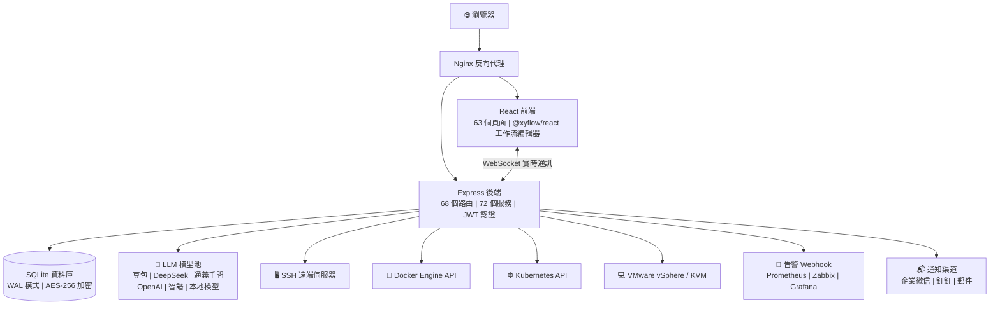

[English](README.en.md) | [中文](README.md)

***

**重要許可證變更通知（2026-05-27）**

本專案自 2026年5月27日 起，所有新提交的程式碼採用 **Mozilla Public License 2.0 (MPL-2.0)** 許可證開源。本專案禁止閉源二次開發、打包銷售、SaaS化營運等商業用途，永久開源。專案屬於成千上萬擁抱開源精神的工程師，而不是一個公司。

***

<br />

<h1 align="center">⚡ ITOps Agent Platform</h1>
<p align="center">
  <strong>AI 多 Agent 協作的企業級維運自動化平臺</strong>
  <br/>
  國產開源 · PagerDuty + Rundeck + Portainer + vCenter 替代方案
  <br/>
  <em>一個平臺，搞定告警 → 診斷 → 修復 → 審批 → 驗證全閉環</em>
</p>

<p align="center">
  <a href="https://github.com/qinshihu/itops-agent-platform/actions/workflows/ci.yml"></a>
  <a href="https://github.com/qinshihu/itops-agent-platform/releases/latest"></a>
  <a href="LICENSE"></a>
  <a href="https://github.com/qinshihu/itops-agent-platform"></a>
  <a href="https://github.com/qinshihu/itops-agent-platform/issues"></a>
  <br/>
  <a href="https://gitee.com/IT_Oline/itops-agent-platform"></a>
  <a href="https://gitcode.com/gcw_IM7aAihp/itops-agent-platform"></a>
  <br/>
  
  
  
  
  
  <br/>
  
  
  
  
  <br/>
  <a href="https://star-history.com/#qinshihu/itops-agent-platform&Date">
    
  </a>
</p>

🎮 [線上演示](https://agentdemo-0mwug01t6.maozi.io/) &emsp;|&emsp; 📝[專案願景與社群共建](專案願景與社群共建.md) &emsp;|&emsp; 📝[AI程式設計Skill](SKILL.md) &emsp;|&emsp; 📝[教學書籍](https://aiopsdoc-0mwug01t6.maozi.io/book/) &emsp;|&emsp; 📖[專案文件](https://aiopsdoc-0mwug01t6.maozi.io/) &emsp;|&emsp; ✍️[作者的話](https://mp.weixin.qq.com/s/NDqYrfqR0RZEvSESyVD2hg)

🌐 專案官網：<https://www.zjzwfw.cloud/ITOpsAgentinfo>

📦 程式碼倉庫：[GitHub](https://github.com/qinshihu/itops-agent-platform)  |  [Gitee](https://gitee.com/IT_Oline/itops-agent-platform)  |  [GitCode](https://gitcode.com/gcw_IM7aAihp/itops-agent-platform)

---------------------------------------------------------------


## 🎯 誰在用 / 誰適合用？

| 角色               | 典型痛點                        | 本平臺如何解決                    |
| ---------------- | --------------------------- | -------------------------- |
| **維運工程師**        | 半夜被告警吵醒，手動 SSH 排查           | AI 自動診斷根因 → 推送審批 → 手機一鍵修復  |
| **SRE / DevOps** | 多套工具來回切換，資訊孤島               | 告警+診斷+執行+審批一站式閉環           |
| **IT 主管 / CTO**  | 維運全靠人，故障響應靠運氣               | 自動化巡檢 + 自愈策略，把人從重複勞動中解放    |
| **中小企業 IT**      | 買不起 PagerDuty/Rundeck 等商業軟體 | 功能對標，開源免費，資料不出域            |
| **安全合規團隊**       | 修復操作無審批、無審計                 | HITL 人工審批 + 全鏈路審計 + 命令安全過濾 |

***

## 為什麼需要這個專案？

凌晨 3 點，伺服器 CPU 飆到 99%。傳統流程是：

```
告警通知 → 被吵醒 → 登入 VPN → SSH 上去 → 敲命令排查 → 翻文件 → 修復 → 寫報告 → 睡覺
```

**整個過程 30-60 分鐘，而你本可以繼續睡覺。**

ITOps Agent Platform 把這個流程變成：

```
告警觸發 → AI 自動診斷根因 → 生成修復命令 → 推送手機審批 → 一鍵執行 → 自動驗證 → 生成報告
```

**全程 3 分鐘，你只需要在手機上點一下"同意"。**

***

## 🚀 維運的終極形態：從自動化到自主化

ITOps Agent Platform 不只是一個維運工具，它瞄準的是 **IT 維運的終極演進方向** — AI 全自主維運。

```
手工維運  →  指令碼自動化  →  平臺化  →  AI 輔助  →  🤖 自主維運（本專案）
 2000s        2010s        2020s       2024+         現在 & 未來
```

| 演進階段 | 特徵 | 人的角色 |
|---------|------|---------|
| 手工維運 | 敲命令、登伺服器 | 執行者 |
| 指令碼自動化 | Shell / Python 半自動化 | 指令碼維護者 |
| 平臺化 | Ansible / Prometheus / Terraform | 平臺操作者 |
| AI 輔助 | Copilot 建議、告警分析 | 決策者 |
| **AI 自主維運** | **AI Agent 全閉環：感知 → 診斷 → 決策 → 執行 → 驗證** | **監督者** |

### 為什麼說這是終極形態？

| 維度 | 傳統方式 | ITOps Agent Platform |
|------|---------|---------------------|
| 故障響應 | 人工：發現 → 定位 → 修復（30-60 分鐘） | AI：自動感知 → 診斷 → 修復（< 3 分鐘） |
| 維運規模 | 1 人管 20-50 臺 | **1 人管 500+ 節點，AI 承擔 80%+ 工作量** |
| 知識沉澱 | 老員工腦中、散落文件 | **知識庫 + RAG，AI 持續學習，永不流失** |
| 決策品質 | 依賴個人經驗，不穩定 | **多 Agent 協作推理，完整推理鏈可審計** |
| 邊際成本 | 加機器 ≈ 加人 | **加機器 ≈ 加 Agent，邊際成本趨近於零** |

> **這不是一個維運工具，這是維運的下一代作業系統。** 當 AI Agent 能夠自主完成告警接入、根因診斷、修復決策、命令執行、結果驗證的全鏈路閉環，維運就不再是"人盯著系統"，而是"人設計策略，AI 執行策略"。

### 行業趨勢：AI 自主維運是不可逆的方向

- **Gartner** 將 AIOps 列為 IT 維運戰略技術趨勢，預測 AI 驅動的自主維運將成為企業標配
- **CNCF** 雲原生 + AI 融合是下一代基礎設施的核心方向
- 維運人力成本逐年攀升，**AI Agent 是唯一能在不增加人力的情況下支撐業務規模 10 倍增長的方案**
- **開源 + AI Agent 協作** 是打破商業軟體壟斷、實現技術普惠的關鍵路徑

### 我們的定位

**ITOps Agent Platform 是目前開源的 AIOps 專案中，唯一將「告警 → 診斷 → 決策 → 執行 → 驗證」全鏈路 AI 自主閉環工程化落地的平臺。**

我們的長期目標是：讓 80% 的日常維運工作完全由 AI Agent 自主完成，人類維運工程師專注於架構設計、策略制定和創新性工作。**這不僅是一個開源專案，這是維運工程師解放運動的起點。**

---

## ⏰ 為什麼是現在？

三個趨勢在同一時間點交匯，讓 AI 自主維運從"概念"變成了"必然"：

| 趨勢 | 說明 |
|------|------|
| **LLM 能力跨越閾值** | GPT-4o / DeepSeek / 豆包 / 通義千問等模型已具備生產級推理能力，能勝任故障診斷、命令生成等嚴肅場景 |
| **維運人力成本不可逆上升** | 企業 IT 規模 10 倍增長，維運團隊無法同比例擴張，唯一的出路是 AI 承擔 80%+ 日常工作量 |
| **開源生態足夠成熟** | Docker / K8s / React / TypeScript / Node.js 技術棧已足夠支撐企業級產品，開源不再是"簡陋"的代名詞 |

> **2026 年是 AI 自主維運的元年。** 當 LLM 能力 + 維運痛點 + 開源生態三者交匯，ITOps Agent Platform 站在了這個歷史節點上。錯過這個視窗，就是錯過一個時代。

---


### 一個 $400 億的市場，正在被 AI 重寫規則

全球 IT 維運市場規模 **$400 億（2025 年）**，預計 2030 年突破 $700 億。每一次正規化轉移都會誕生新的王者：

- 雲端計算轉移 → AWS（$2 萬億市值）
- 雲監控轉移 → Datadog（$400 億市值）
- 開發工具轉移 → GitLab（$140 億 IPO）
- **維運自動化轉移 → ？**

> **問題不是"會不會發生"，而是"誰會成為這個賽道的 GitLab"。** 開源 AIOps 領導者位置目前是空缺的 — 這是一個 Winner-takes-most 的市場。

| 當年 GitLab        | 今天 ITOps Agent Platform              |
|------------|--------------------------|
| 開源替代 GitHub | 開源替代 PagerDuty + Rundeck + Portainer |
| 初期只有基礎 CI/CD | 12 個 AI Agent + 68 個 API 路由 |
| 沒人相信程式碼託管值 $100 億 | **沒人相信維運平臺值 $100 億** |

> ITOps Agent Platform 站在一個更大賽道的更早階段。

### 三個不可逆的順風

| 順風 | 為什麼不可逆 |
|------|------------|
| **AI 能力爆發** | LLM 從"玩具"到"生產級"僅 2 年，下一步是"自主決策" |
| **維運人力斷層** | 70 後維運專家退休潮 + 年輕人不願 7×24 值班 = AI 是唯一出路 |
| **開源吃掉企業軟體** | GitLab、Confluent、Grafana、HashiCorp — 開源 IPO 已發生 5 次，每一次都證明開源模式比閉源更具商業爆發力 |

> **這不是選不選的問題，是選誰的問題。** 當上述三條曲線交匯，AI 自主維運是數學上的必然。

***


***

## 5 分鐘體驗完整閉環

```bash
# 1. 一行命令部署（需要 Docker 環境）
curl -sL https://gitee.com/IT_Oline/itops-agent-platform/raw/main/deploy.sh -o deploy.sh && chmod +x deploy.sh && ./deploy.sh

# 2. 開啟瀏覽器 http://localhost:8080，預設帳號 admin/admin
# 3. 新增一臺伺服器 → 系統自動發現宿主機上的容器和資源
# 4. 配置告警 Webhook → 觸發一條測試告警 → 觀察 AI 自動分析
# 5. 點選"自動修復" → 手機審批 → 完成！
```

**5 分鐘，從零到完整的 AI 維運閉環體驗。**

***

## 這個平臺到底能做什麼？

### 路徑1️⃣   智慧告警 → AI 診斷 → 自動修復

```
Prometheus / Zabbix 告警 → Webhook 接收 
  → AI 根因分析（自然語言診斷報告）
    → 自動生成修復命令 + 風險評估
      → 企微/釘釘推送審批 → 手機一鍵透過
        → SSH 自動執行修復 → 驗證結果 → 生成報告
```

<details>
<summary><b>展開檢視這個流程解決了什麼痛點</b></summary>

| 傳統方式           | 本平臺                  |
| -------------- | -------------------- |
| 告警風暴，半夜被吵醒     | AI 自動降噪去重，同類告警聚合     |
| 手動 ssh 排查，靠經驗猜 | AI 分析日誌 + 指標，給自然語言診斷 |
| 翻文件找修復步驟       | 自動生成結構化修復命令（JSON）    |
| 修復沒審批，出事沒人擔    | 人工審批節點，移動端一鍵審批       |
| 擔心修復出錯無法回滾     | 自動驗證結果，失敗告警          |

</details>

### 路徑2️⃣   視覺化工作流 → 定時自動巡檢

```
拖拽編排工作流（Agent + 審批 + 條件分支）
  → 配置 Cron 定時觸發
    → 自動執行多臺伺服器巡檢
      → 生成合規檢查報告
        → 異常自動建立告警 → 進入路徑1️⃣
```

### 路徑3️⃣   容器與虛擬化統一管理

```
一鍵新增 Docker 主機 / VMware vCenter / Proxmox VE / KVM 節點
  → 自動發現所有容器和虛擬機器
    → 實時監控 CPU / 記憶體 / 網路（WebSocket 推送）
      → 容器日誌流式檢視
        → Docker Compose 視覺化編排
          → K8s 叢集匯入與管理（kubeconfig 匯入 + 叢集狀態監控）
            → 映象倉庫整合（Harbor / ACR / Docker Hub）
```

### 路徑4️⃣   資料中心與網路設施管理

```
網段規劃 → IP 子網與 VLAN 管理 → IP 地址自動分配 / 預留 / 回收
  → 資料中心機房建模（機櫃 / PDU / 裝置生命週期 / 供電管理）
    → 機房 3D 數字孿生監控（WebGL 實時渲染）
      → 網路拓撲自動發現（SNMP / LLDP / ARP）
```

***

## 和同類開源專案有什麼不同？

| 能力                | ITOps Agent | GrafanaOnCall | Portainer | UptimeKuma | Rundeck | Coolify |
| ----------------- | :---------: | :-----------: | :-------: | :--------: | :-----: | :-----: |
| 告警接入 + 降噪         |      ✅      |       ✅       |     ❌     |      ✅     |    ❌    |    ❌    |
| **AI 多 Agent 協作** |    **✅**    |       ❌       |     ❌     |      ❌     |    ❌    |    ❌    |
| **告警 → 自動修復閉環**   |    **✅**    |       ❌       |     ❌     |      ❌     |    ❌    |    ❌    |
| **人工審批（HITL）**    |    **✅**    |       ❌       |     ❌     |      ❌     |    ❌    |    ❌    |
| Docker/VM 視覺化管理   |      ✅      |       ❌       |     ✅     |      ❌     |    ❌    |    ✅    |
| K8s 叢集管理          |      ✅      |       ❌       |     ✅     |      ❌     |    ❌    |    ❌    |
| IP 子網 / VLAN 管理    |      ✅      |       ❌       |     ❌     |      ❌     |    ❌    |    ❌    |
| 資料中心機房建模         |      ✅      |       ❌       |     ❌     |      ❌     |    ❌    |    ❌    |
| 機房 3D 數字孿生        |      ✅      |       ❌       |     ❌     |      ❌     |    ❌    |    ❌    |
| 工作流拖拽編排           |      ✅      |       ✅       |     ❌     |      ❌     |    ✅    |    ❌    |
| Web SSH 終端        |      ✅      |       ❌       |     ✅     |      ❌     |    ❌    |    ❌    |
| 知識庫 + RAG         |      ✅      |       ❌       |     ❌     |      ❌     |    ❌    |    ❌    |
| 定時巡檢 + 自動報告       |      ✅      |       ❌       |     ❌     |      ❌     |    ✅    |    ❌    |
| 成本分析 + 自動伸縮       |      ✅      |       ❌       |     ❌     |      ❌     |    ❌    |    ❌    |
| **本地 AI · 資料不出域** |    **✅**    |       ❌       |     ❌     |      ❌     |    ❌    |    ❌    |
| **國產化（信創）友好**     |    **✅**    |       ❌       |     ❌     |      ❌     |    ❌    |    ❌    |

> **一句話總結**：現有開源工具各管一段 — OnCall 管告警、Portainer 管容器、Rundeck 管執行。ITOps Agent 把這一切打通，加上 **AI 多 Agent 協作大腦**，實現真正的「告警進來，修復完成」。

### vs 商業方案

開源免費不是唯一優勢。與付費商業產品正面比較：

| 能力 | PagerDuty + Rundeck | ServiceNow ITOM | **ITOps Agent（開源免費）** |
|------|:---:|:---:|:---:|
| 年費用（100 節點） | $50,000+ | $100,000+ | **$0** |
| AI 自主診斷 | ❌ 僅告警路由 | ⚠️ 需額外模組 | **✅ 多 Agent 協作推理** |
| 自動修復閉環 | ❌ 需人工執行 | ⚠️ 需定製開發 | **✅ 內建全鏈路** |
| 人工審批（HITL） | ❌ | ⚠️ 需定製 | **✅ 企微/釘釘原生推送** |
| 容器/VM/K8s 管理 | ❌ | ❌ | **✅ 內建視覺化** |
| 資料不出域 | ❌ SaaS 強制上雲 | ❌ SaaS 強制上雲 | **✅ 100% 本地部署** |
| 開源可控 | ❌ 閉源鎖定 | ❌ 閉源鎖定 | **✅ MPL-2.0 開源** |
| 社群驅動 | ❌ | ❌ | **✅** |

> **一個開源專案，做到三個商業產品（PagerDuty + Rundeck + Portainer）合起來都做不到的事。** 而且是免費的。

***

## 架構一覽



> 📐 [檢視完整架構圖 →](./docs/ARCHITECTURE_DIAGRAM.md)

***

| 壁壘 | 說明 |
|------|------|
| **12 Agent 協作排程** | 不是單個 AI API 呼叫，是多 Agent 分工 + 協作 + 仲裁的複雜分散式系統 |
| **全鏈路狀態機** | 告警 → 診斷 → 決策 → 審批 → 執行 → 驗證，7 節點狀態流轉已工程化打磨 |
| **命令安全引擎** | 7 類危險命令策略 + 角色許可權矩陣，確保 AI 生成的命令在生產環境安全執行 |
| **多模型降級鏈** | 主模型故障自動切換備用模型，保證 AI 服務高可用，不因單點故障中斷 |
| **32 版本資料庫遷移** | 經歷 32 次 schema 迭代穩定演進，工程成熟度遠超 Demo 級別專案 |

### 規模化經濟學：開源模式的商業爆發力

| 指標 | 傳統維運 SaaS | ITOps Agent 開源模式 |
|------|:---:|:---:|
| 獲客成本 | 銷售驅動，單個企業客戶 $10,000+ | **≈ $0（社群驅動 + 開發者自傳播）** |
| 邊際服務成本 | 隨使用者數線性增長 | **趨近於零（使用者自託管）** |
| 網路效應 | 弱 | **強（Agent 越多 → 平臺越強 → 社群越大）** |
| 生態鎖定 | 合同到期可遷移 | **知識庫 + Agent 市場 + 工作流模板（深度繫結）** |
| 商業化彈性 | 只能賣訂閱 | **企業版 / 託管雲 / 技術支援 / Agent 市場 / 培訓認證** |

> 開源模式的核心優勢在於獲客效率與規模化能力，已被業界主流開源專案驗證。這為專案的長期可持續發展提供了堅實基礎。

## 🗺️ 未來路線圖

| 階段 | 核心目標 |
|------|---------|
| **v3.x 工程化**（當前） | 多主機容器/VM/K8s 統一管理，告警 → 修復全鏈路閉環 |
| **v4.x 智慧化** | 多 Agent 自主協商決策、跨系統關聯分析、AI 自學習策略最佳化 |
| **v5.x 自治化** | 零人工干預自主維運、AI 驅動的容量規劃與成本最佳化 |
| **v6.x 生態化** | Agent 市場（社群共享 Agent）、多叢集聯邦、維運數字孿生 |

> **路線圖不只是一個時間表，它是維運行業對未來的承諾。** 專案會持續迭代，每一步都朝著"AI 全自主維運"的終極目標邁進。

***

## 核心特性

### 🤖 AI 智慧維運

- **12 個預設 Agent**：告警處理、故障診斷、日誌分析、系統巡檢、變更執行、文件生成、合規檢查、命令執行、自動巡檢、命令生成專家、網路巡檢專家、資料庫維運
- **AI 修復閉環**：告警 → AI 分析 → 修復命令生成 → 審批 → 執行 → 驗證
- **根因分析**：AI 驅動告警分析，自然語言診斷報告，完整推理鏈
- **AI Copilot**：自然語言維運助手，自動感知系統狀態
- **知識庫 + RAG**：21 條預設知識，語義檢索注入 LLM 上下文

### 🔧 視覺化管理

- **工作流編輯器**：拖拽編排，序列/並行/條件分支，10 個預設模板
- **Web SSH 終端**：xterm.js 互動式終端，視窗自適應，會話管理
- **容器管理**：多主機 Docker 視覺化（啟停/日誌/監控/Compose 編排）
- **虛擬機器管理**：VMware vSphere / Proxmox VE / KVM 多平臺，快照管理，實時遷移
- **K8s 管理**：kubeconfig 匯入叢集，Pod / Deployment / Service / Node 全生命週期
- **網段管理**：IP 子網 / VLAN 規劃，自動生成 IP 地址池，分配 / 預留 / 回收，批次操作
- **資料中心管理**：機房機櫃建模，裝置生命週期追蹤，PDU/UPS 供電管理
- **機房 3D 監控**：Three.js WebGL 數字孿生，實時裝置狀態視覺化
- **大屏儀表盤**：全屏 NOC 監控中心

### 🏢 企業級能力

- **HITL 審批**：工作流人工審批節點，企微/釘釘推送，移動端審批
- **告警降噪**：智慧去重 + 抑制 + 關聯分析
- **自動伸縮**：CPU/記憶體指標驅動，冷卻視窗，伸縮歷史
- **成本分析**：容器/VM 成本估算 + 最佳化建議
- **定時任務**：Cron 表示式，自動執行指定工作流
- **報告系統**：自動生成 Markdown 報告

### 🔒 安全與合規

- **AES-256-GCM 加密**：伺服器密碼、SSH 金鑰銀行級加密
- **JWT 雙令牌認證**：Access Token (24h) + Refresh Token (7d)，自動重新整理
- **SSH 命令安全過濾**：7 類危險命令策略（rm -rf / mkfs / iptables -F 等），按角色攔截
- **登入保護**：5 次失敗鎖定 30 分鐘，強制密碼複雜度
- **審計日誌**：全操作可追溯
- **非 root 執行**：Docker 容器最小許可權原則
- **本地 AI**：支援 Ollama / LM Studio / vLLM，資料不出域

***

## 支援的 AI 模型

透過統一的 AI 模型池管理，支援主備降級鏈，每個提供商獨立熔斷器。

| 型別       | 提供商/模型                             | 接入方式      | 推薦場景            |
| -------- | ---------------------------------- | --------- | --------------- |
| **國內雲**  | 火山引擎 · 豆包 (Doubao)                 | 原生 API    | 國內推薦，穩定快速       |
| **國內雲**  | 阿里雲 · 通義千問 (Qwen)                  | OpenAI 相容 | 企業級應用           |
| **國內雲**  | DeepSeek                           | OpenAI 相容 | 程式碼生成、推理         |
| **國內雲**  | 智譜 AI (GLM-4)                      | OpenAI 相容 | 中文理解優秀          |
| **國內雲**  | Moonshot · Kimi                    | OpenAI 相容 | 長文字處理           |
| **國內雲**  | 百度 · 文心一言                          | OpenAI 相容 | 國內企業            |
| **國內雲**  | 零一萬物 (Yi) / 百川 (Baichuan)          | OpenAI 相容 | 開源模型            |
| **國際雲**  | OpenAI (GPT-4o) / Anthropic Claude | 原生 API    | 外網環境            |
| **本地部署** | Ollama / LM Studio / vLLM          | OpenAI 相容 | **資料 100% 不出域** |

> ✅ 模型池統一管理   ✅ 主備降級鏈   ✅ 獨立熔斷器   ✅ 拖拽排序   ✅ 連通性測試

***

## 快速開始

### 方式一：一鍵指令碼部署（推薦）

```bash
# Linux/Mac
curl -sL https://gitee.com/IT_Oline/itops-agent-platform/raw/main/deploy.sh -o deploy.sh && chmod +x deploy.sh && ./deploy.sh

# Windows PowerShell
.\deploy.ps1
```

### 方式二：Docker Compose

```bash
cp .env.example .env
docker compose up -d --build
# 前端: http://localhost:8080
# 健康檢查: http://localhost:3001/health
```

### 方式三：本地開發（熱過載）

```bash
# Docker 本地開發環境
cd local-dev
# Windows: .\start-dev.bat
# Linux/Mac: ./start-dev.sh

# 或傳統方式
npm run dev
# 前端: http://localhost:3000
# 後端: http://localhost:3001
```

**預設管理員**: `admin` / `admin`（首次登入強制修改密碼）

***

## 技術棧

| 層      | 技術                                              |
| ------ | ----------------------------------------------- |
| 前端     | React 18 + TypeScript + Vite 5 + Tailwind CSS 3 |
| 狀態管理   | Zustand + React Query                           |
| 工作流編輯器 | @xyflow/react                                   |
| 後端     | Node.js + Express 4 + TypeScript                |
| 資料庫    | SQLite (better-sqlite3, WAL 模式)                 |
| 實時通訊   | Socket.io 4                                     |
| 遠端連線   | SSH2                                            |
| 容器操作   | Dockerode                                       |
| 部署     | Docker + Docker Compose + Nginx                 |

***

## 專案結構

```
├── backend/src/
│   ├── app.ts                    # Express 入口
│   ├── routes/                   # 68 個 API 路由模組
│   ├── services/                 # 72 個業務服務
│   ├── models/                   # 資料庫 + 遷移（32 版本）
│   ├── presets/                  # 預設資料（Agent / 工作流 / 知識庫等）
│   ├── middleware/               # 6 箇中介軟體（auth / rateLimiter / validation 等）
│   ├── websocket/                # Socket.io 實時通訊
│   └── utils/                    # 工具函式
├── frontend/src/
│   ├── pages/                    # 63 個頁面元件
│   ├── components/               # 通用元件（DataRoom3D / WorkflowEditor 等）
│   ├── contexts/                 # React Context (Auth / Theme / Toast)
│   └── lib/                      # Axios 封裝 / 工具庫
├── docker/                       # 生產 Docker 配置 + Nginx
├── docs/                         # 技術文件
├── .github/workflows/            # CI/CD (ci.yml + release.yml)
├── docker-compose.yml            # 生產編排
└── deploy.sh / deploy.ps1        # 一鍵部署指令碼
```

***

## 文件導航

| 文件                                            | 說明        |
| --------------------------------------------- | --------- |
| [部署手冊](./docs/DEPLOYMENT.md)                  | 詳細部署操作    |
| [API 文件](./docs/API.md)                       | 完整 API 介面 |
| [架構設計](./docs/ARCHITECTURE.md)                | 系統架構說明    |
| [開發指南](./docs/DEVELOPMENT.md)                 | 本地開發搭建    |
| [工作流指南](./docs/WORKFLOW_GUIDE.md)             | 工作流編排使用   |
| [自動修復設計](./docs/AUTO_REMEDIATION_DESIGN.md)   | 告警自動修復    |
| [網路裝置巡檢](./docs/NETWORK_DEVICE_INSPECTION.md) | 網路裝置功能    |
| [測試指南](./docs/TEST_GUIDE.md)                  | 功能測試說明    |
| [專案願景](./專案願景與社群共建.md)                        | 願景與共建     |

***

## 作者

**譚策** — 獨立開發者 | AIOps 領域探索者

- 🌐 專案官網：[ITOpsAgentinfo](https://www.zjzwfw.cloud/ITOpsAgentinfo)
- 📝 部落格：[zjzwfw.cloud](https://www.zjzwfw.cloud/)
- 📧 郵箱：<huawei_network@foxmail.com>
- 💬 微信公眾號：**IT Online**

<p align="left">
  
</p>

***

## 🙏 致謝貢獻者

|                                                             頭像                                                            |                      名稱 / 使用者名稱                     |     角色     | 主要貢獻         |
| :-----------------------------------------------------------------------------------------------------------------------: | :-----------------------------------------------: | :--------: | :----------- |
|  |                    **熱心市民高先生**                    |    微信貢獻者   | 測試反饋         |
|  |                       **@林**                      |    微信貢獻者   | 測試反饋         |
|                          |                      **爾東辰**                      |    微信貢獻者   | 測試           |
|       |                 **xiezhiliang89**                 | GitHub 貢獻者 | 測試           |

<a href="https://github.com/qinshihu/itops-agent-platform/graphs/contributors">
  
</a>

***

## 🌍 社群願景：這不只是程式碼，是一場運動

ITOps Agent Platform 不僅僅是一個開源專案，它是一場 **維運工程師解放運動**。

我們相信：

- **維運不應該是 7×24 待命的體力勞動**，而應該是策略設計和架構創新
- **AI 不應該替代維運工程師**，而應該替代維運工程師不想做的重複工作
- **開源社群的力量** 可以做出比商業軟體更好的產品
- **每一個維運工程師都值得從告警風暴中解脫出來**，去陪伴家人、去追求自己真正熱愛的事

> 如果你也相信維運的未來是 AI 自主化，歡迎加入我們。**Star 是對專案最大的認可，Issues 上的每一個反饋都在讓這個願景更近一步。**

---

## 🔭 長期願景

> **"我們正在構建維運領域的自主作業系統。"**
>
> 全球 5000 萬維運工程師，管理著 $400 億的 IT 基礎設施。今天，他們還在凌晨 3 點爬起來手動修伺服器。
>
> 我們在做的是讓維運從「人操作工具」變成「人制定策略、AI 自主執行」。這不是功能增強，是正規化轉移。
>
> 專案持續迭代中，歡迎關注。每一個 Star 都是對未來的投票。

***

## 🤝 參與貢獻

我們歡迎任何形式的貢獻！

- 🐛 [提交 Bug](https://github.com/qinshihu/itops-agent-platform/issues/new?template=bug_report.yml)
- 💡 [提出新功能](https://github.com/qinshihu/itops-agent-platform/issues/new?template=feature_request.yml)
- 📝 [改進文件](https://github.com/qinshihu/itops-agent-platform/issues/new?template=docs_update.yml)
- 🔒 [報告安全問題](SECURITY.md)

檢視 [貢獻指南](CONTRIBUTING.md) 瞭解詳情。

***

## ⭐ 支援專案

如果這個專案幫到了你，請給我們一個 **Star** ⭐ 讓更多人看到！

<p align="center">
  <a href="https://github.com/qinshihu/itops-agent-platform">
    
  </a>
  &nbsp;&nbsp;
  <a href="https://github.com/qinshihu/itops-agent-platform/fork">
    
  </a>
</p>

> 🌟 **Star 越多，專案越容易被 GitHub Trending 推薦，也越能吸引更多開發者加入共建。每一顆 Star 都是對專案最大的鼓勵！**

***

## 📄 許可證

[MPL-2.0](./LICENSE) © 譚策
