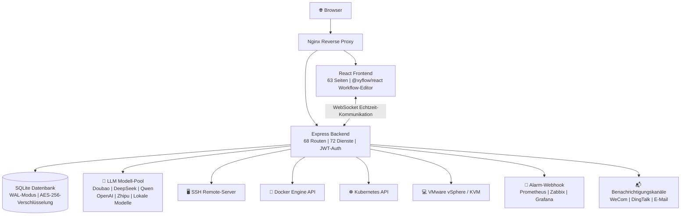

[English](README.en.md) | [中文](README.md) | [한국어](README.ko.md) | [日本語](README.ja.md) | [Deutsch](README.de.md) | [Français](README.fr.md)

***

**Wichtiger Hinweis zur Lizenzänderung (27.05.2026)**

Ab dem 27. Mai 2026 werden alle neu eingereichten Code-Beiträge dieses Projekts unter der **Mozilla Public License 2.0 (MPL-2.0)** als Open Source veröffentlicht. Dieses Projekt verbietet Closed-Source-Weiterentwicklung, Wiederverpackung zum Verkauf, SaaS-Kommerzialisierung und andere kommerzielle Nutzungen. Dauerhaft Open Source. Dieses Projekt gehört den Tausenden von Ingenieuren, die den Open-Source-Geist umarmen, nicht einem einzelnen Unternehmen.

***

<br />

<h1 align="center">⚡ ITOps Agent Platform</h1>
<p align="center">
  <strong>Enterprise-Grade AIOps-Automatisierungsplattform mit Multi-Agent-KI-Zusammenarbeit</strong>
  <br/>
  Open Source aus China · Alternative zu PagerDuty + Rundeck + Portainer + vCenter
  <br/>
  <em>Eine Plattform für den vollständigen Closed-Loop: Alarm → Diagnose → Reparatur → Genehmigung → Verifikation</em>
</p>

<p align="center">
  <a href="https://github.com/qinshihu/itops-agent-platform/actions/workflows/ci.yml"></a>
  <a href="https://github.com/qinshihu/itops-agent-platform/releases/latest"></a>
  <a href="LICENSE"></a>
  <a href="https://github.com/qinshihu/itops-agent-platform"></a>
  <a href="https://github.com/qinshihu/itops-agent-platform/issues"></a>
  <br/>
  <a href="https://gitee.com/IT_Oline/itops-agent-platform"></a>
  <a href="https://gitcode.com/gcw_IM7aAihp/itops-agent-platform"></a>
  <br/>
  
  
  
  
  
  <br/>
  
  
  
  
  <br/>
  <a href="https://star-history.com/#qinshihu/itops-agent-platform&Date">
    
  </a>
</p>

🎮 [Live-Demo](https://agentdemo-0mwug01t6.maozi.io/) &emsp;|&emsp; 📝[Vision & Gemeinschaft](项目愿景与社区共建.md) &emsp;|&emsp; 📝[KI-Programmier-Skill](SKILL.md) &emsp;|&emsp; 📝[Lehrbuch](https://aiopsdoc-0mwug01t6.maozi.io/book/) &emsp;|&emsp; 📖[Projektdokumentation](https://aiopsdoc-0mwug01t6.maozi.io/) &emsp;|&emsp; ✍️[Wort des Autors](https://mp.weixin.qq.com/s/NDqYrfqR0RZEvSESyVD2hg)

🌐 Offizielle Website: <https://www.zjzwfw.cloud/ITOpsAgentinfo>

📦 Code-Repositories: [GitHub](https://github.com/qinshihu/itops-agent-platform)  |  [Gitee](https://gitee.com/IT_Oline/itops-agent-platform)  |  [GitCode](https://gitcode.com/gcw_IM7aAihp/itops-agent-platform)

---------------------------------------------------------------


## 🎯 Wer nutzt es / Für wen ist es geeignet?

| Rolle | Typische Schmerzpunkte | Wie diese Plattform sie löst |
| ---------------- | --------------------------- | -------------------------- |
| **Betriebsingenieure** | Werden um Mitternacht von Alarmen geweckt, manuelles SSH-Troubleshooting | KI diagnostiziert automatisch die Ursache → sendet zur Genehmigung → One-Tap-Reparatur auf dem Handy |
| **SRE / DevOps** | Wechseln zwischen mehreren Tools, Informationssilos | One-Stop-Closed-Loop für Alarme + Diagnose + Ausführung + Genehmigung |
| **IT-Leiter / CTOs** | Betrieb hängt vollständig von Menschen ab, Störungsreaktion ist Glückssache | Automatisierte Inspektion + Selbstheilungsstrategien, befreien Menschen von repetitiver Arbeit |
| **KMU-IT-Teams** | Können kommerzielle Software wie PagerDuty/Rundeck nicht leisten | Funktionsgleichheit, Open Source und kostenlos, Daten verlassen die Domäne nicht |
| **Sicherheits- & Compliance-Teams** | Reparaturmaßnahmen ohne Genehmigung oder Audit-Trail | HITL-Menschen-Genehmigung + Full-Chain-Audit + Befehlssicherheitsfilterung |

***

## Warum brauchen Sie dieses Projekt?

3 Uhr morgens. Server-CPU schießt auf 99%. Der traditionelle Workflow ist:

```
Alarmbenachrichtigung → Aufwachen → VPN-Anmeldung → SSH-Verbindung → Befehle zur Fehlersuche → Dokumentation prüfen → Reparatur → Bericht schreiben → Weiterschlafen
```

**Der gesamte Prozess dauert 30-60 Minuten. Sie hätten weiter schlafen können.**

Die ITOps Agent Platform verwandelt dies in:

```
Alarm ausgelöst → KI diagnostiziert automatisch die Ursache → Reparaturbefehle generieren → Zur Genehmigung aufs Handy senden → One-Tap-Ausführung → Auto-Verifikation → Bericht generieren
```

**Der gesamte Prozess dauert 3 Minuten. Sie müssen nur auf „Genehmigen" tippen.**

***

## 🚀 Die ultimative Form des Betriebs: Von Automatisierung zu Autonomie

Die ITOps Agent Platform ist nicht nur ein Betriebstool. Sie zielt auf die **ultimative Evolution des IT-Betriebs** ab — vollständig autonome KI-Betriebsführung.

```
Manueller Betrieb  →  Skript-Automatisierung  →  Plattformisierung  →  KI-Unterstützung  →  🤖 Autonomer Betrieb (dieses Projekt)
 2000er        2010er        2020er       2024+         Jetzt & Zukunft
```

| Evolutionsstufe | Merkmale | Menschliche Rolle |
|---------|------|---------|
| Manueller Betrieb | Befehle eingeben, auf Server einloggen | Ausführender |
| Skript-Automatisierung | Shell / Python Semi-Automatisierung | Skript-Verwalter |
| Plattformisierung | Ansible / Prometheus / Terraform | Plattform-Bedienender |
| KI-Unterstützung | Copilot-Vorschläge, Alarmanalyse | Entscheidungsträger |
| **KI-autonomer Betrieb** | **KI-Agent Full-Loop: Wahrnehmen → Diagnostizieren → Entscheiden → Ausführen → Verifizieren** | **Aufsichtsperson** |

### Warum ist dies die ultimative Form?

| Dimension | Traditioneller Ansatz | ITOps Agent Platform |
|------|---------|---------------------|
| Störungsreaktion | Mensch: entdecken → lokalisieren → reparieren (30-60 Min) | KI: auto-wahrnehmen → diagnostizieren → reparieren (< 3 Min) |
| Betriebsmaßstab | 1 Person verwaltet 20-50 Knoten | **1 Person verwaltet 500+ Knoten, KI bearbeitet 80%+ der Arbeit** |
| Wissensbewahrung | Im Kopf erfahrener Ingenieure, verstreute Dokumente | **Wissensdatenbank + RAG, KI lernt kontinuierlich, geht nie verloren** |
| Entscheidungsqualität | Hängt von persönlicher Erfahrung ab, instabil | **Multi-Agent-kollaborative Schlussfolgerung, vollständige Reasoning-Chain auditierbar** |
| Grenzkosten | Maschinen hinzufügen ≈ Personal hinzufügen | **Maschinen hinzufügen ≈ Agenten hinzufügen, Grenzkosten nähern sich Null** |

> **Dies ist kein Betriebstool. Dies ist das Betriebssystem der nächsten Generation für den Betrieb.** Wenn KI-Agenten autonom die gesamte Kette von Alarm-Eingang, Ursachendiagnose, Reparatur-Entscheidung, Befehlsausführung und Ergebnisverifikation abschließen können, ist Betrieb nicht mehr „Menschen beobachten Systeme", sondern „Menschen entwerfen Strategien, KI führt Strategien aus."

### Branchentrends: KI-autonomer Betrieb ist eine unumkehrbare Richtung

- **Gartner** listet AIOps als strategischen IT-Betriebstechnologie-Trend auf und prognostiziert, dass KI-gesteuerte autonome Betriebsführung zum Unternehmensstandard wird
- **CNCF** Cloud-Native + KI-Konvergenz ist die Kernrichtung der nächsten Generation Infrastruktur
- Betriebsarbeitskosten steigen Jahr für Jahr. **KI-Agenten sind die einzige Lösung, die 10x Geschäftswachstum ohne Personalzunahme unterstützt**
- **Open Source + KI-Agent-Zusammenarbeit** ist der Schlüsselpfad zur Breche kommerzieller Software-Monopole und zur Realisierung technologischer Demokratisierung

### Unser Positionierung

**Die ITOps Agent Platform ist derzeit das einzige Open-Source-AIOps-Projekt, das die Full-Chain-KI-autonome Closed-Loop „Alarm → Diagnose → Entscheiden → Ausführen → Verifizieren" für die Produktion technisch umgesetzt hat.**

Langfristiges Ziel: 80% der täglichen Betriebsarbeit wird vollständig autonom von KI-Agenten erledigt, während menschliche Betriebsingenieure sich auf Architekturdesign, Strategieformulierung und innovative Arbeit konzentrieren. **Dies ist nicht nur ein Open-Source-Projekt. Dies ist der Ausgangspunkt der Befreiungsbewegung der Betriebsingenieure.**

---

## ⏰ Warum jetzt?

Drei Trends treffen zum gleichen Zeitpunkt aufeinander und verwandeln KI-autonomen Betrieb von „Konzept" zu „Unvermeidlichkeit":

| Trend | Erklärung |
|------|------|
| **LLM-Fähigkeit überschreitet die Schwelle** | GPT-4o / DeepSeek / Doubao / Qwen und andere Modelle verfügen nun über produktionsreife Reasoning-Fähigkeiten, geeignet für ernste Szenarien wie Fehlerdiagnose und Befehlsgenerierung |
| **Unumkehrbarer Anstieg der Betriebsarbeitskosten** | Unternehmens-IT skaliert 10x, Betriebsteams können nicht proportional expandieren. Der einzige Ausweg ist KI, die 80%+ der täglichen Arbeit bearbeitet |
| **Reifes Open-Source-Ökosystem** | Docker / K8s / React / TypeScript / Node.js-Stacks sind reif genug für Enterprise-Produkte. Open Source ist nicht mehr Synonym für „grob" |

> **2026 ist das Gründungsjahr des KI-autonomen Betriebs.** Wenn LLM-Fähigkeit + Betriebs-Schmerzpunkte + Open-Source-Ökosystem zusammentreffen, steht die ITOps Agent Platform an diesem historischen Knotenpunkt. Dieses Fenster zu verpassen, bedeutet, eine Ära zu verpassen.

---

### Ein 40-Milliarden-Dollar-Markt, dessen Regeln von KI neu geschrieben werden

Der globale IT-Betriebsmarkt beträgt **40 Milliarden Dollar (2025)** und wird voraussichtlich **2030 über 70 Milliarden Dollar überschreiten**. Jeder Paradigmenwechsel schafft neue Führungskräfte:

- Cloud-Computing-Shift → AWS (2 Billionen Dollar Marktkapitalisierung)
- Cloud-Monitoring-Shift → Datadog (40 Milliarden Dollar Marktkapitalisierung)
- Dev-Tools-Shift → GitLab (14 Milliarden Dollar IPO)
- **Betriebsautomatisierungs-Shift → ?**

> **Die Frage ist nicht „wird es passieren", sondern „wer wird das GitLab dieses Bereichs".** Die Open-Source-AIOps-Führungsposition ist derzeit vakant — dies ist ein Winner-takes-most-Markt.

| GitLab damals | ITOps Agent Platform heute |
|------------|--------------------------|
| Open-Source-Alternative zu GitHub | Open-Source-Alternative zu PagerDuty + Rundeck + Portainer |
| Anfangs nur grundlegende CI/CD | 12 KI-Agenten + 68 API-Routen |
| Niemand glaubte, dass Code-Hosting 10 Milliarden Dollar wert ist | **Niemand glaubt, dass eine Betriebsplattform 10 Milliarden Dollar wert ist** |

> Die ITOps Agent Platform steht in einem früheren Stadium eines größeren Marktes.

### Drei unumkehrbare Rückenwinde

| Rückenwind | Warum unumkehrbar |
|------|------------|
| **KI-Fähigkeits-Explosion** | LLM ging in nur 2 Jahren von „Spielzeug" zu „Produktionsreif". Der nächste Schritt ist „autonome Entscheidungsfindung" |
| **Betriebs-Talent-Lücke** | Welle der Pensionierung von Betriebsexperten der 70er + junge Leute wollen keinen 7×24 Bereitschaftsdienst = KI ist der einzige Ausweg |
| **Open Source frisst Enterprise-Software** | GitLab, Confluent, Grafana, HashiCorp — Open-Source-IPOs sind 5 Mal passiert, jedes Mal bewiesen, dass Open Source mehr kommerzielle Explosivkraft hat als Closed Source |

> **Dies ist keine Frage des Ob, sondern des Mit-Wem.** Wenn sich die oben genannten drei Kurven schneiden, ist KI-autonomer Betrieb eine mathematische Unvermeidlichkeit.

***


***

## Erleben Sie den vollständigen Closed-Loop in 5 Minuten

```bash
# 1. Einzeilige Befehlsbereitstellung (Docker-Umgebung erforderlich)
curl -sL https://gitee.com/IT_Oline/itops-agent-platform/raw/main/deploy.sh -o deploy.sh && chmod +x deploy.sh && ./deploy.sh

# 2. Browser öffnen unter http://localhost:8080, Standardkonto admin/admin
# 3. Server hinzufügen → System entdeckt automatisch Container und Ressourcen auf dem Host
# 4. Alarm-Webhook konfigurieren → Testalarm auslösen → KI-Auto-Analyse beobachten
# 5. „Auto-Reparatur" klicken → Mobile Genehmigung → Fertig!
```

**5 Minuten von Null zum vollständigen KI-Betriebs-Closed-Loop-Erlebnis.**

***

## Was kann diese Plattform tun?

### Pfad 1️⃣  Intelligenter Alarm → KI-Diagnose → Auto-Reparatur

```
Prometheus / Zabbix-Alarm → Webhook-Eingang
  → KI-Wurzelursachenanalyse (natürlichsprachlicher Diagnosebericht)
    → Auto-Generierung von Reparaturbefehlen + Risikobewertung
      → WeCom/DingTalk-Genehmigungs-Push → One-Tap-Genehmigung auf dem Handy
        → SSH-Auto-Ausführung → Ergebnisse verifizieren → Bericht generieren
```

<details>
<summary><b>Aufklappen, um zu sehen, welche Schmerzpunkte dieser Workflow löst</b></summary>

| Traditioneller Ansatz | Diese Plattform |
| -------------- | -------------------- |
| Alarm-Sturm, um Mitternacht geweckt | KI-Auto-Deduplizierung und Rauschunterdrückung, ähnliche Alarme aggregiert |
| Manuelles SSH-Troubleshooting, Raten nach Erfahrung | KI analysiert Logs + Metriken, gibt natürlichsprachliche Diagnose |
| In Dokumenten nach Reparatur-Schritten suchen | Strukturierte Reparaturbefehle (JSON) automatisch generieren |
| Keine Genehmigung für Reparatur, niemand übernimmt Verantwortung bei Vorfällen | Menschlicher Genehmigungsknoten, One-Tap-Genehmigung auf dem Handy |
| Befürchtung von Reparaturfehlern ohne Rollback | Auto-Verifikation der Ergebnisse, Fehlalarme |

</details>

### Pfad 2️⃣  Visueller Workflow → Geplante Auto-Inspektion

```
Drag-and-Drop-Workflow-Orchestrierung (Agent + Genehmigung + Bedingungszweige)
  → Cron-Zeitplan-Trigger konfigurieren
    → Auto-Ausführung der Multi-Server-Inspektion
      → Compliance-Prüfbericht generieren
        → Auto-Alarm bei Anomalien → Pfad 1️⃣ betreten
```

### Pfad 3️⃣  Container- & Virtualisierungs-Unified-Management

```
Ein-Klick-Hinzufügen von Docker-Host / VMware vCenter / Proxmox VE / KVM-Knoten
  → Auto-Entdeckung aller Container und VMs
    → Echtzeit-Überwachung von CPU / Speicher / Netzwerk (WebSocket-Push)
      → Container-Logs als Stream anzeigen
        → Docker Compose visuelle Orchestrierung
          → K8s-Cluster-Import und -Management (kubeconfig-Import + Cluster-Status-Überwachung)
            → Image-Registry-Integration (Harbor / ACR / Docker Hub)
```

### Pfad 4️⃣  Rechenzentrums- & Netzwerkinfrastruktur-Management

```
Netzwerkplanung → IP-Subnetz- und VLAN-Management → IP-Auto-Zuweisung / Reservierung / Rückgewinnung
  → Rechenzentrumsraum-Modellierung (Rack / PDU / Geräte-Lebenszyklus / Energiemanagement)
    → Raum-3D-Digital-Twin-Überwachung (WebGL-Echtzeit-Rendering)
      → Netzwerk-Topologie-Auto-Entdeckung (SNMP / LLDP / ARP)
```

***

## Worin unterscheidet es sich von ähnlichen Open-Source-Projekten?

| Fähigkeit | ITOps Agent | GrafanaOnCall | Portainer | UptimeKuma | Rundeck | Coolify |
| ----------------- | :---------: | :-----------: | :-------: | :--------: | :-----: | :-----: |
| Alarm-Eingang + Rauschunterdrückung | ✅ | ✅ | ❌ | ✅ | ❌ | ❌ |
| **KI Multi-Agent-Zusammenarbeit** | **✅** | ❌ | ❌ | ❌ | ❌ | ❌ |
| **Alarm → Auto-Reparatur-Closed-Loop** | **✅** | ❌ | ❌ | ❌ | ❌ | ❌ |
| **Human-in-the-Loop (HITL) Genehmigung** | **✅** | ❌ | ❌ | ❌ | ❌ | ❌ |
| Docker/VM-Visual-Management | ✅ | ❌ | ✅ | ❌ | ❌ | ✅ |
| K8s-Cluster-Management | ✅ | ❌ | ✅ | ❌ | ❌ | ❌ |
| IP-Subnetz / VLAN-Management | ✅ | ❌ | ❌ | ❌ | ❌ | ❌ |
| Rechenzentrumsraum-Modellierung | ✅ | ❌ | ❌ | ❌ | ❌ | ❌ |
| Raum-3D-Digital-Twin | ✅ | ❌ | ❌ | ❌ | ❌ | ❌ |
| Workflow Drag-and-Drop-Orchestrierung | ✅ | ✅ | ❌ | ❌ | ✅ | ❌ |
| Web SSH-Terminal | ✅ | ❌ | ✅ | ❌ | ❌ | ❌ |
| Wissensdatenbank + RAG | ✅ | ❌ | ❌ | ❌ | ❌ | ❌ |
| Geplante Inspektion + Auto-Bericht | ✅ | ❌ | ❌ | ❌ | ✅ | ❌ |
| Kostenanalyse + Auto-Scaling | ✅ | ❌ | ❌ | ❌ | ❌ | ❌ |
| **Lokale KI · Daten bleiben im Haus** | **✅** | ❌ | ❌ | ❌ | ❌ | ❌ |
| **Domestische Tech (Xinchuang) freundlich** | **✅** | ❌ | ❌ | ❌ | ❌ | ❌ |

> **Zusammenfassung in einem Satz**: Bestehende Open-Source-Tools verwalten jeweils ein Segment — OnCall für Alarme, Portainer für Container, Rundeck für Ausführung. ITOps Agent verbindet all dies, fügt ein **KI Multi-Agent-kollaboratives Gehirn** hinzu und erreicht echtes „Alarm kommt rein, Reparatur ist erledigt."

### vs Kommerzielle Lösungen

Kostenlos und Open Source zu sein ist nicht der einzige Vorteil. Direkter Vergleich mit kostenpflichtigen kommerziellen Produkten:

| Fähigkeit | PagerDuty + Rundeck | ServiceNow ITOM | **ITOps Agent (Open Source & Kostenlos)** |
|------|:---:|:---:|:---:|
| Jahreskosten (100 Knoten) | $50.000+ | $100.000+ | **$0** |
| KI-autonome Diagnose | ❌ Nur Alarm-Routing | ⚠️ Zusätzliche Module erforderlich | **✅ Multi-Agent-kollaborative Schlussfolgerung** |
| Auto-Reparatur-Closed-Loop | ❌ Manuelle Ausführung erforderlich | ⚠️ Benutzerdefinierte Entwicklung erforderlich | **✅ Integrierte Full-Chain** |
| Human-in-the-Loop (HITL) | ❌ | ⚠️ Anpassung erforderlich | **✅ Native WeCom/DingTalk-Push** |
| Container/VM/K8s-Management | ❌ | ❌ | **✅ Integrierte Visualisierung** |
| Daten bleiben im Haus | ❌ SaaS erzwingt Cloud | ❌ SaaS erzwingt Cloud | **✅ 100% On-Premise-Bereitstellung** |
| Open Source und kontrollierbar | ❌ Closed-Source-Lock-in | ❌ Closed-Source-Lock-in | **✅ MPL-2.0 Open Source** |
| Community-getrieben | ❌ | ❌ | **✅** |

> **Ein Open-Source-Projekt erreicht, was drei kommerzielle Produkte (PagerDuty + Rundeck + Portainer) zusammen nicht können.** Und es ist kostenlos.

***

## Architektur-Überblick



> 📐 [Vollständiges Architekturdiagramm ansehen →](./docs/ARCHITECTURE_DIAGRAM.md)

***

| Eintrittsbarriere | Erklärung |
|------|------|
| **12 Agent-kollaborative Planung** | Kein einzelner KI-API-Aufruf, sondern ein komplexes verteiltes System aus Multi-Agent-Arbeitsteilung + Zusammenarbeit + Schiedsrichter |
| **Full-Chain-Zustandsmaschine** | Alarm → Diagnose → Entscheidung → Genehmigung → Ausführung → Verifikation, 7-Knoten-Zustandsübergänge technisch umgesetzt und poliert |
| **Befehlssicherheits-Engine** | 7 Kategorien gefährlicher Befehlsrichtlinien + Rollen-Berechtigungsmatrix, sichert sichere Ausführung KI-generierter Befehle in der Produktion |
| **Multi-Modell-Degradationskette** | Automatisches Failover auf Backup-Modelle bei Primärmodell-Ausfall, sichert KI-Dienst-Hochverfügbarkeit, kein Single Point of Failure |
| **32-Versionen-Datenbank-Migrationen** | 32 Schema-Iterationen stabiler Evolution, Engineering-Reife weit über Demo-Level-Projekte hinaus |

### Skalierungsökonomie: Die kommerzielle Explosivkraft des Open-Source-Modells

| Metrik | Traditionelle Betriebs-SaaS | ITOps Agent Open-Source-Modell |
|------|:---:|:---:|
| Kundenakquisitionskosten | Vertriebsgetrieben, einzelner Unternehmenskunde $10.000+ | **≈ $0 (community-getrieben + Entwickler-Selbstverbreitung)** |
| Grenzservicekosten | Wachsen linear mit Benutzerzahl | **Nähern sich Null (Benutzer-Self-Hosting)** |
| Netzwerkeffekte | Schwach | **Stark (mehr Agenten → stärkere Plattform → größere Community)** |
| Ökosystem-Lock-in | Migrierbar bei Vertragsende | **Wissensdatenbank + Agent-Marktplatz + Workflow-Templates (tief gebunden)** |
| Kommerzialisierungsflexibilität | Kann nur Abonnements verkaufen | **Enterprise-Edition / Managed Cloud / Technischer Support / Agent-Marktplatz / Trainingszertifizierung** |

> Der Kernvorteil des Open-Source-Modells liegt in der Kundenakquisitionseffizienz und Skalierungsfähigkeit, validiert durch branchenübliche Open-Source-Projekte. Dies bietet eine solide Grundlage für die langfristige nachhaltige Entwicklung des Projekts.

## 🗺️ Zukunfts-Roadmap

| Phase | Kernziel |
|------|---------|
| **v3.x Engineering** (Aktuell) | Multi-Host Container/VM/K8s Unified-Management, Alarm → Reparatur Full-Chain-Closed-Loop |
| **v4.x Intelligenz** | Multi-Agent-autonome Verhandlungs-Entscheidungsfindung, Cross-System-Korrelationsanalyse, KI-Selbstlernstrategie-Optimierung |
| **v5.x Autonomie** | Zero-Human-Intervention autonomer Betrieb, KI-gesteuerte Kapazitätsplanung und Kostenoptimierung |
| **v6.x Ökosystem** | Agent-Marktplatz (Community-geteilte Agenten), Multi-Cluster-Föderation, Betriebs-Digital-Twin |

> **Die Roadmap ist nicht nur ein Zeitplan, sondern ein Versprechen für die Zukunft der Betriebsbranche.** Das Projekt wird kontinuierlich iterieren, jeder Schritt bewegt sich auf das ultimative Ziel „vollständig KI-autonomer Betrieb" zu.

***

## Kernfunktionen

### 🤖 KI-Intelligenter Betrieb

- **12 voreingestellte Agenten**: Alarmbehandlung, Fehlerdiagnose, Log-Analyse, Systeminspektion, Change-Ausführung, Dokumentengenerierung, Compliance-Prüfung, Befehlsausführung, Auto-Inspektion, Befehlsgenerierungs-Experte, Netzwerkinspektions-Experte, Datenbankbetrieb
- **KI-Reparatur-Closed-Loop**: Alarm → KI-Analyse → Reparaturbefehlsgenerierung → Genehmigung → Ausführung → Verifikation
- **Wurzelursachenanalyse**: KI-gesteuerte Alarmanalyse, natürlichsprachliche Diagnoseberichte, vollständige Reasoning-Chains
- **KI Copilot**: Natürlichsprachiger Betriebsassistent, erkennt Systemstatus automatisch
- **Wissensdatenbank + RAG**: 21 voreingestellte Wissenseinträge, semantische Suche injiziert LLM-Kontext

### 🔧 Visuelles Management

- **Workflow-Editor**: Drag-and-Drop-Orchestrierung, seriell/parallel/bedingte Verzweigungen, 10 voreingestellte Templates
- **Web SSH-Terminal**: xterm.js interaktives Terminal, Fenster-Auto-Resize, Sitzungsmanagement
- **Container-Management**: Multi-Host Docker-Visualisierung (Start/Stopp/Logs/Überwachung/Compose-Orchestrierung)
- **VM-Management**: VMware vSphere / Proxmox VE / KVM Multi-Plattform, Snapshot-Management, Live-Migration
- **K8s-Management**: kubeconfig Cluster-Import, Pod / Deployment / Service / Node Full-Lifecycle
- **Netzwerk-Management**: IP-Subnetz / VLAN-Planung, Auto-Generierung von IP-Adress-Pools, Zuweisung / Reservierung / Rückgewinnung, Batch-Operationen
- **Rechenzentrums-Management**: Raum-Rack-Modellierung, Geräte-Lebenszyklus-Tracking, PDU/UPS-Energiemanagement
- **Raum-3D-Überwachung**: Three.js WebGL Digital-Twin, Echtzeit-Gerätestatus-Visualisierung
- **Großbild-Dashboard**: Vollbild-NOC-Überwachungszentrum

### 🏢 Enterprise-Fähigkeiten

- **HITL-Genehmigung**: Workflow-Menschen-Genehmigungsknoten, WeCom/DingTalk-Push, Mobile-Genehmigung
- **Alarm-Rauschunterdrückung**: Intelligente Deduplizierung + Unterdrückung + Korrelationsanalyse
- **Auto-Scaling**: CPU/Speicher-Metrik-getrieben, Cooldown-Fenster, Scaling-Historie
- **Kostenanalyse**: Container/VM-Kostenschätzung + Optimierungsvorschläge
- **Geplante Aufgaben**: Cron-Ausdrücke, Auto-Ausführung spezifizierter Workflows
- **Berichtssystem**: Auto-Generierung von Markdown-Berichten

### 🔒 Sicherheit & Compliance

- **AES-256-GCM-Verschlüsselung**: Server-Passwörter, SSH-Schlüssel Bank-Grade-Verschlüsselung
- **JWT Dual-Token-Authentifizierung**: Access Token (24h) + Refresh Token (7d), Auto-Refresh
- **SSH-Befehlssicherheitsfilterung**: 7 Kategorien gefährlicher Befehlsrichtlinien (rm -rf / mkfs / iptables -F etc.), rollenbasierte Interzeption
- **Login-Schutz**: 5 Fehlversuche sperren für 30 Minuten, erzwungene Passwortkomplexität
- **Audit-Logs**: Volle Nachvollziehbarkeit aller Operationen
- **Non-root-Ausführung**: Docker-Container-Least-Privilege-Prinzip
- **Lokale KI**: Unterstützt Ollama / LM Studio / vLLM, Daten bleiben im Haus

***

## Unterstützte KI-Modelle

Verwaltet durch einen einheitlichen KI-Modell-Pool, unterstützt primäre/sekundäre Degradationsketten, unabhängige Circuit-Breaker für jeden Anbieter.

| Typ | Anbieter/Modell | Zugriffsmethode | Empfohlenes Szenario |
| -------- | ---------------------------------- | --------- | --------------- |
| **Inländische Cloud** | Volcano Engine · Doubao | Native API | Empfohlen für China, stabil und schnell |
| **Inländische Cloud** | Alibaba Cloud · Qwen | OpenAI-kompatibel | Enterprise-Anwendungen |
| **Inländische Cloud** | DeepSeek | OpenAI-kompatibel | Code-Generierung, Reasoning |
| **Inländische Cloud** | Zhipu AI (GLM-4) | OpenAI-kompatibel | Hervorragendes Chinesisch-Verständnis |
| **Inländische Cloud** | Moonshot · Kimi | OpenAI-kompatibel | Langtext-Verarbeitung |
| **Inländische Cloud** | Baidu · Wenxin Yiyan | OpenAI-kompatibel | Inländische Unternehmen |
| **Inländische Cloud** | 01.AI (Yi) / Baichuan | OpenAI-kompatibel | Open-Source-Modelle |
| **Internationale Cloud** | OpenAI (GPT-4o) / Anthropic Claude | Native API | Externe Netzwerkumgebungen |
| **Lokale Bereitstellung** | Ollama / LM Studio / vLLM | OpenAI-kompatibel | **Daten 100% im Haus** |

> ✅ Einheitliche Modell-Pool-Verwaltung ✅ Primäre/sekundäre Degradationskette ✅ Unabhängige Circuit-Breaker ✅ Drag-and-Drop-Sortierung ✅ Konnektivitätstest

***

## Schnellstart

### Option 1: Ein-Klick-Skript-Bereitstellung (Empfohlen)

```bash
# Linux/Mac
curl -sL https://gitee.com/IT_Oline/itops-agent-platform/raw/main/deploy.sh -o deploy.sh && chmod +x deploy.sh && ./deploy.sh

# Windows PowerShell
.\deploy.ps1
```

### Option 2: Docker Compose

```bash
cp .env.example .env
docker compose up -d --build
# Frontend: http://localhost:8080
# Health-Check: http://localhost:3001/health
```

### Option 3: Lokale Entwicklung (Hot Reload)

```bash
# Docker lokale Entwicklungsumgebung
cd local-dev
# Windows: .\start-dev.bat
# Linux/Mac: ./start-dev.sh

# Oder traditioneller Weg
npm run dev
# Frontend: http://localhost:3000
# Backend: http://localhost:3001
```

**Standard-Admin**: `admin` / `admin` (erzwungene Passwortänderung beim ersten Login)

***

## Tech-Stack

| Schicht | Technologie |
| ------ | ----------------------------------------------- |
| Frontend | React 18 + TypeScript + Vite 5 + Tailwind CSS 3 |
| Zustandsmanagement | Zustand + React Query |
| Workflow-Editor | @xyflow/react |
| Backend | Node.js + Express 4 + TypeScript |
| Datenbank | SQLite (better-sqlite3, WAL-Modus) |
| Echtzeit-Kommunikation | Socket.io 4 |
| Remote-Verbindung | SSH2 |
| Container-Operationen | Dockerode |
| Bereitstellung | Docker + Docker Compose + Nginx |

***

## Projektstruktur

```
├── backend/src/
│   ├── app.ts                    # Express-Einstieg
│   ├── routes/                   # 68 API-Routen-Module
│   ├── services/                 # 72 Geschäftsdienste
│   ├── models/                   # Datenbank + Migrationen (32 Versionen)
│   ├── presets/                  # Voreingestellte Daten (Agenten / Workflows / Wissensdatenbank etc.)
│   ├── middleware/               # 6 Middlewares (auth / rateLimiter / validation etc.)
│   ├── websocket/                # Socket.io Echtzeit-Kommunikation
│   └── utils/                    # Hilfsfunktionen
├── frontend/src/
│   ├── pages/                    # 63 Seiten-Komponenten
│   ├── components/               # Gemeinsame Komponenten (DataRoom3D / WorkflowEditor etc.)
│   ├── contexts/                 # React Context (Auth / Theme / Toast)
│   └── lib/                      # Axios-Wrapper / Hilfsbibliothek
├── docker/                       # Produktions-Docker-Konfig + Nginx
├── docs/                         # Technische Dokumentation
├── .github/workflows/            # CI/CD (ci.yml + release.yml)
├── docker-compose.yml            # Produktions-Orchestrierung
└── deploy.sh / deploy.ps1        # Ein-Klick-Bereitstellungsskripte
```

***

## Dokumentations-Navigation

| Dokument | Erklärung |
| --------------------------------------------- | --------- |
| [Bereitstellungshandbuch](./docs/DEPLOYMENT.md) | Detaillierte Bereitstellungsoperationen |
| [API-Dokumentation](./docs/API.md) | Vollständige API-Schnittstellen |
| [Architektur-Design](./docs/ARCHITECTURE.md) | Systemarchitektur-Erklärung |
| [Entwicklungsleitfaden](./docs/DEVELOPMENT.md) | Lokale Entwicklungsumgebung aufbauen |
| [Workflow-Leitfaden](./docs/WORKFLOW_GUIDE.md) | Workflow-Orchestrierungsnutzung |
| [Auto-Reparatur-Design](./docs/AUTO_REMEDIATION_DESIGN.md) | Alarm-Auto-Reparatur |
| [Netzwerkgerät-Inspektion](./docs/NETWORK_DEVICE_INSPECTION.md) | Netzwerkgerät-Funktionen |
| [Testleitfaden](./docs/TEST_GUIDE.md) | Funktionale Test-Erklärung |
| [Projektvision](./项目愿景与社区共建.md) | Vision und Gemeinschaftsaufbau |

***

## Autor

**Tan Ce** — Unabhängiger Entwickler | AIOps-Entdecker

- 🌐 Offizielle Website: [ITOpsAgentinfo](https://www.zjzwfw.cloud/ITOpsAgentinfo)
- 📝 Blog: [zjzwfw.cloud](https://www.zjzwfw.cloud/)
- 📧 E-Mail: <huawei_network@foxmail.com>
- 💬 WeChat-Offizieller-Account: **IT Online**

<p align="left">
  
</p>

***

## 🙏 Dank an Mitwirkende

| Avatar | Name / Benutzername | Rolle | Hauptbeitrag |
| :-----------------------------------------------------------------------------------------------------------------------: | :-----------------------------------------------: | :--------: | :----------- |
|  | **Engagierter Bürger Herr Gao** | WeChat-Mitwirkender | Test-Feedback |
|  | **@Lin** | WeChat-Mitwirkender | Test-Feedback |
|  | **Er Dongchen** | WeChat-Mitwirkender | Testen |
|  | **xiezhiliang89** | GitHub-Mitwirkender | Testen |

<a href="https://github.com/qinshihu/itops-agent-platform/graphs/contributors">
  
</a>

***

## 🌍 Gemeinschaftsvision: Dies ist nicht nur Code, es ist eine Bewegung

Die ITOps Agent Platform ist nicht nur ein Open-Source-Projekt. Sie ist eine **Befreiungsbewegung der Betriebsingenieure**.

Wir glauben:

- **Betrieb sollte keine 7×24 Bereitschaftskörperarbeit sein**, sondern Strategie-Design und Architektur-Innovation
- **KI sollte Betriebsingenieure nicht ersetzen**, sondern die repetitive Arbeit ersetzen, die Betriebsingenieure nicht tun wollen
- **Die Kraft der Open-Source-Community** kann bessere Produkte als kommerzielle Software bauen
- **Jeder Betriebsingenieur verdient es, aus dem Alarm-Sturm befreit zu werden**, Zeit mit der Familie zu verbringen, das zu verfolgen, was er wirklich liebt

> Wenn Sie auch glauben, dass die Zukunft des Betriebs KI-Autonomie ist, willkommen bei uns. **Ein Star ist die größte Anerkennung für das Projekt. Jedes Feedback auf Issues bringt diese Vision einen Schritt näher.**

---

## 🔭 Langfristige Vision

> **„Wir bauen das autonome Betriebssystem für den Betriebsbereich."**
>
> Weltweit verwalten 50 Millionen Betriebsingenieure 40 Milliarden Dollar IT-Infrastruktur. Heute stehen sie immer noch um 3 Uhr morgens auf, um Server manuell zu reparieren.
>
> Was wir tun, ist die Transformation des Betriebs von „Menschen bedienen Tools" zu „Menschen entwerfen Strategien, KI führt autonom aus". Dies ist keine Funktionsverbesserung, sondern ein Paradigmenwechsel.
>
> Das Projekt befindet sich in kontinuierlicher Iteration. Folgen Sie uns. Jeder Star ist eine Stimme für die Zukunft.

***

## 🤝 Mitwirken

Wir begrüßen Beiträge jeglicher Art!

- 🐛 [Bug melden](https://github.com/qinshihu/itops-agent-platform/issues/new?template=bug_report.yml)
- 💡 [Funktion vorschlagen](https://github.com/qinshihu/itops-agent-platform/issues/new?template=feature_request.yml)
- 📝 [Dokumentation verbessern](https://github.com/qinshihu/itops-agent-platform/issues/new?template=docs_update.yml)
- 🔒 [Sicherheitsproblem melden](SECURITY.md)

Details siehe [Mitwirkungsleitfaden](CONTRIBUTING.md).

***

## ⭐ Projekt unterstützen

Wenn dieses Projekt Ihnen geholfen hat, geben Sie uns bitte einen **Star** ⭐, damit mehr Menschen es sehen!

<p align="center">
  <a href="https://github.com/qinshihu/itops-agent-platform">
    
  </a>
  &nbsp;&nbsp;
  <a href="https://github.com/qinshihu/itops-agent-platform/fork">
    
  </a>
</p>

> 🌟 **Je mehr Stars, desto wahrscheinlicher wird das Projekt von GitHub Trending empfohlen, und desto mehr Entwickler werden sich dem gemeinsamen Aufbau anschließen. Jeder Star ist die größte Ermutigung für das Projekt!**

***

## 📄 Lizenz

[MPL-2.0](./LICENSE) © Tan Ce
