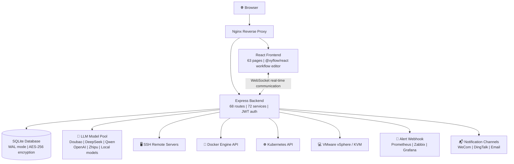

[English](README.en.md) | [中文](README.md) | [한국어](README.ko.md) | [日本語](README.ja.md) | [Deutsch](README.de.md) | [Français](README.fr.md)

***

**Important License Change Notice (2026-05-27)**

Effective May 27, 2026, all new code contributions to this project are licensed under the **Mozilla Public License 2.0 (MPL-2.0)**. This project prohibits closed-source secondary development, repackaging for sale, SaaS commercialization, and other commercial uses. Permanently open source. This project belongs to the thousands of engineers who embrace the open-source spirit, not to a single corporation.

***

<br />

<h1 align="center">⚡ ITOps Agent Platform</h1>
<p align="center">
  <strong>Enterprise-grade AIOps Automation Platform with Multi-Agent AI Collaboration</strong>
  <br/>
  Open Source from China · Alternative to PagerDuty + Rundeck + Portainer + vCenter
  <br/>
  <em>One platform for the full loop: Alert → Diagnose → Remediate → Approve → Verify</em>
</p>

<p align="center">
  <a href="https://github.com/qinshihu/itops-agent-platform/actions/workflows/ci.yml"></a>
  <a href="https://github.com/qinshihu/itops-agent-platform/releases/latest"></a>
  <a href="LICENSE"></a>
  <a href="https://github.com/qinshihu/itops-agent-platform"></a>
  <a href="https://github.com/qinshihu/itops-agent-platform/issues"></a>
  <br/>
  <a href="https://gitee.com/IT_Oline/itops-agent-platform"></a>
  <a href="https://gitcode.com/gcw_IM7aAihp/itops-agent-platform"></a>
  <br/>
  
  
  
  
  
  <br/>
  
  
  
  
  <br/>
  <a href="https://star-history.com/#qinshihu/itops-agent-platform&Date">
    
  </a>
</p>

🎮 [Live Demo](https://agentdemo-0mwug01t6.maozi.io/) &emsp;|&emsp; 📝[Vision & Community](项目愿景与社区共建.md) &emsp;|&emsp; 📝[AI Coding Skill](SKILL.md) &emsp;|&emsp; 📝[Documentation Book](https://aiopsdoc-0mwug01t6.maozi.io/book/) &emsp;|&emsp; 📖[Project Docs](https://aiopsdoc-0mwug01t6.maozi.io/) &emsp;|&emsp; ✍️[Author's Note](https://mp.weixin.qq.com/s/NDqYrfqR0RZEvSESyVD2hg)

🌐 Official Website: <https://www.zjzwfw.cloud/ITOpsAgentinfo>

📦 Repositories: [GitHub](https://github.com/qinshihu/itops-agent-platform)  |  [Gitee](https://gitee.com/IT_Oline/itops-agent-platform)  |  [GitCode](https://gitcode.com/gcw_IM7aAihp/itops-agent-platform)

---------------------------------------------------------------


## 🎯 Who Is Using / Who Should Use?

| Role | Typical Pain Points | How This Platform Solves Them |
| ---------------- | --------------------------- | -------------------------- |
| **Operations Engineers** | Woken up by alerts at midnight, manually SSH to troubleshoot | AI auto-diagnoses root cause → pushes for approval → one-tap fix on mobile |
| **SRE / DevOps** | Switching between multiple tools, information silos | One-stop closed loop for alerts + diagnosis + execution + approval |
| **IT Managers / CTOs** | Operations rely entirely on people, incident response is a gamble | Automated inspection + self-healing strategies, freeing people from repetitive work |
| **SMB IT Teams** | Can't afford commercial software like PagerDuty/Rundeck | Feature parity, open source and free, data stays on-premise |
| **Security & Compliance** | Remediation actions without approval or audit trail | HITL human approval + full-chain audit + command security filtering |

***

## Why Do You Need This Project?

It's 3 AM. Server CPU spikes to 99%. The traditional workflow is:

```
Alert notification → Get woken up → Log in to VPN → SSH into server → Run commands to troubleshoot → Check docs → Fix → Write report → Go back to sleep
```

**The whole process takes 30-60 minutes. You could have kept sleeping.**

ITOps Agent Platform transforms this into:

```
Alert triggered → AI auto-diagnoses root cause → Generates remediation commands → Pushes to mobile for approval → One-tap execution → Auto-verification → Report generated
```

**The entire process takes 3 minutes. You only need to tap "Approve" on your phone.**

***

## 🚀 The Ultimate Form of Operations: From Automation to Autonomy

ITOps Agent Platform is not just an operations tool. It targets the **ultimate evolution of IT operations** — AI fully autonomous operations.

```
Manual Ops  →  Script Automation  →  Platformization  →  AI Assisted  →  🤖 Autonomous Ops (This Project)
 2000s        2010s        2020s       2024+         Now & Future
```

| Evolution Stage | Characteristics | Human Role |
|---------|------|---------|
| Manual Ops | Type commands, log into servers | Executor |
| Script Automation | Shell / Python semi-automation | Script maintainer |
| Platformization | Ansible / Prometheus / Terraform | Platform operator |
| AI Assisted | Copilot suggestions, alert analysis | Decision maker |
| **AI Autonomous Ops** | **AI Agent full loop: Perceive → Diagnose → Decide → Execute → Verify** | **Supervisor** |

### Why Is This the Ultimate Form?

| Dimension | Traditional Approach | ITOps Agent Platform |
|------|---------|---------------------|
| Incident Response | Human: discover → locate → fix (30-60 min) | AI: auto-perceive → diagnose → fix (< 3 min) |
| Operations Scale | 1 person manages 20-50 nodes | **1 person manages 500+ nodes, AI handles 80%+ workload** |
| Knowledge Retention | In senior engineers' heads, scattered docs | **Knowledge base + RAG, AI continuously learns, never lost** |
| Decision Quality | Depends on personal experience, unstable | **Multi-Agent collaborative reasoning, full reasoning chain auditable** |
| Marginal Cost | Add machines ≈ add people | **Add machines ≈ add Agents, marginal cost approaches zero** |

> **This is not an operations tool. This is the next-generation operating system for operations.** When AI Agents can autonomously complete the full chain of alert ingestion, root cause diagnosis, remediation decision, command execution, and result verification, operations is no longer "people watching systems" but "people designing strategies, AI executing strategies."

### Industry Trends: AI Autonomous Operations Is an Irreversible Direction

- **Gartner** lists AIOps as a strategic IT operations technology trend, predicting AI-driven autonomous operations will become standard for enterprises
- **CNCF** cloud-native + AI convergence is the core direction of next-generation infrastructure
- Operations labor costs are rising year by year. **AI Agents are the only solution that can support 10x business growth without increasing headcount**
- **Open source + AI Agent collaboration** is the key path to breaking commercial software monopolies and achieving technology democratization

### Our Positioning

**ITOps Agent Platform is currently the only open-source AIOps project that has engineered the full-chain AI autonomous closed loop of "Alert → Diagnose → Decide → Execute → Verify" into production.**

Our long-term goal: Let 80% of daily operations work be fully completed by AI Agents autonomously, while human operations engineers focus on architecture design, strategy formulation, and innovative work. **This is not just an open-source project. This is the starting point of the operations engineers' liberation movement.**

---

## ⏰ Why Now?

Three trends converge at the same point in time, making AI autonomous operations transform from "concept" to "inevitability":

| Trend | Explanation |
|------|------|
| **LLM Capability Crosses the Threshold** | GPT-4o / DeepSeek / Doubao / Qwen and other models now have production-grade reasoning capabilities, suitable for serious scenarios like fault diagnosis and command generation |
| **Irreversible Rise in Operations Labor Costs** | Enterprise IT scales 10x, but operations teams cannot expand proportionally. The only way out is AI handling 80%+ of daily workload |
| **Mature Open Source Ecosystem** | Docker / K8s / React / TypeScript / Node.js stacks are mature enough to support enterprise-grade products. Open source is no longer synonymous with "crude" |

> **2026 is the inaugural year of AI autonomous operations.** When LLM capability + operations pain points + open source ecosystem converge, ITOps Agent Platform stands at this historical node. Missing this window means missing an era.

---

### A $40 Billion Market Being Rewritten by AI

The global IT operations market is **$40 billion (2025)**, expected to exceed **$70 billion by 2030**. Every paradigm shift creates new leaders:

- Cloud computing shift → AWS ($2 trillion market cap)
- Cloud monitoring shift → Datadog ($40 billion market cap)
- Dev tools shift → GitLab ($14 billion IPO)
- **Operations automation shift → ?**

> **The question is not "will it happen" but "who will become the GitLab of this space."** The open-source AIOps leader position is currently vacant — this is a winner-takes-most market.

| GitLab Back Then | ITOps Agent Platform Today |
|------------|--------------------------|
| Open source alternative to GitHub | Open source alternative to PagerDuty + Rundeck + Portainer |
| Initially only basic CI/CD | 12 AI Agents + 68 API routes |
| No one believed code hosting was worth $10 billion | **No one believes an operations platform is worth $10 billion** |

> ITOps Agent Platform stands at an earlier stage of a larger market.

### Three Irreversible Tailwinds

| Tailwind | Why It's Irreversible |
|------|------------|
| **AI Capability Explosion** | LLM went from "toy" to "production-grade" in just 2 years. Next step is "autonomous decision-making" |
| **Operations Talent Gap** | Wave of 70s-generation ops experts retiring + young people unwilling to do 7×24 on-call = AI is the only way out |
| **Open Source Eating Enterprise Software** | GitLab, Confluent, Grafana, HashiCorp — open source IPOs have happened 5 times, each proving open source has more commercial explosive power than closed source |

> **This is not a choice of whether to do it, but who to do it with.** When the above three curves intersect, AI autonomous operations is a mathematical inevitability.

***


***

## Experience the Full Loop in 5 Minutes

```bash
# 1. One-line deployment (requires Docker)
curl -sL https://gitee.com/IT_Oline/itops-agent-platform/raw/main/deploy.sh -o deploy.sh && chmod +x deploy.sh && ./deploy.sh

# 2. Open browser at http://localhost:8080, default account admin/admin
# 3. Add a server → System auto-discovers containers and resources on the host
# 4. Configure alert Webhook → Trigger a test alert → Watch AI auto-analysis
# 5. Click "Auto Remediate" → Mobile approval → Done!
```

**5 minutes, from zero to a complete AI operations closed-loop experience.**

***

## What Can This Platform Do?

### Path 1️⃣  Intelligent Alert → AI Diagnosis → Auto Remediation

```
Prometheus / Zabbix alert → Webhook ingestion
  → AI root cause analysis (natural language diagnosis report)
    → Auto-generate remediation commands + risk assessment
      → WeCom/DingTalk push for approval → One-tap approval on mobile
        → SSH auto-execution → Verify results → Generate report
```

<details>
<summary><b>Expand to see what pain points this workflow solves</b></summary>

| Traditional Approach | This Platform |
| -------------- | -------------------- |
| Alert storm, woken up at midnight | AI auto-deduplication and noise reduction, similar alerts aggregated |
| Manual SSH troubleshooting, guessing by experience | AI analyzes logs + metrics, gives natural language diagnosis |
| Check docs for remediation steps | Auto-generates structured remediation commands (JSON) |
| No approval for remediation, no one takes responsibility | Human approval node, one-tap approval on mobile |
| Worried about remediation errors with no rollback | Auto-verification of results, failure alerts |

</details>

### Path 2️⃣  Visual Workflow → Scheduled Auto Inspection

```
Drag-and-drop workflow orchestration (Agent + Approval + Conditional branches)
  → Configure Cron scheduled trigger
    → Auto-execute multi-server inspection
      → Generate compliance check report
        → Auto-create alert for anomalies → Enter Path 1️⃣
```

### Path 3️⃣  Container & Virtualization Unified Management

```
One-click add Docker host / VMware vCenter / Proxmox VE / KVM node
  → Auto-discover all containers and VMs
    → Real-time monitor CPU / Memory / Network (WebSocket push)
      → Stream container logs
        → Docker Compose visual orchestration
          → K8s cluster import and management (kubeconfig import + cluster status monitoring)
            → Image registry integration (Harbor / ACR / Docker Hub)
```

### Path 4️⃣  Data Center & Network Infrastructure Management

```
Network planning → IP subnet and VLAN management → IP auto-allocation / reservation / reclamation
  → Data center room modeling (rack / PDU / device lifecycle / power management)
    → Room 3D digital twin monitoring (WebGL real-time rendering)
      → Network topology auto-discovery (SNMP / LLDP / ARP)
```

***

## How Is It Different from Similar Open Source Projects?

| Capability | ITOps Agent | GrafanaOnCall | Portainer | UptimeKuma | Rundeck | Coolify |
| ----------------- | :---------: | :-----------: | :-------: | :--------: | :-----: | :-----: |
| Alert ingestion + noise reduction | ✅ | ✅ | ❌ | ✅ | ❌ | ❌ |
| **AI Multi-Agent Collaboration** | **✅** | ❌ | ❌ | ❌ | ❌ | ❌ |
| **Alert → Auto-remediation closed loop** | **✅** | ❌ | ❌ | ❌ | ❌ | ❌ |
| **Human-in-the-loop (HITL) Approval** | **✅** | ❌ | ❌ | ❌ | ❌ | ❌ |
| Docker/VM visual management | ✅ | ❌ | ✅ | ❌ | ❌ | ✅ |
| K8s cluster management | ✅ | ❌ | ✅ | ❌ | ❌ | ❌ |
| IP subnet / VLAN management | ✅ | ❌ | ❌ | ❌ | ❌ | ❌ |
| Data center room modeling | ✅ | ❌ | ❌ | ❌ | ❌ | ❌ |
| Room 3D digital twin | ✅ | ❌ | ❌ | ❌ | ❌ | ❌ |
| Workflow drag-and-drop orchestration | ✅ | ✅ | ❌ | ❌ | ✅ | ❌ |
| Web SSH terminal | ✅ | ❌ | ✅ | ❌ | ❌ | ❌ |
| Knowledge base + RAG | ✅ | ❌ | ❌ | ❌ | ❌ | ❌ |
| Scheduled inspection + auto-report | ✅ | ❌ | ❌ | ❌ | ✅ | ❌ |
| Cost analysis + auto-scaling | ✅ | ❌ | ❌ | ❌ | ❌ | ❌ |
| **Local AI · Data stays on-premise** | **✅** | ❌ | ❌ | ❌ | ❌ | ❌ |
| **Domestic tech (Xinchuang) friendly** | **✅** | ❌ | ❌ | ❌ | ❌ | ❌ |

> **One-sentence summary**: Existing open-source tools each manage one segment — OnCall for alerts, Portainer for containers, Rundeck for execution. ITOps Agent connects all of this, adds an **AI multi-Agent collaborative brain**, and achieves true "alert comes in, remediation is done."

### vs Commercial Solutions

Being free and open source is not the only advantage. Head-to-head comparison with paid commercial products:

| Capability | PagerDuty + Rundeck | ServiceNow ITOM | **ITOps Agent (Open Source Free)** |
|------|:---:|:---:|:---:|
| Annual cost (100 nodes) | $50,000+ | $100,000+ | **$0** |
| AI autonomous diagnosis | ❌ Alert routing only | ⚠️ Requires additional modules | **✅ Multi-Agent collaborative reasoning** |
| Auto-remediation closed loop | ❌ Requires manual execution | ⚠️ Requires custom development | **✅ Built-in full chain** |
| Human-in-the-loop (HITL) | ❌ | ⚠️ Requires customization | **✅ Native WeCom/DingTalk push** |
| Container/VM/K8s management | ❌ | ❌ | **✅ Built-in visualization** |
| Data stays on-premise | ❌ SaaS forced cloud | ❌ SaaS forced cloud | **✅ 100% on-premise deployment** |
| Open source and controllable | ❌ Closed source lock-in | ❌ Closed source lock-in | **✅ MPL-2.0 open source** |
| Community driven | ❌ | ❌ | **✅** |

> **One open-source project achieves what three commercial products (PagerDuty + Rundeck + Portainer) combined cannot do.** And it's free.

***

## Architecture Overview



> 📐 [View full architecture diagram →](./docs/ARCHITECTURE_DIAGRAM.md)

***

| Barrier | Explanation |
|------|------|
| **12 Agent collaborative scheduling** | Not a single AI API call, but a complex distributed system of multi-Agent division of labor + collaboration + arbitration |
| **Full-chain state machine** | Alert → Diagnose → Decide → Approve → Execute → Verify, 7-node state transitions engineered and polished |
| **Command security engine** | 7 categories of dangerous command policies + role permission matrix, ensuring AI-generated commands execute safely in production |
| **Multi-model degradation chain** | Automatic failover to backup models when primary model fails, ensuring AI service high availability, no single point of failure |
| **32-version database migrations** | 32 schema iterations of stable evolution, engineering maturity far beyond demo-level projects |

### Scale Economics: The Commercial Explosive Power of Open Source

| Metric | Traditional Operations SaaS | ITOps Agent Open Source Model |
|------|:---:|:---:|
| Customer acquisition cost | Sales-driven, single enterprise customer $10,000+ | **≈ $0 (community-driven + developer self-propagation)** |
| Marginal service cost | Grows linearly with user count | **Approaches zero (user self-hosted)** |
| Network effects | Weak | **Strong (more Agents → stronger platform → larger community)** |
| Ecosystem lock-in | Movable when contract expires | **Knowledge base + Agent marketplace + workflow templates (deeply bound)** |
| Commercialization flexibility | Can only sell subscriptions | **Enterprise edition / managed cloud / tech support / Agent marketplace / training certification** |

> The core advantage of the open-source model lies in customer acquisition efficiency and scaling capability, validated by mainstream open-source projects in the industry. This provides a solid foundation for the project's long-term sustainable development.

## 🗺️ Future Roadmap

| Phase | Core Goal |
|------|---------|
| **v3.x Engineering** (Current) | Multi-host container/VM/K8s unified management, alert → remediation full-chain closed loop |
| **v4.x Intelligence** | Multi-Agent autonomous negotiation and decision-making, cross-system correlation analysis, AI self-learning strategy optimization |
| **v5.x Autonomy** | Zero human intervention autonomous operations, AI-driven capacity planning and cost optimization |
| **v6.x Ecosystem** | Agent marketplace (community-shared Agents), multi-cluster federation, operations digital twin |

> **The roadmap is not just a timeline; it is a commitment to the future of the operations industry.** The project will continue to iterate, with each step advancing toward the ultimate goal of "fully AI autonomous operations."

***

## Core Features

### 🤖 AI Intelligent Operations

- **12 preset Agents**: Alert handling, fault diagnosis, log analysis, system inspection, change execution, document generation, compliance checking, command execution, auto-inspection, command generation expert, network inspection expert, database operations
- **AI remediation closed loop**: Alert → AI analysis → remediation command generation → approval → execution → verification
- **Root cause analysis**: AI-driven alert analysis, natural language diagnosis reports, full reasoning chains
- **AI Copilot**: Natural language operations assistant, automatically senses system status
- **Knowledge base + RAG**: 21 preset knowledge entries, semantic retrieval injects LLM context

### 🔧 Visual Management

- **Workflow editor**: Drag-and-drop orchestration, serial/parallel/conditional branches, 10 preset templates
- **Web SSH terminal**: xterm.js interactive terminal, window auto-resize, session management
- **Container management**: Multi-host Docker visualization (start/stop/logs/monitoring/Compose orchestration)
- **VM management**: VMware vSphere / Proxmox VE / KVM multi-platform, snapshot management, live migration
- **K8s management**: kubeconfig cluster import, Pod / Deployment / Service / Node full lifecycle
- **Network management**: IP subnet / VLAN planning, auto-generate IP address pools, allocation / reservation / reclamation, batch operations
- **Data center management**: Room rack modeling, device lifecycle tracking, PDU/UPS power management
- **Room 3D monitoring**: Three.js WebGL digital twin, real-time device status visualization
- **Large screen dashboard**: Full-screen NOC monitoring center

### 🏢 Enterprise-grade Capabilities

- **HITL approval**: Workflow human approval nodes, WeCom/DingTalk push, mobile approval
- **Alert noise reduction**: Intelligent deduplication + suppression + correlation analysis
- **Auto-scaling**: CPU/memory metric-driven, cooldown windows, scaling history
- **Cost analysis**: Container/VM cost estimation + optimization suggestions
- **Scheduled tasks**: Cron expressions, auto-execute specified workflows
- **Reporting system**: Auto-generate Markdown reports

### 🔒 Security & Compliance

- **AES-256-GCM encryption**: Server passwords, SSH keys bank-grade encryption
- **JWT dual-token authentication**: Access Token (24h) + Refresh Token (7d), auto-refresh
- **SSH command security filtering**: 7 categories of dangerous command policies (rm -rf / mkfs / iptables -F etc.), intercepted by role
- **Login protection**: 5 failed attempts lock for 30 minutes, mandatory password complexity
- **Audit logs**: Full operation traceability
- **Non-root execution**: Docker container least privilege principle
- **Local AI**: Supports Ollama / LM Studio / vLLM, data stays on-premise

***

## Supported AI Models

Managed through a unified AI model pool, supports primary/backup degradation chains, independent circuit breakers for each provider.

| Type | Provider/Model | Access Method | Recommended Scenario |
| -------- | ---------------------------------- | --------- | --------------- |
| **Domestic Cloud** | Volcano Engine · Doubao | Native API | Recommended for China, stable and fast |
| **Domestic Cloud** | Alibaba Cloud · Qwen | OpenAI compatible | Enterprise applications |
| **Domestic Cloud** | DeepSeek | OpenAI compatible | Code generation, reasoning |
| **Domestic Cloud** | Zhipu AI (GLM-4) | OpenAI compatible | Excellent Chinese comprehension |
| **Domestic Cloud** | Moonshot · Kimi | OpenAI compatible | Long text processing |
| **Domestic Cloud** | Baidu · Wenxin Yiyan | OpenAI compatible | Domestic enterprises |
| **Domestic Cloud** | 01.AI (Yi) / Baichuan | OpenAI compatible | Open source models |
| **International Cloud** | OpenAI (GPT-4o) / Anthropic Claude | Native API | External network environments |
| **Local Deployment** | Ollama / LM Studio / vLLM | OpenAI compatible | **Data 100% stays on-premise** |

> ✅ Unified model pool management ✅ Primary/backup degradation chain ✅ Independent circuit breakers ✅ Drag-and-drop sorting ✅ Connectivity test

***

## Quick Start

### Option 1: One-click Script Deployment (Recommended)

```bash
# Linux/Mac
curl -sL https://gitee.com/IT_Oline/itops-agent-platform/raw/main/deploy.sh -o deploy.sh && chmod +x deploy.sh && ./deploy.sh

# Windows PowerShell
.\deploy.ps1
```

### Option 2: Docker Compose

```bash
cp .env.example .env
docker compose up -d --build
# Frontend: http://localhost:8080
# Health check: http://localhost:3001/health
```

### Option 3: Local Development (Hot Reload)

```bash
# Docker local development environment
cd local-dev
# Windows: .\start-dev.bat
# Linux/Mac: ./start-dev.sh

# Or traditional way
npm run dev
# Frontend: http://localhost:3000
# Backend: http://localhost:3001
```

**Default admin**: `admin` / `admin` (forced password change on first login)

***

## Tech Stack

| Layer | Technology |
| ------ | ----------------------------------------------- |
| Frontend | React 18 + TypeScript + Vite 5 + Tailwind CSS 3 |
| State Management | Zustand + React Query |
| Workflow Editor | @xyflow/react |
| Backend | Node.js + Express 4 + TypeScript |
| Database | SQLite (better-sqlite3, WAL mode) |
| Real-time Communication | Socket.io 4 |
| Remote Connection | SSH2 |
| Container Operations | Dockerode |
| Deployment | Docker + Docker Compose + Nginx |

***

## Project Structure

```
├── backend/src/
│   ├── app.ts                    # Express entry
│   ├── routes/                   # 68 API route modules
│   ├── services/                 # 72 business services
│   ├── models/                   # Database + migrations (32 versions)
│   ├── presets/                  # Preset data (Agents / workflows / knowledge base etc.)
│   ├── middleware/               # 6 middlewares (auth / rateLimiter / validation etc.)
│   ├── websocket/                # Socket.io real-time communication
│   └── utils/                    # Utility functions
├── frontend/src/
│   ├── pages/                    # 63 page components
│   ├── components/               # Common components (DataRoom3D / WorkflowEditor etc.)
│   ├── contexts/                 # React Context (Auth / Theme / Toast)
│   └── lib/                      # Axios wrapper / utility library
├── docker/                       # Production Docker config + Nginx
├── docs/                         # Technical documentation
├── .github/workflows/            # CI/CD (ci.yml + release.yml)
├── docker-compose.yml            # Production orchestration
└── deploy.sh / deploy.ps1        # One-click deployment scripts
```

***

## Documentation Navigation

| Document | Explanation |
| --------------------------------------------- | --------- |
| [Deployment Guide](./docs/DEPLOYMENT.md) | Detailed deployment operations |
| [API Docs](./docs/API.md) | Complete API interfaces |
| [Architecture Design](./docs/ARCHITECTURE.md) | System architecture explanation |
| [Development Guide](./docs/DEVELOPMENT.md) | Local development setup |
| [Workflow Guide](./docs/WORKFLOW_GUIDE.md) | Workflow orchestration usage |
| [Auto-remediation Design](./docs/AUTO_REMEDIATION_DESIGN.md) | Alert auto-remediation |
| [Network Device Inspection](./docs/NETWORK_DEVICE_INSPECTION.md) | Network device features |
| [Test Guide](./docs/TEST_GUIDE.md) | Functional testing explanation |
| [Project Vision](./项目愿景与社区共建.md) | Vision and community building |

***

## Author

**Tan Ce** — Independent Developer | AIOps Explorer

- 🌐 Official Website: [ITOpsAgentinfo](https://www.zjzwfw.cloud/ITOpsAgentinfo)
- 📝 Blog: [zjzwfw.cloud](https://www.zjzwfw.cloud/)
- 📧 Email: <huawei_network@foxmail.com>
- 💬 WeChat Official Account: **IT Online**

<p align="left">
  
</p>

***

## 🙏 Acknowledging Contributors

| Avatar | Name / Username | Role | Main Contribution |
| :-----------------------------------------------------------------------------------------------------------------------: | :-----------------------------------------------: | :--------: | :----------- |
|  | **Mr. Gao (Enthusiastic Citizen)** | WeChat Contributor | Testing feedback |
|  | **@Lin** | WeChat Contributor | Testing feedback |
|  | **Er Dongchen** | WeChat Contributor | Testing |
|  | **xiezhiliang89** | GitHub Contributor | Testing |

<a href="https://github.com/qinshihu/itops-agent-platform/graphs/contributors">
  
</a>

***

## 🌍 Community Vision: This Is Not Just Code, It's a Movement

ITOps Agent Platform is not just an open-source project. It is an **Operations Engineers' Liberation Movement**.

We believe:

- **Operations should not be 7×24 manual labor**, but strategy design and architecture innovation
- **AI should not replace operations engineers**, but should replace the repetitive work that operations engineers don't want to do
- **The power of the open-source community** can build better products than commercial software
- **Every operations engineer deserves to be freed from the alert storm**, to spend time with family, to pursue what they truly love

> If you also believe that the future of operations is AI autonomy, welcome to join us. **A Star is the greatest recognition of the project. Every feedback on Issues brings this vision one step closer.**

---

## 🔭 Long-term Vision

> **"We are building the autonomous operating system for the operations domain."**
>
> 50 million operations engineers worldwide manage $40 billion of IT infrastructure. Today, they are still getting up at 3 AM to manually fix servers.
>
> What we are doing is transforming operations from "people operating tools" to "people designing strategies, AI autonomously executing." This is not a feature enhancement; it is a paradigm shift.
>
> The project is under continuous iteration. Welcome to follow. Every Star is a vote for the future.

***

## 🤝 Contributing

We welcome contributions of any kind!

- 🐛 [Submit a Bug](https://github.com/qinshihu/itops-agent-platform/issues/new?template=bug_report.yml)
- 💡 [Request a Feature](https://github.com/qinshihu/itops-agent-platform/issues/new?template=feature_request.yml)
- 📝 [Improve Documentation](https://github.com/qinshihu/itops-agent-platform/issues/new?template=docs_update.yml)
- 🔒 [Report a Security Issue](SECURITY.md)

See [Contributing Guide](CONTRIBUTING.md) for details.

***

## ⭐ Support the Project

If this project has helped you, please give us a **Star** ⭐ to let more people see it!

<p align="center">
  <a href="https://github.com/qinshihu/itops-agent-platform">
    
  </a>
  &nbsp;&nbsp;
  <a href="https://github.com/qinshihu/itops-agent-platform/fork">
    
  </a>
</p>

> 🌟 **More Stars make the project more likely to be recommended by GitHub Trending, and also attract more developers to join the co-building. Every Star is the greatest encouragement for the project!**

***

## 📄 License

[MPL-2.0](./LICENSE) © Tan Ce
