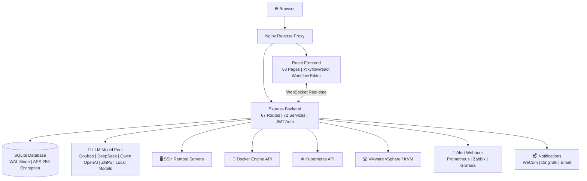

[English](README.en.md) | [中文](README.md)

---

**Important License Change Notice (2026-05-27)**

Effective May 27, 2026, all new code submissions are open-sourced under the **Mozilla Public License 2.0 (MPL-2.0)**. Code submitted before 16:00, May 27, 2026 remains under the original MIT license. Closed-source derivative works, packaged sales, and SaaS operations are prohibited. This project is permanently open-source.

👤 Author: Tan Ce | IT Online

---

<br/>

<h1 align="center">⚡ ITOps Agent Platform</h1>
<p align="center">
  <strong>AI Multi-Agent Enterprise IT Operations Automation</strong>
  <br/>
  Open-Source · Alternative to PagerDuty + Rundeck + Portainer + vCenter
  <br/>
  <em>Alert → Diagnose → Remediate → Approve → Verify — All in One Platform</em>
</p>

<p align="center">
  <a href="https://github.com/qinshihu/itops-agent-platform/actions/workflows/ci.yml"></a>
  <a href="https://github.com/qinshihu/itops-agent-platform/releases/latest"></a>
  <a href="LICENSE"></a>
  <a href="https://github.com/qinshihu/itops-agent-platform"></a>
  <a href="https://github.com/qinshihu/itops-agent-platform/issues"></a>
  <br/>
  
  
  
  
  
  <br/>
  
  
  
  
  <br/>
  <a href="https://star-history.com/#qinshihu/itops-agent-platform&Date">
    
  </a>
</p>

📝 [Project Vision](项目愿景与社区共建.md) &nbsp;|&nbsp; 📖 [Documentation](https://aiopsdoc-0mwug01t6.maozi.io/) &nbsp;|&nbsp; 🎮 [Live Demo](https://agentdemo-0mwug01t6.maozi.io/)

🌐 Website: <https://www.zjzwfw.cloud/ITOpsAgentinfo>

---

## 🎯 Who's This For?

| Role | Pain Point | How This Platform Solves It |
|------|-----------|---------------------------|
| **Ops Engineer** | Woken up at 3 AM by alerts, manual SSH troubleshooting | AI auto-diagnoses root cause → approval push → one-tap fix |
| **SRE / DevOps** | Switching between multiple tools, siloed information | Alert + Diagnose + Execute + Approve in one platform |
| **IT Manager / CTO** | Ops fully dependent on people, incident response is luck-based | Automated inspection + self-healing, free humans from repetitive work |
| **SMB IT Teams** | Can't afford PagerDuty / Rundeck licenses | Feature parity, open-source, data stays on-prem |
| **Security & Compliance** | No approval or audit trail for remediation actions | HITL approval + full audit + command safety filtering |

---

## Why This Project Exists

It's 3 AM. Your server CPU just spiked to 99%. The traditional flow:

```
Alert → Wake up → VPN login → SSH in → Run diagnostic commands → Search docs → Fix → Write report → Go back to bed
```

**30-60 minutes, and you could have been sleeping.**

ITOps Agent Platform transforms this into:

```
Alert triggers → AI auto-diagnoses root cause → Generates remediation commands → Pushes to phone for approval → One-tap execute → Auto-verify → Report generated
```

**3 minutes. All you do is tap "Approve" on your phone.**

---


---

## 5 Minutes to Full AIOps Experience

```bash
# 1. Deploy with one command (Docker required)
curl -sL https://gitee.com/IT_Online/itops-agent-platform/raw/main/deploy.sh -o deploy.sh && chmod +x deploy.sh && ./deploy.sh

# 2. Open http://localhost:8080, login with admin/admin
# 3. Add a server → auto-discovers containers and resources on the host
# 4. Configure alert webhook → trigger a test alert → watch AI auto-analyze
# 5. Click "Auto Remediate" → approve on phone → Done!
```

**5 minutes from zero to a complete AI-powered IT operations loop.**

---

## What Can This Platform Do?

### Path 1 &nbsp; Smart Alerts → AI Diagnosis → Auto Remediation

```
Prometheus / Zabbix Alert → Webhook Ingest
  → AI Root Cause Analysis (natural language diagnosis report)
    → Auto-generate remediation commands + risk assessment
      → Push to WeCom/DingTalk for approval → one-tap on phone
        → SSH auto-execute remediation → verify result → generate report
```

<details>
<summary><b>Expand to see pain points solved</b></summary>

| Traditional Way | This Platform |
|----------------|---------------|
| Alert storms, woken up at night | AI auto dedup & suppress, aggregate related alerts |
| Manual SSH troubleshooting, guesswork | AI analyzes logs + metrics, gives natural language diagnosis |
| Search docs for fix steps | Auto-generate structured remediation commands (JSON) |
| No approval for fixes, no accountability | Human approval node, mobile one-tap approve |
| Worry about breaking things, no rollback | Auto verify results, alert on failure |

</details>

### Path 2 &nbsp; Visual Workflow → Scheduled Auto Inspection

```
Drag-and-drop workflow (Agent + Approval + Conditional branches)
  → Configure Cron trigger
    → Auto-execute multi-server inspection
      → Generate compliance check report
        → Anomalies auto-create alerts → enter Path 1
```

### Path 3 &nbsp; Unified Container & Virtualization Management

```
Add Docker Host / VMware vCenter / KVM Node with one click
  → Auto-discover all containers and VMs
    → Real-time CPU / Memory / Network monitoring (WebSocket push)
      → Streaming container log viewer
        → Docker Compose visual orchestration
          → Image registry integration (Harbor / ACR / Docker Hub)
```

---

## How Is This Different From Other Open-Source Tools?

| Capability | ITOps Agent | Grafana<br/>OnCall | Portainer | Uptime<br/>Kuma | Rundeck | Coolify |
|------|:---------:|:---------:|:---------:|:-----------:|:-------:|:-------:|
| Alert Ingestion + Noise Reduction | ✅ | ✅ | ❌ | ✅ | ❌ | ❌ |
| **AI Multi-Agent Collaboration** | **✅** | ❌ | ❌ | ❌ | ❌ | ❌ |
| **Alert → Auto-Remediation Loop** | **✅** | ❌ | ❌ | ❌ | ❌ | ❌ |
| **Human-in-the-Loop (HITL)** | **✅** | ❌ | ❌ | ❌ | ❌ | ❌ |
| Docker/VM Visualization | ✅ | ❌ | ✅ | ❌ | ❌ | ✅ |
| K8s Cluster Management | ✅ | ❌ | ✅ | ❌ | ❌ | ❌ |
| Drag-and-Drop Workflow | ✅ | ✅ | ❌ | ❌ | ✅ | ❌ |
| Web SSH Terminal | ✅ | ❌ | ✅ | ❌ | ❌ | ❌ |
| Knowledge Base + RAG | ✅ | ❌ | ❌ | ❌ | ❌ | ❌ |
| Scheduled Inspection + Reports | ✅ | ❌ | ❌ | ❌ | ✅ | ❌ |
| Cost Analysis + Auto-Scaling | ✅ | ❌ | ❌ | ❌ | ❌ | ❌ |
| **Local AI · Data Never Leaves** | **✅** | ❌ | ❌ | ❌ | ❌ | ❌ |
| **China Cloud & LLM Friendly** | **✅** | ❌ | ❌ | ❌ | ❌ | ❌ |

> **In a nutshell**: Existing tools each handle one piece — OnCall for alerts, Portainer for containers, Rundeck for execution. ITOps Agent connects them all with an **AI Multi-Agent brain**, delivering true "alert in, fix done."

---

## Architecture Overview



> 📐 [View Full Architecture Diagram →](./docs/ARCHITECTURE_DIAGRAM.md)

---

## Core Features

### 🤖 AI-Powered Operations

- **12 Preset Agents**: Alert handling, fault diagnosis, log analysis, system inspection, change execution, doc generation, compliance checks, command execution, auto inspection, command generation expert, network inspection expert, database ops
- **AI Remediation Loop**: Alert → AI analysis → remediation command generation → approval → execution → verification
- **Root Cause Analysis**: AI-driven alert analysis, natural language diagnosis reports, complete reasoning chain
- **AI Copilot**: Natural language ops assistant with automatic system state awareness
- **Knowledge Base + RAG**: 21 preset entries, semantic retrieval injected into LLM context

### 🔧 Visual Management

- **Workflow Editor**: Drag-and-drop orchestration, serial/parallel/conditional branches, 10 preset templates
- **Web SSH Terminal**: xterm.js interactive terminal, window auto-resize, session management
- **Container Management**: Docker visualization (start/stop/logs/monitor/Compose)
- **VM Management**: VMware vSphere / KVM support, snapshot management, live migration
- **K8s Management**: Pod / Deployment / Service / Node full lifecycle
- **Big Screen Dashboard**: Full-screen NOC monitoring center

### 🏢 Enterprise Capabilities

- **HITL Approval**: Human approval nodes, WeCom/DingTalk push, mobile approval
- **Alert Noise Reduction**: Smart dedup + suppression + correlation analysis
- **Auto Scaling**: CPU/memory metric-driven, cooldown windows, scaling history
- **Cost Analysis**: Container/VM cost estimation + optimization recommendations
- **Scheduled Tasks**: Cron expressions, auto-execute workflows
- **Report System**: Auto-generated Markdown reports

### 🔒 Security & Compliance

- **AES-256-GCM Encryption**: Bank-level encryption for server passwords and SSH keys
- **JWT Dual-Token Auth**: Access Token (24h) + Refresh Token (7d), auto-refresh
- **SSH Command Filter**: 7 categories of dangerous command policies, role-based blocking
- **Login Protection**: 5 failures lock for 30 minutes, enforced password complexity
- **Audit Trail**: Full operation traceability
- **Non-Root Execution**: Docker containers with least privilege
- **On-Premise AI**: Ollama / LM Studio / vLLM support, 100% data sovereignty

---

## Supported AI Models

Unified AI model pool with primary-backup fallback chains and per-provider circuit breakers.

| Type | Provider/Model | Integration | Best For |
|------|---------------|-------------|----------|
| **China Cloud** | VolcEngine · Doubao | Native API | Recommended for China users |
| **China Cloud** | Alibaba Cloud · Qwen | OpenAI Compatible | Enterprise apps |
| **China Cloud** | DeepSeek | OpenAI Compatible | Code generation, reasoning |
| **China Cloud** | ZhiPu AI (GLM-4) | OpenAI Compatible | Chinese language excellence |
| **China Cloud** | Moonshot · Kimi | OpenAI Compatible | Long text processing |
| **China Cloud** | Baidu · Wenxin | OpenAI Compatible | Enterprise apps |
| **China Cloud** | 01.AI (Yi) / Baichuan | OpenAI Compatible | Open-source models |
| **Global Cloud** | OpenAI (GPT-4o) / Anthropic Claude | Native API | External network access |
| **On-Premise** | Ollama / LM Studio / vLLM | OpenAI Compatible | **100% data sovereignty** |

> ✅ Unified pool &nbsp; ✅ Fallback chains &nbsp; ✅ Circuit breakers &nbsp; ✅ Drag-to-prioritize &nbsp; ✅ Connectivity tests

---

## Quick Start

### Option 1: One-Click Script (Recommended)

```bash
# Linux/Mac
curl -sL https://gitee.com/IT_Online/itops-agent-platform/raw/main/deploy.sh -o deploy.sh && chmod +x deploy.sh && ./deploy.sh

# Windows PowerShell
.\deploy.ps1
```

### Option 2: Docker Compose

```bash
cp .env.example .env
docker compose up -d --build
# Frontend: http://localhost:8080
# Health: http://localhost:3001/health
```

### Option 3: Local Dev (Hot Reload)

```bash
# Docker dev environment
cd local-dev
# Windows: .\start-dev.bat
# Linux/Mac: ./start-dev.sh

# Or traditional
npm run dev
# Frontend: http://localhost:3000
# Backend: http://localhost:3001
```

**Default Admin**: `admin` / `admin` (forced password change on first login)

---

## Tech Stack

| Layer | Technology |
|-------|------------|
| Frontend | React 18 + TypeScript + Vite 5 + Tailwind CSS 3 |
| State | Zustand + React Query |
| Workflow Editor | @xyflow/react |
| Backend | Node.js + Express 4 + TypeScript |
| Database | SQLite (better-sqlite3, WAL mode) |
| Real-time | Socket.io 4 |
| Remote | SSH2 |
| Container Ops | Dockerode |
| Deployment | Docker + Docker Compose + Nginx |

---

## Project Structure

```
├── backend/src/
│   ├── app.ts                    # Express entry
│   ├── routes/                   # 67 API route modules
│   ├── services/                 # 72 business services
│   ├── models/                   # Database + migrations (32 versions)
│   ├── middleware/               # 6 middleware (auth / rateLimiter / validation etc.)
│   ├── websocket/                # Socket.io real-time
│   └── utils/                    # Utilities
├── frontend/src/
│   ├── pages/                    # 63 page components
│   ├── components/               # Shared components
│   ├── contexts/                 # React Context (Auth / Theme / Toast)
│   └── lib/                      # Axios wrapper / utilities
├── docker/                       # Production Docker config + Nginx
├── docs/                         # Technical documentation
├── .github/workflows/            # CI/CD (ci.yml + release.yml)
├── docker-compose.yml            # Production orchestration
└── deploy.sh / deploy.ps1        # One-click deploy scripts
```

---

## Documentation

| Document | Description |
|----------|-------------|
| [Deployment Guide](./docs/DEPLOYMENT.md) | Detailed deployment |
| [API Reference](./docs/API.md) | Complete API docs |
| [Architecture](./docs/ARCHITECTURE.md) | System design |
| [Development Guide](./docs/DEVELOPMENT.md) | Local setup |
| [Workflow Guide](./docs/WORKFLOW_GUIDE.md) | Workflow usage |
| [Auto Remediation](./docs/AUTO_REMEDIATION_DESIGN.md) | Alert auto-remediation |
| [Network Inspection](./docs/NETWORK_DEVICE_INSPECTION.md) | Network features |
| [Test Guide](./docs/TEST_GUIDE.md) | Testing guide |
| [Project Vision](./项目愿景与社区共建.md) | Vision & community |

---

## Author

**Tan Ce** — Independent Developer | AIOps Explorer

- 🌐 Official Website: [ITOpsAgentinfo](https://www.zjzwfw.cloud/ITOpsAgentinfo)
- 📝 Blog: [zjzwfw.cloud](https://www.zjzwfw.cloud/)
- 📧 Email: <huawei_network@foxmail.com>
- 💬 WeChat Official Account: **IT Online**

<p align="left">
  
</p>

---

## 🙏 Contributors

| Avatar | Name / Username | Role | Contributions |
|:---:|:---:|:---:|:---|
|  | **Tan Ce** ([@qinshihu](https://github.com/qinshihu)) | Author | Architecture, core dev, docs |
|  | **热心市民高先生** | WeChat Contributor | Testing & feedback |
|  | **@林** | WeChat Contributor | Testing & feedback |
|  | **尔东辰** | WeChat Contributor | Testing |
|  | **xiezhiliang89** | GitHub Contributor | Testing |

<a href="https://github.com/qinshihu/itops-agent-platform/graphs/contributors">
  
</a>

---

## 🤝 Contributing

We welcome contributions of all kinds!

- 🐛 [Report Bug](https://github.com/qinshihu/itops-agent-platform/issues/new?template=bug_report.yml)
- 💡 [Request Feature](https://github.com/qinshihu/itops-agent-platform/issues/new?template=feature_request.yml)
- 📝 [Improve Docs](https://github.com/qinshihu/itops-agent-platform/issues/new?template=docs_update.yml)
- 🔒 [Report Security](SECURITY.md)

See [Contributing Guide](CONTRIBUTING.md) for details.

---

## ⭐ Support the Project

If this project helps you, give us a **Star** ⭐ to help more people discover it!

<p align="center">
  <a href="https://github.com/qinshihu/itops-agent-platform">
    
  </a>
  &nbsp;&nbsp;
  <a href="https://github.com/qinshihu/itops-agent-platform/fork">
    
  </a>
</p>

> 🌟 **More stars → higher chance on GitHub Trending → more contributors join. Every single star means the world to us!**

---

## 📄 License

[MPL-2.0](./LICENSE) © Tan Ce
