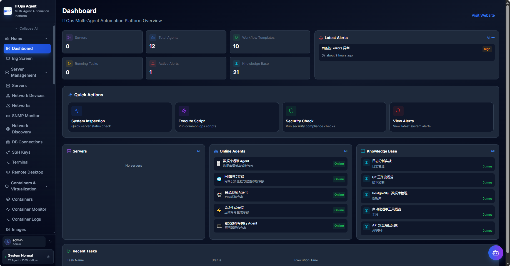
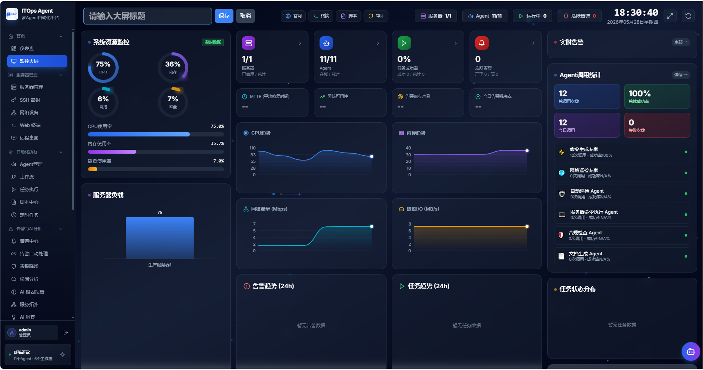
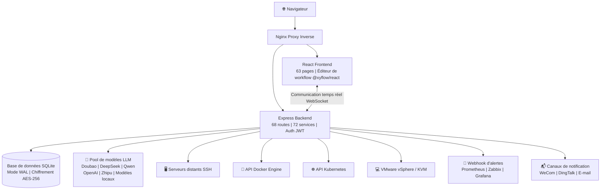

[English](README.en.md) | [中文](README.md) | [한국어](README.ko.md) | [日本語](README.ja.md) | [Deutsch](README.de.md) | [Français](README.fr.md)

***

**Avis important de changement de licence (27-05-2026)**

À compter du 27 mai 2026, toutes les nouvelles contributions de code à ce projet sont publiées sous la licence **Mozilla Public License 2.0 (MPL-2.0)**. Ce projet interdit le développement secondaire en source fermée, la revente sous forme de package, la commercialisation SaaS et autres usages commerciaux. Open source permanent. Ce projet appartient aux milliers d'ingénieurs qui embrassent l'esprit open source, et non à une seule entreprise.

***

<br />

<h1 align="center">⚡ ITOps Agent Platform</h1>
<p align="center">
  <strong>Plateforme d'automatisation des opérations d'entreprise avec collaboration multi-agents IA</strong>
  <br/>
  Open source chinois · Alternative à PagerDuty + Rundeck + Portainer + vCenter
  <br/>
  <em>Une plateforme pour la boucle fermée complète : Alerte → Diagnostic → Réparation → Approbation → Vérification</em>
</p>

<p align="center">
  <a href="https://github.com/qinshihu/itops-agent-platform/actions/workflows/ci.yml"></a>
  <a href="https://github.com/qinshihu/itops-agent-platform/releases/latest"></a>
  <a href="LICENSE"></a>
  <a href="https://github.com/qinshihu/itops-agent-platform"></a>
  <a href="https://github.com/qinshihu/itops-agent-platform/issues"></a>
  <br/>
  <a href="https://gitee.com/IT_Oline/itops-agent-platform"></a>
  <a href="https://gitcode.com/gcw_IM7aAihp/itops-agent-platform"></a>
  <br/>
  
  
  
  
  
  <br/>
  
  
  
  
  <br/>
  <a href="https://star-history.com/#qinshihu/itops-agent-platform&Date">
    
  </a>
</p>

🎮 [Démo en ligne](https://agentdemo-0mwug01t6.maozi.io/) &emsp;|&emsp; 📝[Vision et communauté](项目愿景与社区共建.md) &emsp;|&emsp; 📝[Skill de programmation IA](SKILL.md) &emsp;|&emsp; 📝[Livre pédagogique](https://aiopsdoc-0mwug01t6.maozi.io/book/) &emsp;|&emsp; 📖[Documentation du projet](https://aiopsdoc-0mwug01t6.maozi.io/) &emsp;|&emsp; ✍️[Mot de l'auteur](https://mp.weixin.qq.com/s/NDqYrfqR0RZEvSESyVD2hg)

🌐 Site officiel : <https://www.zjzwfw.cloud/ITOpsAgentinfo>

📦 Dépôts de code : [GitHub](https://github.com/qinshihu/itops-agent-platform)  |  [Gitee](https://gitee.com/IT_Oline/itops-agent-platform)  |  [GitCode](https://gitcode.com/gcw_IM7aAihp/itops-agent-platform)

---------------------------------------------------------------


## 🎯 Qui l'utilise / À qui est-il destiné ?

| Rôle | Points de douleur typiques | Comment cette plateforme les résout |
| ---------------- | --------------------------- | -------------------------- |
| **Ingénieurs d'exploitation** | Réveillés par des alertes à minuit, dépannage SSH manuel | L'IA diagnostique automatiquement la cause racine → pousse pour approbation → réparation en un clic sur mobile |
| **SRE / DevOps** | Alternance entre plusieurs outils, silos d'information | Boucle fermée tout-en-un pour alertes + diagnostic + exécution + approbation |
| **Responsables IT / CTO** | L'exploitation repose entièrement sur les personnes, la réponse aux incidents est aléatoire | Inspection automatisée + stratégies d'auto-guérison, libérant les personnes du travail répétitif |
| **IT des PME** | Ne peuvent pas se permettre des logiciels commerciaux comme PagerDuty/Rundeck | Parité fonctionnelle, open source et gratuit, les données ne quittent pas le domaine |
| **Équipes sécurité et conformité** | Opérations de réparation sans approbation ou piste d'audit | Approbation humaine HITL + audit chaîne complète + filtrage de sécurité des commandes |

***

## Pourquoi avez-vous besoin de ce projet ?

3 heures du matin. Le CPU du serveur grimpe à 99 %. Le flux traditionnel est :

```
Notification d'alerte → Se réveiller → Connexion VPN → SSH sur le serveur → Commandes de diagnostic → Consulter la documentation → Réparer → Rédiger un rapport → Retour au lit
```

**Tout le processus prend 30-60 minutes. Vous auriez pu continuer à dormir.**

La plateforme ITOps Agent transforme cela en :

```
Alerte déclenchée → L'IA diagnostique automatiquement la cause racine → Génère les commandes de réparation → Pousse vers le mobile pour approbation → Exécution en un clic → Vérification automatique → Rapport généré
```

**L'ensemble prend 3 minutes. Vous n'avez qu'à approuver sur votre téléphone.**

***

## 🚀 La forme ultime de l'exploitation : De l'automatisation à l'autonomie

La plateforme ITOps Agent n'est pas qu'un outil d'exploitation. Elle vise la **direction évolutive ultime de l'exploitation IT** — l'exploitation entièrement autonome par IA.

```
Exploitation manuelle  →  Automatisation par scripts  →  Plateformisation  →  Assistance IA  →  🤖 Exploitation autonome (ce projet)
 Années 2000        Années 2010        Années 2020       2024+         Maintenant & Avenir
```

| Étape d'évolution | Caractéristiques | Rôle humain |
|---------|------|---------|
| Exploitation manuelle | Saisie de commandes, connexion aux serveurs | Exécutant |
| Automatisation par scripts | Shell / Python semi-automatisation | Mainteneur de scripts |
| Plateformisation | Ansible / Prometheus / Terraform | Opérateur de plateforme |
| Assistance IA | Suggestions Copilot, analyse d'alertes | Décideur |
| **Exploitation autonome IA** | **Boucle fermée complète Agent IA : Percevoir → Diagnostiquer → Décider → Exécuter → Vérifier** | **Superviseur** |

### Pourquoi est-ce la forme ultime ?

| Dimension | Approche traditionnelle | Plateforme ITOps Agent |
|------|---------|---------------------|
| Réponse aux incidents | Humain : découvrir → localiser → réparer (30-60 min) | IA : auto-percevoir → diagnostiquer → réparer (< 3 min) |
| Échelle d'exploitation | 1 personne gère 20-50 nœuds | **1 personne gère 500+ nœuds, l'IA gère 80%+ de la charge** |
| Rétention des connaissances | Dans la tête des ingénieurs seniors, docs dispersées | **Base de connaissances + RAG, l'IA apprend en continu, jamais perdu** |
| Qualité des décisions | Dépend de l'expérience personnelle, instable | **Raisonnement collaboratif multi-agents, chaîne de raisonnement complète auditable** |
| Coût marginal | Ajouter des machines ≈ ajouter du personnel | **Ajouter des machines ≈ ajouter des agents, coût marginal tend vers zéro** |

> **Ce n'est pas un outil d'exploitation. C'est le système d'exploitation de nouvelle génération pour l'exploitation.** Quand les agents IA peuvent achever de manière autonome la chaîne complète de réception d'alertes, diagnostic de la cause racine, décision de réparation, exécution de commandes et vérification des résultats, l'exploitation n'est plus « des personnes surveillant des systèmes » mais « des personnes concevant des stratégies, l'IA exécutant les stratégies ».

### Tendances sectorielles : L'exploitation autonome par IA est une direction irréversible

- **Gartner** classe l'AIOps comme une tendance technologique stratégique de l'exploitation IT, prédisant que l'exploitation autonome pilotée par IA deviendra la norme pour les entreprises
- **CNCF** Cloud-Native + Convergence IA est la direction centrale de l'infrastructure de nouvelle génération
- Les coûts de main-d'œuvre d'exploitation augmentent chaque année. **Les agents IA sont la seule solution permettant une croissance d'échelle 10× sans augmentation des effectifs**
- **Open source + Collaboration d'agents IA** est la voie clé pour briser les monopoles des logiciels commerciaux et réaliser la démocratisation technologique

### Notre positionnement

**La plateforme ITOps Agent est actuellement le seul projet open source AIOps qui a mis en œuvre de manière technique la boucle fermée autonome par IA complète « Alerte → Diagnostic → Décider → Exécuter → Vérifier » en production.**

Notre objectif à long terme : Laisser 80 % du travail d'exploitation quotidien être entièrement accompli de manière autonome par des agents IA, tandis que les ingénieurs d'exploitation humains se concentrent sur la conception d'architecture, la formulation de stratégies et le travail innovant. **Ce n'est pas seulement un projet open source. C'est le point de départ du mouvement de libération des ingénieurs d'exploitation.**

---

## ⏰ Pourquoi maintenant ?

Trois tendances convergent au même moment, transformant l'exploitation autonome par IA de « concept » à « inévitable » :

| Tendance | Explication |
|------|------|
| **Les capacités des LLM franchissent le seuil** | GPT-4o / DeepSeek / Doubao / Qwen et autres modèles disposent désormais de capacités de raisonnement de niveau production, adaptées à des scénarios sérieux comme le diagnostic de pannes et la génération de commandes |
| **Hausse irréversible des coûts de main-d'œuvre d'exploitation** | L'échelle IT de l'entreprise croît 10×, les équipes d'exploitation ne peuvent pas s'étendre proportionnellement. La seule issue est l'IA gérant 80 %+ du travail quotidien |
| **Écosystème open source suffisamment mature** | Les stacks Docker / K8s / React / TypeScript / Node.js sont assez matures pour supporter des produits d'entreprise. L'open source n'est plus synonyme de « rudimentaire » |

> **2026 est l'année inaugurale de l'exploitation autonome par IA.** Quand les capacités des LLM + les points de douleur de l'exploitation + l'écosystème open source convergent, la plateforme ITOps Agent se tient à ce nœud historique. Manquer cette fenêtre, c'est manquer une ère.

---

### Un marché de 40 milliards de dollars, dont les règles sont réécrites par l'IA

Le marché mondial de l'exploitation IT est de **40 milliards de dollars (2025)**, et devrait dépasser **70 milliards de dollars d'ici 2030**. Chaque changement de paradigme crée de nouveaux leaders :

- Migration vers le cloud → AWS (capitalisation de 2 000 milliards $)
- Monitoring cloud → Datadog (capitalisation de 40 milliards $)
- Outils de développement → GitLab (IPO de 14 milliards $)
- **Automatisation de l'exploitation → ?**

> **La question n'est pas « est-ce que cela arrivera » mais « qui deviendra le GitLab de ce domaine ».** La position de leader open source AIOps est actuellement vacante — c'est un marché où le gagnant prend presque tout.

| GitLab à l'époque | Plateforme ITOps Agent aujourd'hui |
|------------|--------------------------|
| Alternative open source à GitHub | Alternative open source à PagerDuty + Rundeck + Portainer |
| Au début, seulement CI/CD de base | 12 agents IA + 68 routes API |
| Personne ne croyait que l'hébergement de code valait 10 milliards $ | **Personne ne croit qu'une plateforme d'exploitation vaut 10 milliards $** |

> La plateforme ITOps Agent se trouve à une étape plus précoce d'un marché plus vaste.

### Trois vents arrière irréversibles

| Vent arrière | Pourquoi est-il irréversible |
|------|------------|
| **Explosion des capacités IA** | Les LLM sont passés de « jouets » à « niveau production » en seulement 2 ans. La prochaine étape est la « prise de décision autonome » |
| **Fracture des talents d'exploitation** | Vague de départ à la retraite des experts d'exploitation nés dans les années 70 + les jeunes ne veulent pas faire de garde 7×24 = l'IA est la seule issue |
| **L'open source dévore les logiciels d'entreprise** | GitLab, Confluent, Grafana, HashiCorp — les IPO open source se sont produites 5 fois, prouvant à chaque fois que l'open source a plus de pouvoir explosif commercial que le source fermé |

> **Ce n'est pas une question de faire ou non, mais de avec qui le faire.** Quand les trois courbes ci-dessus se croisent, l'exploitation autonome par IA est une inévitabilité mathématique.

***






***

## Expérimentez la boucle fermée complète en 5 minutes

```bash
# 1. Déploiement en une ligne de commande (nécessite Docker)
curl -sL https://gitee.com/IT_Oline/itops-agent-platform/raw/main/deploy.sh -o deploy.sh && chmod +x deploy.sh && ./deploy.sh

# 2. Ouvrir le navigateur à http://localhost:8080, compte par défaut admin/admin
# 3. Ajouter un serveur → Le système découvre automatiquement les conteneurs et ressources sur l'hôte
# 4. Configurer le Webhook d'alerte → Déclencher une alerte de test → Observer l'analyse auto de l'IA
# 5. Cliquer sur « Réparation automatique » → Approbation mobile → Terminé !
```

**5 minutes, de zéro à l'expérience complète de la boucle fermée d'exploitation par IA.**

***

## Que peut faire cette plateforme ?

### Chemin 1️⃣  Alerte intelligente → Diagnostic IA → Réparation automatique

```
Alerte Prometheus / Zabbix → Réception Webhook
  → Analyse de la cause racine par IA (rapport de diagnostic en langage naturel)
    → Génération automatique des commandes de réparation + évaluation des risques
      → Push d'approbation WeCom/DingTalk → Approbation en un clic sur mobile
        → Exécution automatique SSH → Vérification des résultats → Génération du rapport
```

<details>
<summary><b>Déplier pour voir les points de douleur résolus par ce flux</b></summary>

| Approche traditionnelle | Cette plateforme |
| -------------- | -------------------- |
| Tempête d'alertes, réveillé à minuit | Déduplication et réduction du bruit auto par IA, alertes similaires agrégées |
| Dépannage SSH manuel, deviner par l'expérience | L'IA analyse les logs + métriques, fournit un diagnostic en langage naturel |
| Chercher les étapes de réparation dans la documentation | Génération automatique de commandes de réparation structurées (JSON) |
| Pas d'approbation pour la réparation, personne ne prend la responsabilité en cas d'incident | Nœud d'approbation humaine, approbation en un clic sur mobile |
| Crainte d'erreurs de réparation sans rollback | Vérification automatique des résultats, alertes en cas d'échec |

</details>

### Chemin 2️⃣  Workflow visuel → Inspection automatique planifiée

```
Orchestration de workflow par glisser-déposer (Agent + Approbation + Branches conditionnelles)
  → Configurer le déclencheur planifié Cron
    → Exécution automatique de l'inspection multi-serveurs
      → Génération du rapport de vérification de conformité
        → Création automatique d'alerte pour anomalies → Entrer dans le chemin 1️⃣
```

### Chemin 3️⃣  Gestion unifiée des conteneurs et de la virtualisation

```
Ajout en un clic d'hôte Docker / VMware vCenter / Proxmox VE / Nœud KVM
  → Découverte automatique de tous les conteneurs et VMs
    → Surveillance en temps réel du CPU / Mémoire / Réseau (push WebSocket)
      → Visualisation des logs de conteneurs en streaming
        → Orchestration visuelle Docker Compose
          → Import et gestion de cluster K8s (import kubeconfig + surveillance de l'état du cluster)
            → Intégration de registre d'images (Harbor / ACR / Docker Hub)
```

### Chemin 4️⃣  Gestion des centres de données et de l'infrastructure réseau

```
Planification réseau → Gestion des sous-réseaux IP et VLAN → Attribution / Réservation / Récupération automatique d'IP
  → Modélisation de la salle du centre de données (rack / PDU / cycle de vie des équipements / gestion de l'alimentation)
    → Surveillance du jumeau numérique 3D de la salle (rendu en temps réel WebGL)
      → Découverte automatique de la topologie réseau (SNMP / LLDP / ARP)
```

***

## En quoi est-il différent des projets open source similaires ?

| Capacité | ITOps Agent | GrafanaOnCall | Portainer | UptimeKuma | Rundeck | Coolify |
| ----------------- | :---------: | :-----------: | :-------: | :--------: | :-----: | :-----: |
| Réception d'alertes + réduction du bruit | ✅ | ✅ | ❌ | ✅ | ❌ | ❌ |
| **Collaboration multi-agents IA** | **✅** | ❌ | ❌ | ❌ | ❌ | ❌ |
| **Boucle fermée Alerte → Réparation automatique** | **✅** | ❌ | ❌ | ❌ | ❌ | ❌ |
| **Approbation avec intervention humaine (HITL)** | **✅** | ❌ | ❌ | ❌ | ❌ | ❌ |
| Gestion visuelle Docker/VM | ✅ | ❌ | ✅ | ❌ | ❌ | ✅ |
| Gestion de cluster K8s | ✅ | ❌ | ✅ | ❌ | ❌ | ❌ |
| Gestion des sous-réseaux IP / VLAN | ✅ | ❌ | ❌ | ❌ | ❌ | ❌ |
| Modélisation de la salle du centre de données | ✅ | ❌ | ❌ | ❌ | ❌ | ❌ |
| Jumeau numérique 3D de la salle | ✅ | ❌ | ❌ | ❌ | ❌ | ❌ |
| Orchestration de workflow par glisser-déposer | ✅ | ✅ | ❌ | ❌ | ✅ | ❌ |
| Terminal Web SSH | ✅ | ❌ | ✅ | ❌ | ❌ | ❌ |
| Base de connaissances + RAG | ✅ | ❌ | ❌ | ❌ | ❌ | ❌ |
| Inspection planifiée + rapport automatique | ✅ | ❌ | ❌ | ❌ | ✅ | ❌ |
| Analyse des coûts + mise à l'échelle automatique | ✅ | ❌ | ❌ | ❌ | ❌ | ❌ |
| **IA locale · Les données ne quittent pas le domaine** | **✅** | ❌ | ❌ | ❌ | ❌ | ❌ |
| **Compatible avec la technologie domestique (Xinchuang)** | **✅** | ❌ | ❌ | ❌ | ❌ | ❌ |

> **Résumé en une phrase** : Les outils open source existants gèrent chacun un segment — OnCall pour les alertes, Portainer pour les conteneurs, Rundeck pour l'exécution. ITOps Agent connecte tout cela, ajoute un **cerveau collaboratif multi-agents IA**, et réalise le véritable « alerte reçue, réparation accomplie ».

### vs Solutions commerciales

Être gratuit et open source n'est pas le seul avantage. Comparaison frontale avec les produits commerciaux payants :

| Capacité | PagerDuty + Rundeck | ServiceNow ITOM | **ITOps Agent (Open Source Gratuit)** |
|------|:---:|:---:|:---:|
| Coût annuel (100 nœuds) | 50 000 $+ | 100 000 $+ | **0 $** |
| Diagnostic autonome par IA | ❌ Routage d'alertes uniquement | ⚠️ Modules supplémentaires requis | **✅ Raisonnement collaboratif multi-agents** |
| Boucle fermée de réparation automatique | ❌ Exécution manuelle requise | ⚠️ Développement personnalisé requis | **✅ Chaîne complète intégrée** |
| Intervention humaine (HITL) | ❌ | ⚠️ Personnalisation requise | **✅ Push natif WeCom/DingTalk** |
| Gestion Conteneurs/VM/K8s | ❌ | ❌ | **✅ Visualisation intégrée** |
| Les données ne quittent pas le domaine | ❌ SaaS impose le cloud | ❌ SaaS impose le cloud | **✅ Déploiement 100 % sur site** |
| Open source et contrôlable | ❌ Verrouillage source fermée | ❌ Verrouillage source fermée | **✅ Open source MPL-2.0** |
| Piloté par la communauté | ❌ | ❌ | **✅** |

> **Un projet open source accomplit ce que trois produits commerciaux (PagerDuty + Rundeck + Portainer) réunis ne peuvent pas faire.** Et c'est gratuit.

***

## Vue d'ensemble de l'architecture



> 📐 [Voir le diagramme d'architecture complet →](./docs/ARCHITECTURE_DIAGRAM.md)

***

| Barrière | Explication |
|------|------|
| **Planification collaborative de 12 agents** | Pas un simple appel API IA, mais un système distribué complexe de division du travail multi-agents + collaboration + arbitrage |
| **Machine à états chaîne complète** | Alerte → Diagnostic → Décision → Approbation → Exécution → Vérification, 7 transitions d'état de nœuds mises en œuvre et polies |
| **Moteur de sécurité des commandes** | 7 catégories de politiques de commandes dangereuses + matrice de permissions par rôle, assurant l'exécution sécurisée des commandes générées par l'IA en production |
| **Chaîne de dégradation multi-modèles** | Basculement automatique vers les modèles de secours en cas de défaillance du modèle principal, assurant la haute disponibilité du service IA, pas de point de défaillance unique |
| **32 versions de migrations de base de données** | 32 itérations de schéma d'évolution stable, maturité d'ingénierie bien au-delà des projets de niveau démo |

### Économies d'échelle : La puissance explosive commerciale du modèle open source

| Métrique | SaaS d'exploitation traditionnel | Modèle open source ITOps Agent |
|------|:---:|:---:|
| Coût d'acquisition client | Piloté par les ventes, client entreprise unique 10 000 $+ | **≈ 0 $ (piloté par la communauté + propagation auto des développeurs)** |
| Coût de service marginal | Croît linéairement avec le nombre d'utilisateurs | **Tend vers zéro (auto-hébergement par les utilisateurs)** |
| Effets de réseau | Faibles | **Forts (plus d'agents → plateforme plus forte → communauté plus grande)** |
| Verrouillage de l'écosystème | Migrable à l'expiration du contrat | **Base de connaissances + Place de marché d'agents + Modèles de workflow (lien profond)** |
| Flexibilité de commercialisation | Ne peut vendre que des abonnements | **Édition entreprise / Cloud géré / Support technique / Place de marché d'agents / Certification de formation** |

> L'avantage principal du modèle open source réside dans l'efficacité d'acquisition client et la capacité de mise à l'échelle, validés par les projets open source majeurs du secteur. Cela fournit une base solide pour le développement durable à long terme du projet.

## 🗺️ Feuille de route future

| Phase | Objectif principal |
|------|---------|
| **v3.x Ingénierie** (Actuel) | Gestion unifiée multi-hôtes conteneurs/VM/K8s, boucle fermée complète Alerte → Réparation |
| **v4.x Intelligence** | Négociation et décision autonomes multi-agents, analyse de corrélation cross-système, optimisation auto-apprentissage des stratégies par IA |
| **v5.x Autonomie** | Exploitation autonome sans intervention humaine, planification de capacité et optimisation des coûts pilotées par IA |
| **v6.x Écosystème** | Place de marché d'agents (agents partagés par la communauté), fédération multi-clusters, jumeau numérique des opérations |

> **La feuille de route n'est pas seulement un calendrier, c'est un engagement envers l'avenir de l'industrie de l'exploitation.** Le projet continuera à itérer, chaque pas avançant vers l'objectif ultime de « l'exploitation entièrement autonome par IA ».

***

## Fonctionnalités principales

### 🤖 Exploitation intelligente par IA

- **12 agents prédéfinis** : Traitement des alertes, diagnostic des pannes, analyse des logs, inspection système, exécution de changements, génération de documents, vérification de conformité, exécution de commandes, inspection automatique, expert en génération de commandes, expert en inspection réseau, exploitation de bases de données
- **Boucle fermée de réparation par IA** : Alerte → Analyse IA → Génération de commandes de réparation → Approbation → Exécution → Vérification
- **Analyse de la cause racine** : Analyse d'alertes pilotée par IA, rapports de diagnostic en langage naturel, chaînes de raisonnement complètes
- **Copilote IA** : Assistant d'exploitation en langage naturel, perçoit automatiquement l'état du système
- **Base de connaissances + RAG** : 21 entrées de connaissances prédéfinies, injection de contexte LLM par recherche sémantique

### 🔧 Gestion visuelle

- **Éditeur de workflow** : Orchestration par glisser-déposer, branches série/parallèle/conditionnelle, 10 modèles prédéfinis
- **Terminal Web SSH** : Terminal interactif xterm.js, redimensionnement auto de fenêtre, gestion de sessions
- **Gestion des conteneurs** : Visualisation Docker multi-hôtes (démarrer/arrêter/logs/surveillance/orchestration Compose)
- **Gestion des VMs** : Multi-plateforme VMware vSphere / Proxmox VE / KVM, gestion des snapshots, migration à chaud
- **Gestion K8s** : Import de cluster kubeconfig, cycle de vie complet Pod / Deployment / Service / Node
- **Gestion réseau** : Planification des sous-réseaux IP / VLAN, génération automatique de pools d'adresses IP, attribution / réservation / récupération, opérations par lots
- **Gestion du centre de données** : Modélisation de rack de salle, suivi du cycle de vie des équipements, gestion de l'alimentation PDU/UPS
- **Surveillance 3D de la salle** : Jumeau numérique WebGL Three.js, visualisation de l'état des équipements en temps réel
- **Tableau de bord grand écran** : Centre de surveillance NOC plein écran

### 🏢 Capacités de niveau entreprise

- **Approbation HITL** : Nœuds d'approbation humaine de workflow, push WeCom/DingTalk, approbation mobile
- **Réduction du bruit d'alertes** : Déduplication intelligente + suppression + analyse de corrélation
- **Mise à l'échelle automatique** : Pilotée par métriques CPU/mémoire, fenêtres de refroidissement, historique de mise à l'échelle
- **Analyse des coûts** : Estimation des coûts conteneurs/VM + suggestions d'optimisation
- **Tâches planifiées** : Expressions Cron, exécution automatique de workflows spécifiés
- **Système de rapports** : Génération automatique de rapports Markdown

### 🔒 Sécurité et conformité

- **Chiffrement AES-256-GCM** : Mots de passe serveur, clés SSH chiffrement de niveau bancaire
- **Authentification à double jeton JWT** : Access Token (24h) + Refresh Token (7j), rafraîchissement automatique
- **Filtrage de sécurité des commandes SSH** : 7 catégories de politiques de commandes dangereuses (rm -rf / mkfs / iptables -F etc.), interception par rôle
- **Protection de connexion** : 5 échecs verrouillent pendant 30 minutes, complexité de mot de passe forcée
- **Journaux d'audit** : Traçabilité complète de toutes les opérations
- **Exécution non-root** : Principe du moindre privilège pour les conteneurs Docker
- **IA locale** : Supporte Ollama / LM Studio / vLLM, les données ne quittent pas le domaine

***

## Modèles d'IA pris en charge

Gérés via un pool de modèles d'IA unifié, supporte les chaînes de dégradation primaire/secondaire, des disjoncteurs indépendants pour chaque fournisseur.

| Type | Fournisseur/Modèle | Méthode d'accès | Scénario recommandé |
| -------- | ---------------------------------- | --------- | --------------- |
| **Cloud domestique** | Volcano Engine · Doubao | API native | Recommandé pour la Chine, stable et rapide |
| **Cloud domestique** | Alibaba Cloud · Qwen | Compatible OpenAI | Applications d'entreprise |
| **Cloud domestique** | DeepSeek | Compatible OpenAI | Génération de code, raisonnement |
| **Cloud domestique** | Zhipu AI (GLM-4) | Compatible OpenAI | Excellente compréhension du chinois |
| **Cloud domestique** | Moonshot · Kimi | Compatible OpenAI | Traitement de textes longs |
| **Cloud domestique** | Baidu · Wenxin Yiyan | Compatible OpenAI | Entreprises domestiques |
| **Cloud domestique** | 01.AI (Yi) / Baichuan | Compatible OpenAI | Modèles open source |
| **Cloud international** | OpenAI (GPT-4o) / Anthropic Claude | API native | Environnements réseau externes |
| **Déploiement local** | Ollama / LM Studio / vLLM | Compatible OpenAI | **Données 100 % conservées dans le domaine** |

> ✅ Gestion unifiée du pool de modèles ✅ Chaîne de dégradation primaire/secondaire ✅ Disjoncteurs indépendants ✅ Tri par glisser-déposer ✅ Test de connectivité

***

## Démarrage rapide

### Option 1 : Déploiement par script en un clic (Recommandé)

```bash
# Linux/Mac
curl -sL https://gitee.com/IT_Oline/itops-agent-platform/raw/main/deploy.sh -o deploy.sh && chmod +x deploy.sh && ./deploy.sh

# Windows PowerShell
.\deploy.ps1
```

### Option 2 : Docker Compose

```bash
cp .env.example .env
docker compose up -d --build
# Frontend : http://localhost:8080
# Vérification de santé : http://localhost:3001/health
```

### Option 3 : Développement local (Rechargement à chaud)

```bash
# Environnement de développement local Docker
cd local-dev
# Windows : .\start-dev.bat
# Linux/Mac : ./start-dev.sh

# Ou méthode traditionnelle
npm run dev
# Frontend : http://localhost:3000
# Backend : http://localhost:3001
```

**Admin par défaut** : `admin` / `admin` (changement de mot de passe forcé lors de la première connexion)

***

## Stack technique

| Couche | Technologie |
| ------ | ----------------------------------------------- |
| Frontend | React 18 + TypeScript + Vite 5 + Tailwind CSS 3 |
| Gestion d'état | Zustand + React Query |
| Éditeur de workflow | @xyflow/react |
| Backend | Node.js + Express 4 + TypeScript |
| Base de données | SQLite (better-sqlite3, mode WAL) |
| Communication temps réel | Socket.io 4 |
| Connexion distante | SSH2 |
| Opérations de conteneurs | Dockerode |
| Déploiement | Docker + Docker Compose + Nginx |

***

## Structure du projet

```
├── backend/src/
│   ├── app.ts                    # Point d'entrée Express
│   ├── routes/                   # 68 modules de routes API
│   ├── services/                 # 72 services métier
│   ├── models/                   # Base de données + migrations (32 versions)
│   ├── presets/                  # Données prédéfinies (Agents / Workflows / Base de connaissances etc.)
│   ├── middleware/               # 6 middlewares (auth / rateLimiter / validation etc.)
│   ├── websocket/                # Communication temps réel Socket.io
│   └── utils/                    # Fonctions utilitaires
├── frontend/src/
│   ├── pages/                    # 63 composants de pages
│   ├── components/               # Composants communs (DataRoom3D / WorkflowEditor etc.)
│   ├── contexts/                 # React Context (Auth / Theme / Toast)
│   └── lib/                      # Wrapper Axios / bibliothèque utilitaire
├── docker/                       # Config Docker production + Nginx
├── docs/                         # Documentation technique
├── .github/workflows/            # CI/CD (ci.yml + release.yml)
├── docker-compose.yml            # Orchestration production
└── deploy.sh / deploy.ps1        # Scripts de déploiement en un clic
```

***

## Navigation de la documentation

| Document | Explication |
| --------------------------------------------- | --------- |
| [Guide de déploiement](./docs/DEPLOYMENT.md) | Opérations de déploiement détaillées |
| [Documentation API](./docs/API.md) | Interfaces API complètes |
| [Conception d'architecture](./docs/ARCHITECTURE.md) | Explication de l'architecture système |
| [Guide de développement](./docs/DEVELOPMENT.md) | Mise en place du développement local |
| [Guide de workflow](./docs/WORKFLOW_GUIDE.md) | Utilisation de l'orchestration de workflow |
| [Conception de réparation automatique](./docs/AUTO_REMEDIATION_DESIGN.md) | Réparation automatique des alertes |
| [Inspection des équipements réseau](./docs/NETWORK_DEVICE_INSPECTION.md) | Fonctionnalités des équipements réseau |
| [Guide de test](./docs/TEST_GUIDE.md) | Explication des tests fonctionnels |
| [Vision du projet](./项目愿景与社区共建.md) | Vision et construction communautaire |

***

## Auteur

**Tan Ce** — Développeur indépendant | Explorateur AIOps

- 🌐 Site officiel : [ITOpsAgentinfo](https://www.zjzwfw.cloud/ITOpsAgentinfo)
- 📝 Blog : [zjzwfw.cloud](https://www.zjzwfw.cloud/)
- 📧 E-mail : <huawei_network@foxmail.com>
- 💬 Compte officiel WeChat : **IT Online**

<p align="left">
  
</p>

***

## 🙏 Remerciements aux contributeurs

| Avatar | Nom / Nom d'utilisateur | Rôle | Contribution principale |
| :-----------------------------------------------------------------------------------------------------------------------: | :-----------------------------------------------: | :--------: | :----------- |
|  | **M. Gao (Citoyen engagé)** | Contributeur WeChat | Retour de test |
|  | **@Lin** | Contributeur WeChat | Retour de test |
|  | **Er Dongchen** | Contributeur WeChat | Tests |
|  | **xiezhiliang89** | Contributeur GitHub | Tests |

<a href="https://github.com/qinshihu/itops-agent-platform/graphs/contributors">
  
</a>

***

## 🌍 Vision communautaire : Ce n'est pas seulement du code, c'est un mouvement

La plateforme ITOps Agent n'est pas seulement un projet open source. C'est un **mouvement de libération des ingénieurs d'exploitation**.

Nous croyons :

- **L'exploitation ne devrait pas être un travail manuel 7×24**, mais plutôt une conception de stratégie et une innovation d'architecture
- **L'IA ne devrait pas remplacer les ingénieurs d'exploitation**, mais devrait remplacer le travail répétitif que les ingénieurs d'exploitation ne veulent pas faire
- **La force de la communauté open source** peut créer de meilleurs produits que les logiciels commerciaux
- **Chaque ingénieur d'exploitation mérite d'être libéré de la tempête d'alertes**, pour passer du temps avec sa famille, pour poursuivre ce qu'il aime vraiment

> Si vous croyez aussi que l'avenir de l'exploitation est l'autonomie par IA, rejoignez-nous. **Une Star est la plus grande reconnaissance pour le projet. Chaque retour sur Issues rapproche cette vision d'un pas.**

---

## 🔭 Vision à long terme

> **« Nous construisons le système d'exploitation autonome pour le domaine de l'exploitation. »**
>
> 50 millions d'ingénieurs d'exploitation dans le monde gèrent 40 milliards de dollars d'infrastructure IT. Aujourd'hui, ils se lèvent encore à 3 heures du matin pour réparer manuellement des serveurs.
>
> Ce que nous faisons est de transformer l'exploitation de « des personnes utilisant des outils » à « des personnes concevant des stratégies, l'IA exécutant de manière autonome ». Ce n'est pas une amélioration de fonctionnalité, c'est un changement de paradigme.
>
> Le projet est en itération continue. Suivez-nous. Chaque Star est un vote pour l'avenir.

***

## 🤝 Contribuer

Nous accueillons les contributions de toute nature !

- 🐛 [Soumettre un bug](https://github.com/qinshihu/itops-agent-platform/issues/new?template=bug_report.yml)
- 💡 [Proposer une fonctionnalité](https://github.com/qinshihu/itops-agent-platform/issues/new?template=feature_request.yml)
- 📝 [Améliorer la documentation](https://github.com/qinshihu/itops-agent-platform/issues/new?template=docs_update.yml)
- 🔒 [Signaler un problème de sécurité](SECURITY.md)

Voir le [Guide de contribution](CONTRIBUTING.md) pour les détails.

***

## ⭐ Soutenir le projet

Si ce projet vous a aidé, veuillez nous donner une **Star** ⭐ pour que plus de personnes le voient !

<p align="center">
  <a href="https://github.com/qinshihu/itops-agent-platform">
    
  </a>
  &nbsp;&nbsp;
  <a href="https://github.com/qinshihu/itops-agent-platform/fork">
    
  </a>
</p>

> 🌟 **Plus il y a de Stars, plus le projet est susceptible d'être recommandé par GitHub Trending, et plus il attirera de développeurs pour rejoindre la construction commune. Chaque Star est la plus grande encouragement pour le projet !**

***

## 📄 Licence

[MPL-2.0](./LICENSE) © Tan Ce
