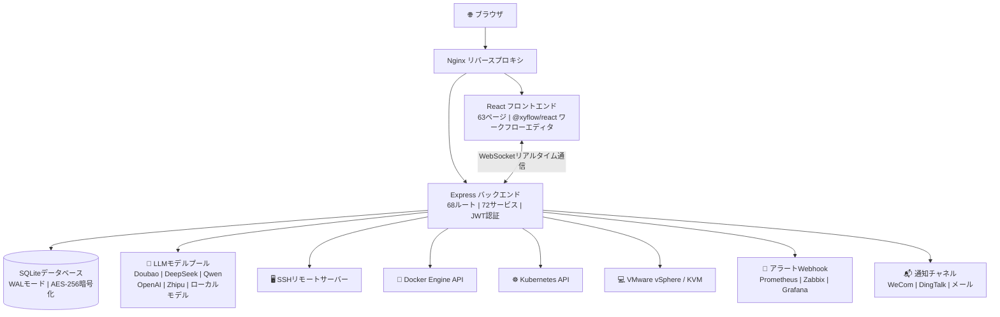

[English](README.en.md) | [中文](README.md) | [한국어](README.ko.md) | [日本語](README.ja.md) | [Deutsch](README.de.md) | [Français](README.fr.md)

***

**重要なライセンス変更通知（2026-05-27）**

本プロジェクトは2026年5月27日より、すべての新規コード提出が **Mozilla Public License 2.0 (MPL-2.0)** ライセンスでオープンソース化されます。本プロジェクトは、クローズドソースの二次開発、パッケージ販売、SaaS化などの商業利用を禁止し、永久にオープンソースです。本プロジェクトは、オープンソース精神を受け継ぐ何千ものエンジニアに属し、一つの企業のものではありません。

***

<br />

<h1 align="center">⚡ ITOps Agent Platform</h1>
<p align="center">
  <strong>AIマルチエージェント協働のエンタープライズ級運用自動化プラットフォーム</strong>
  <br/>
  中国産オープンソース · PagerDuty + Rundeck + Portainer + vCenter の代替案
  <br/>
  <em>1つのプラットフォームで、アラート → 診断 → 修復 → 承認 → 検証の完全クローズドループ</em>
</p>

<p align="center">
  <a href="https://github.com/qinshihu/itops-agent-platform/actions/workflows/ci.yml"></a>
  <a href="https://github.com/qinshihu/itops-agent-platform/releases/latest"></a>
  <a href="LICENSE"></a>
  <a href="https://github.com/qinshihu/itops-agent-platform"></a>
  <a href="https://github.com/qinshihu/itops-agent-platform/issues"></a>
  <br/>
  <a href="https://gitee.com/IT_Oline/itops-agent-platform"></a>
  <a href="https://gitcode.com/gcw_IM7aAihp/itops-agent-platform"></a>
  <br/>
  
  
  
  
  
  <br/>
  
  
  
  
  <br/>
  <a href="https://star-history.com/#qinshihu/itops-agent-platform&Date">
    
  </a>
</p>

🎮 [オンラインデモ](https://agentdemo-0mwug01t6.maozi.io/) &emsp;|&emsp; 📝[ビジョンとコミュニティ貢献](项目愿景与社区共建.md) &emsp;|&emsp; 📝[AIプログラミングスキル](SKILL.md) &emsp;|&emsp; 📝[教育書籍](https://aiopsdoc-0mwug01t6.maozi.io/book/) &emsp;|&emsp; 📖[プロジェクトドキュメント](https://aiopsdoc-0mwug01t6.maozi.io/) &emsp;|&emsp; ✍️[著者の言葉](https://mp.weixin.qq.com/s/NDqYrfqR0RZEvSESyVD2hg)

🌐 公式ウェブサイト: <https://www.zjzwfw.cloud/ITOpsAgentinfo>

📦 コードリポジトリ: [GitHub](https://github.com/qinshihu/itops-agent-platform)  |  [Gitee](https://gitee.com/IT_Oline/itops-agent-platform)  |  [GitCode](https://gitcode.com/gcw_IM7aAihp/itops-agent-platform)

---------------------------------------------------------------


## 🎯 誰が使うか / 誰に適しているか？

| 役割 | 典型的な課題 | 本プラットフォームの解決策 |
| ---------------- | --------------------------- | -------------------------- |
| **運用エンジニア** | 深夜にアラートで起こされ、手動でSSH調査 | AI自動根本原因診断 → 承認プッシュ → モバイルワンタッチ修復 |
| **SRE / DevOps** | 複数ツールを行き来し、情報サイロ | アラート+診断+実行+承認のワンストップクローズドループ |
| **ITマネージャー / CTO** | 運用が人に完全依存し、障害対応が運任せ | 自動化巡回 + 自己修復戦略、反復作業から人を解放 |
| **中小企業IT** | PagerDuty/Rundeckなどの商用ソフトウェアを購入できない | 機能同等、オープンソース無料、データがドメイン外に出ない |
| **セキュリティ・コンプライアンスチーム** | 修復操作に承認や監査証跡がない | HITL人間承認 + フルチェーン監査 + コマンドセキュリティフィルタリング |

***

## なぜこのプロジェクトが必要か？

午前3時、サーバーCPUが99%に急上昇。従来のフローは：

```
アラート通知 → 目が覚める → VPNにログイン → SSHで接続 → コマンドで調査 → ドキュメント確認 → 修復 → レポート作成 → 再就寝
```

**全体で30-60分。あなたは眠り続けられたはずだ。**

ITOps Agent Platformはこのフローを次のように変革する：

```
アラート発火 → AI自動根本原因診断 → 修復コマンド生成 → モバイル承認プッシュ → ワンタッチ実行 → 自動検証 → レポート生成
```

**全体で3分。あなたはスマートフォンで「承認」をタップするだけだ。**

***

## 🚀 運用の究極形態：自動化から自律化へ

ITOps Agent Platformは単なる運用ツールではない。これは **IT運用の究極的な進化方向** を目指す — AI完全自律運用。

```
手動運用  →  スクリプト自動化  →  プラットフォーム化  →  AI支援  →  🤖 自律運用（本プロジェクト）
 2000年代        2010年代        2020年代       2024+         現在＆未来
```

| 進化段階 | 特徴 | 人間の役割 |
|---------|------|---------|
| 手動運用 | コマンド入力、サーバーにログイン | 実行者 |
| スクリプト自動化 | Shell / Python 半自動化 | スクリプト管理者 |
| プラットフォーム化 | Ansible / Prometheus / Terraform | プラットフォーム操作者 |
| AI支援 | Copilot提案、アラート分析 | 意思決定者 |
| **AI自律運用** | **AIエージェント完全クローズドループ：感知 → 診断 → 意思決定 → 実行 → 検証** | **監督者** |

### なぜこれが究極形態か？

| 次元 | 従来の方式 | ITOps Agent Platform |
|------|---------|---------------------|
| 障害対応 | 人間：発見 → 特定 → 修復（30-60分） | AI：自動感知 → 診断 → 修復（3分未満） |
| 運用規模 | 1人が20-50台を管理 | **1人が500+ノードを管理、AIが80%+の作業を処理** |
| 知識蓄積 | シニアエンジニアの頭の中、散在するドキュメント | **ナレッジベース + RAG、AIが継続学習、永久保存** |
| 意思決定の質 | 個人の経験に依存、不安定 | **マルチエージェント協働推論、完全な推論チェーンが監査可能** |
| 限界費用 | 機器追加 ≈ 人員追加 | **機器追加 ≈ エージェント追加、限界費用がゼロに収束** |

> **これは運用ツールではなく、運用の次世代オペレーティングシステムだ。** AIエージェントがアラート受信、根本原因診断、修復意思決定、コマンド実行、結果検証のフルチェーンクローズドループを自律的に完了できるようになると、運用はもはや「人がシステムを見守る」のではなく「人が戦略を設計し、AIが戦略を実行する」ものとなる。

### 業界トレンド：AI自律運用は不可逆の方向

- **Gartner**はAIOpsをIT運用戦略技術トレンドとして選定し、AI駆動の自律運用が企業の標準になると予測
- **CNCF**クラウドネイティブ + AI融合は次世代インフラの核心方向
- 運用人件費は年々上昇しており、**AIエージェントは人員増加なしにビジネス規模を10倍成長させる唯一の方案**
- **オープンソース + AIエージェント協働**は商用ソフトウェアの独占を打破し、技術の民主化を実現する核心経路

### 私たちのポジショニング

**ITOps Agent Platformは、現在のオープンソースAIOpsプロジェクトの中で唯一、「アラート → 診断 → 意思決定 → 実行 → 検証」のフルチェーンAI自律クローズドループをエンジニアリングしてプロダクションに適用したプラットフォームである。**

長期目標：日常運用作業の80%をAIエージェントが完全に自律的に完了し、人間の運用エンジニアはアーキテクチャ設計、戦略立案、および革新的な業務に集中する。**これは単なるオープンソースプロジェクトではなく、運用エンジニア解放運動の出発点である。**

---

## ⏰ なぜ今か？

3つのトレンドが同時期に交差し、AI自律運用を「概念」から「必然」へと変化させている：

| トレンド | 説明 |
|------|------|
| **LLM能力が閾値を超える** | GPT-4o / DeepSeek / Doubao / Qwenなどのモデルがプロダクション級の推論能力を持ち、障害診断やコマンド生成などの厳粛なシナリオに適する |
| **運用人件費の不可逆的な上昇** | 企業IT規模が10倍成長、運用チームは同比例で拡張できず、唯一の出口はAIが80%+の日常業務を処理すること |
| **オープンソースエコシステムの十分な成熟** | Docker / K8s / React / TypeScript / Node.js技術スタックがエンタープライズ級製品を支えるほど成熟し、オープンソースはもはや「粗雑」の代名詞ではない |

> **2026年はAI自律運用の元年である。** LLM能力 + 運用の痛み + オープンソースエコシステムが交差する時、ITOps Agent Platformはこの歴史的な節目に立っている。この窓を逃せば、一時代を逃すことになる。

---

### 400億ドルの市場が、AIによってルールを書き換えられている

グローバルIT運用市場規模は **400億ドル（2025年）** であり、2030年には **700億ドルを突破**すると予想される。すべてのパラダイムシフトは新しい王者を生み出す：

- クラウドコンピューティングシフト → AWS（時価総額2兆ドル）
- クラウドモニタリングシフト → Datadog（時価総額400億ドル）
- 開発ツールシフト → GitLab（140億ドルIPO）
- **運用自動化シフト → ？**

> **問題は「起こるかどうか」ではなく「誰がこの分野のGitLabになるか」である。** オープンソースAIOpsリーダーの座は現在空席である — これは勝者が大部分を占める市場である。

| 当時のGitLab | 今日のITOps Agent Platform |
|------------|--------------------------|
| GitHubのオープンソース代替 | PagerDuty + Rundeck + Portainerのオープンソース代替 |
| 初期は基本的なCI/CDのみ | 12個のAIエージェント + 68個のAPIルート |
| コードホスティングが100億ドルの価値があると信じる者はいなかった | **運用プラットフォームが100億ドルの価値があると信じる者はいない** |

> ITOps Agent Platformは、より大きな市場のより早い段階に立っている。

### 3つの不可逆な追い風

| 追い風 | なぜ不可逆か |
|------|------------|
| **AI能力の爆発** | LLMが「おもちゃ」から「プロダクション級」になるのに2年しかかからなかった。次の段階は「自律的意思決定」 |
| **運用人材の断層** | 70年代生まれの運用専門家の退職潮 + 若者が7×24オンコールを望まない = AIが唯一の出口 |
| **オープンソースがエンタープライズソフトウェアを食う** | GitLab、Confluent、Grafana、HashiCorp — オープンソースIPOが5回発生し、毎回オープンソースがクローズドソースより強い商業的爆発力を証明 |

> **これはやるかどうかの問題ではなく、誰とやるかの問題である。** 上記3曲線が交差する時、AI自律運用は数学的必然である。

***


***

## 5分で完全クローズドループを体験

```bash
# 1. ワンラインコマンドデプロイ（Docker環境が必要）
curl -sL https://gitee.com/IT_Oline/itops-agent-platform/raw/main/deploy.sh -o deploy.sh && chmod +x deploy.sh && ./deploy.sh

# 2. ブラウザで http://localhost:8080 を開く、デフォルトアカウント admin/admin
# 3. サーバーを追加 → システムがホスト上のコンテナとリソースを自動発見
# 4. アラートWebhookを設定 → テストアラートを発火 → AI自動分析を観察
# 5. 「自動修復」をクリック → モバイル承認 → 完了！
```

**5分でゼロから完全なAI運用クローズドループ体験。**

***

## このプラットフォームは何ができるか？

### パス1️⃣  インテリジェントアラート → AI診断 → 自動修復

```
Prometheus / Zabbix アラート → Webhook受信
  → AI根本原因分析（自然言語診断レポート）
    → 自動修復コマンド + リスク評価生成
      → WeCom/DingTalk承認プッシュ → モバイルワンタッチ承認
        → SSH自動実行 → 結果検証 → レポート生成
```

<details>
<summary><b>展開してこのフローが解決する課題を見る</b></summary>

| 従来の方式 | 本プラットフォーム |
| -------------- | -------------------- |
| アラートストーム、深夜に起こされる | AI自動重複排除とノイズ低減、類似アラートの集約 |
| 手動SSH調査、経験で推測 | AIがログ + 指標を分析し、自然言語診断を提供 |
| ドキュメントで修復手順を検索 | 構造化修復コマンド（JSON）を自動生成 |
| 修復に承認がなく、事故時に責任者がいない | 人間承認ノード、モバイルワンタッチ承認 |
| 修復エラーやロールバック不可を心配 | 結果の自動検証、失敗アラート |

</details>

### パス2️⃣  可視化ワークフロー → 定時自動巡回

```
ドラッグ＆ドロップワークフローオーケストレーション（エージェント + 承認 + 条件分岐）
  → Cron定時トリガーを設定
    → 複数サーバーの自動巡回を実行
      → コンプライアンスチェックレポートを生成
        → 異常を自動アラート生成 → パス1️⃣へ
```

### パス3️⃣  コンテナと仮想化の統合管理

```
ワンクリックでDockerホスト / VMware vCenter / Proxmox VE / KVMノードを追加
  → すべてのコンテナとVMを自動発見
    → CPU / メモリ / ネットワークをリアルタイム監視（WebSocketプッシュ）
      → コンテナログをストリーミング表示
        → Docker Compose可視化オーケストレーション
          → K8sクラスターのインポートと管理（kubeconfigインポート + クラスター状態監視）
            → イメージレジストリ統合（Harbor / ACR / Docker Hub）
```

### パス4️⃣  データセンターとネットワークインフラ管理

```
ネットワーク計画 → IPサブネットとVLAN管理 → IP自動割り当て / 予約 / 回収
  → データセンタールームモデリング（ラック / PDU / デバイスライフサイクル / 電源管理）
    → ルーム3Dデジタルツイン監視（WebGLリアルタイムレンダリング）
      → ネットワークトポロジ自動発見（SNMP / LLDP / ARP）
```

***

## 類似オープンソースプロジェクトとの違いは？

| 能力 | ITOps Agent | GrafanaOnCall | Portainer | UptimeKuma | Rundeck | Coolify |
| ----------------- | :---------: | :-----------: | :-------: | :--------: | :-----: | :-----: |
| アラート受信 + ノイズ低減 | ✅ | ✅ | ❌ | ✅ | ❌ | ❌ |
| **AIマルチエージェント協働** | **✅** | ❌ | ❌ | ❌ | ❌ | ❌ |
| **アラート → 自動修復クローズドループ** | **✅** | ❌ | ❌ | ❌ | ❌ | ❌ |
| **人間介入承認（HITL）** | **✅** | ❌ | ❌ | ❌ | ❌ | ❌ |
| Docker/VM可視化管理 | ✅ | ❌ | ✅ | ❌ | ❌ | ✅ |
| K8sクラスター管理 | ✅ | ❌ | ✅ | ❌ | ❌ | ❌ |
| IPサブネット / VLAN管理 | ✅ | ❌ | ❌ | ❌ | ❌ | ❌ |
| データセンタールームモデリング | ✅ | ❌ | ❌ | ❌ | ❌ | ❌ |
| ルーム3Dデジタルツイン | ✅ | ❌ | ❌ | ❌ | ❌ | ❌ |
| ワークフロードラッグ＆ドロップオーケストレーション | ✅ | ✅ | ❌ | ❌ | ✅ | ❌ |
| Web SSHターミナル | ✅ | ❌ | ✅ | ❌ | ❌ | ❌ |
| ナレッジベース + RAG | ✅ | ❌ | ❌ | ❌ | ❌ | ❌ |
| 定時巡回 + 自動レポート | ✅ | ❌ | ❌ | ❌ | ✅ | ❌ |
| コスト分析 + 自動スケーリング | ✅ | ❌ | ❌ | ❌ | ❌ | ❌ |
| **ローカルAI · データがドメイン外に出ない** | **✅** | ❌ | ❌ | ❌ | ❌ | ❌ |
| **国産化（信創）対応** | **✅** | ❌ | ❌ | ❌ | ❌ | ❌ |

> **一言でまとめると**：既存のオープンソースツールは各々が一区間を管理 — OnCallはアラート、Portainerはコンテナ、Rundeckは実行。ITOps Agentはこれらすべてを接続し、**AIマルチエージェント協働ブレイン**を加えて、真の「アラートが入れば修復が完了」を実現する。

### 商用ソリューションとの比較

無料のオープンソースが唯一の強みではない。有料商用製品との正面比較：

| 能力 | PagerDuty + Rundeck | ServiceNow ITOM | **ITOps Agent（オープンソース無料）** |
|------|:---:|:---:|:---:|
| 年間費用（100ノード） | $50,000+ | $100,000+ | **$0** |
| AI自律診断 | ❌ アラートルーティングのみ | ⚠️ 追加モジュールが必要 | **✅ マルチエージェント協働推論** |
| 自動修復クローズドループ | ❌ 手動実行が必要 | ⚠️ カスタム開発が必要 | **✅ 内蔵フルチェーン** |
| 人間介入承認（HITL） | ❌ | ⚠️ カスタマイズが必要 | **✅ WeCom/DingTalkネイティブプッシュ** |
| コンテナ/VM/K8s管理 | ❌ | ❌ | **✅ 内蔵可視化** |
| データがドメイン外に出ない | ❌ SaaS強制クラウド | ❌ SaaS強制クラウド | **✅ 100%オンプレミスデプロイ** |
| オープンソースで管理可能 | ❌ クローズドソースロックイン | ❌ クローズドソースロックイン | **✅ MPL-2.0オープンソース** |
| コミュニティ主導 | ❌ | ❌ | **✅** |

> **1つのオープンソースプロジェクトが、3つの商用製品（PagerDuty + Rundeck + Portainer）を合わせてもできないことを実現する。** しかも無料だ。

***

## アーキテクチャ概要



> 📐 [完全なアーキテクチャ図を見る →](./docs/ARCHITECTURE_DIAGRAM.md)

***

| 参入障壁 | 説明 |
|------|------|
| **12エージェント協働スケジューリング** | 単一のAI API呼び出しではなく、マルチエージェント分業 + 協働 + 仲裁の複雑な分散システム |
| **フルチェーン状態マシン** | アラート → 診断 → 意思決定 → 承認 → 実行 → 検証、7ノード状態遷移がエンジニアリングされ磨き上げられている |
| **コマンドセキュリティエンジン** | 7種類の危険コマンドポリシー + ロール権限マトリクス、AI生成コマンドがプロダクション環境で安全に実行されることを保証 |
| **マルチモデルデグラデーションチェーン** | プライマリモデル障害時にバックアップモデルへ自動フェイルオーバー、AIサービスの高可用性を保証、単一障害点なし |
| **32バージョンデータベースマイグレーション** | 32回のスキーマ反復を経て安定進化、エンジニアリング成熟度がデモ級プロジェクトをはるかに超える |

### スケールエコノミクス：オープンソースモデルの商業的爆発力

| 指標 | 従来の運用SaaS | ITOps Agentオープンソースモデル |
|------|:---:|:---:|
| 顧客獲得コスト | セールス主導、単一企業顧客 $10,000+ | **≈ $0（コミュニティ主導 + 開発者自発的伝播）** |
| 限界サービスコスト | ユーザー数に比例して線形増加 | **ゼロに収束（ユーザー自己ホスティング）** |
| ネットワーク効果 | 弱い | **強い（エージェントが多いほど → プラットフォームが強くなる → コミュニティが大きくなる）** |
| エコシステムロックイン | 契約満了時に移行可能 | **ナレッジベース + エージェントマーケットプレイス + ワークフローテンプレート（深い結合）** |
| 商業化の柔軟性 | サブスクリプションのみ販売可能 | **エンタープライズエディション / マネージドクラウド / テクニカルサポート / エージェントマーケットプレイス / トレーニング認証** |

> オープンソースモデルの核心強みは顧客獲得効率とスケーリング能力にあり、業界の主流オープンソースプロジェクトで検証されている。これはプロジェクトの長期的な持続可能な発展に堅実な基盤を提供する。

## 🗺️ 将来ロードマップ

| 段階 | 核心目標 |
|------|---------|
| **v3.x エンジニアリング**（現在） | マルチホストコンテナ/VM/K8s統合管理、アラート → 修復フルチェーンクローズドループ |
| **v4.x 知能化** | マルチエージェント自律協商意思決定、クロスシステム関連分析、AI自己学習戦略最適化 |
| **v5.x 自律化** | ゼロ人間介入自律運用、AI駆動の容量計画とコスト最適化 |
| **v6.x エコシステム化** | エージェントマーケットプレイス（コミュニティ共有エージェント）、マルチクラスター連合、運用デジタルツイン |

> **ロードマップは単なるタイムテーブルではなく、運用業界の未来への約束である。** プロジェクトは継続的に反復し、一歩一歩が「完全なAI自律運用」という究極目標に向かって進む。

***

## 核心機能

### 🤖 AI知能運用

- **12個のプリセットエージェント**：アラート処理、障害診断、ログ分析、システム巡回、変更実行、ドキュメント生成、コンプライアンスチェック、コマンド実行、自動巡回、コマンド生成専門家、ネットワーク巡回専門家、データベース運用
- **AI修復クローズドループ**：アラート → AI分析 → 修復コマンド生成 → 承認 → 実行 → 検証
- **根本原因分析**：AI駆動アラート分析、自然言語診断レポート、完全な推論チェーン
- **AI Copilot**：自然言語運用アシスタント、システム状態を自動感知
- **ナレッジベース + RAG**：21個のプリセットナレッジ、意味検索でLLMコンテキストを注入

### 🔧 可視化管理

- **ワークフローエディタ**：ドラッグ＆ドロップオーケストレーション、直列/並列/条件分岐、10個のプリセットテンプレート
- **Web SSHターミナル**：xterm.jsインタラクティブターミナル、ウィンドウ自動リサイズ、セッション管理
- **コンテナ管理**：マルチホストDocker可視化（起動/停止/ログ/監視/Composeオーケストレーション）
- **VM管理**：VMware vSphere / Proxmox VE / KVMマルチプラットフォーム、スナップショット管理、ライブマイグレーション
- **K8s管理**：kubeconfigクラスターインポート、Pod / Deployment / Service / Nodeフルライフサイクル
- **ネットワーク管理**：IPサブネット / VLAN計画、IPアドレスプール自動生成、割り当て / 予約 / 回収、一括操作
- **データセンター管理**：ルームラックモデリング、デバイスライフサイクル追跡、PDU/UPS電源管理
- **ルーム3D監視**：Three.js WebGLデジタルツイン、リアルタイムデバイス状態可視化
- **大型画面ダッシュボード**：フルスクリーンNOC監視センター

### 🏢 エンタープライズ級能力

- **HITL承認**：ワークフロー人間承認ノード、WeCom/DingTalkプッシュ、モバイル承認
- **アラートノイズ低減**：知能型重複排除 + 抑制 + 関連分析
- **自動スケーリング**：CPU/メモリ指標駆動、クールダウンウィンドウ、スケーリング履歴
- **コスト分析**：コンテナ/VMコスト見積もり + 最適化提案
- **定時タスク**：Cron式、指定ワークフローの自動実行
- **レポートシステム**：Markdownレポート自動生成

### 🔒 セキュリティとコンプライアンス

- **AES-256-GCM暗号化**：サーバーパスワード、SSHキー銀行級暗号化
- **JWTデュアルトークン認証**：Access Token (24h) + Refresh Token (7d)、自動更新
- **SSHコマンドセキュリティフィルタリング**：7種類の危険コマンドポリシー（rm -rf / mkfs / iptables -F など）、ロール別遮断
- **ログイン保護**：5回失敗で30分ロック、強制パスワード複雑度
- **監査ログ**：全操作の追跡可能性
- **Non-root実行**：Dockerコンテナ最小権限原則
- **ローカルAI**：Ollama / LM Studio / vLLMをサポート、データがドメイン外に出ない

***

## サポートAIモデル

統合AIモデルプール管理を通じて、主/予備デグラデーションチェーンをサポートし、各プロバイダーは独立したサーキットブレーカーを備える。

| タイプ | プロバイダー/モデル | アクセス方式 | 推奨シナリオ |
| -------- | ---------------------------------- | --------- | --------------- |
| **国内クラウド** | Volcano Engine · Doubao | ネイティブAPI | 中国国内推奨、安定して高速 |
| **国内クラウド** | Alibaba Cloud · Qwen | OpenAI互換 | エンタープライズアプリケーション |
| **国内クラウド** | DeepSeek | OpenAI互換 | コード生成、推論 |
| **国内クラウド** | Zhipu AI (GLM-4) | OpenAI互換 | 優れた中国語理解 |
| **国内クラウド** | Moonshot · Kimi | OpenAI互換 | 長文テキスト処理 |
| **国内クラウド** | Baidu · Wenxin Yiyan | OpenAI互換 | 国内企業 |
| **国内クラウド** | 01.AI (Yi) / Baichuan | OpenAI互換 | オープンソースモデル |
| **国際クラウド** | OpenAI (GPT-4o) / Anthropic Claude | ネイティブAPI | 外部ネットワーク環境 |
| **ローカルデプロイ** | Ollama / LM Studio / vLLM | OpenAI互換 | **データ100%ドメイン内保管** |

> ✅ 統合モデルプール管理 ✅ 主/予備デグラデーションチェーン ✅ 独立したサーキットブレーカー ✅ ドラッグ＆ドロップ並び替え ✅ 接続性テスト

***

## クイックスタート

### 方法1：ワンクリックスクリプトデプロイ（推奨）

```bash
# Linux/Mac
curl -sL https://gitee.com/IT_Oline/itops-agent-platform/raw/main/deploy.sh -o deploy.sh && chmod +x deploy.sh && ./deploy.sh

# Windows PowerShell
.\deploy.ps1
```

### 方法2：Docker Compose

```bash
cp .env.example .env
docker compose up -d --build
# フロントエンド: http://localhost:8080
# ヘルスチェック: http://localhost:3001/health
```

### 方法3：ローカル開発（ホットリロード）

```bash
# Dockerローカル開発環境
cd local-dev
# Windows: .\start-dev.bat
# Linux/Mac: ./start-dev.sh

# または従来の方式
npm run dev
# フロントエンド: http://localhost:3000
# バックエンド: http://localhost:3001
```

**デフォルト管理者**: `admin` / `admin`（初回ログイン時に強制パスワード変更）

***

## 技術スタック

| 層 | 技術 |
| ------ | ----------------------------------------------- |
| フロントエンド | React 18 + TypeScript + Vite 5 + Tailwind CSS 3 |
| 状態管理 | Zustand + React Query |
| ワークフローエディタ | @xyflow/react |
| バックエンド | Node.js + Express 4 + TypeScript |
| データベース | SQLite (better-sqlite3, WALモード) |
| リアルタイム通信 | Socket.io 4 |
| リモート接続 | SSH2 |
| コンテナ操作 | Dockerode |
| デプロイ | Docker + Docker Compose + Nginx |

***

## プロジェクト構造

```
├── backend/src/
│   ├── app.ts                    # Expressエントリーポイント
│   ├── routes/                   # 68個のAPIルートモジュール
│   ├── services/                 # 72個のビジネスサービス
│   ├── models/                   # データベース + マイグレーション（32バージョン）
│   ├── presets/                  # プリセットデータ（エージェント / ワークフロー / ナレッジベースなど）
│   ├── middleware/               # 6個のミドルウェア（auth / rateLimiter / validation など）
│   ├── websocket/                # Socket.ioリアルタイム通信
│   └── utils/                    # ユーティリティ関数
├── frontend/src/
│   ├── pages/                    # 63個のページコンポーネント
│   ├── components/               # 共通コンポーネント（DataRoom3D / WorkflowEditor など）
│   ├── contexts/                 # React Context (Auth / Theme / Toast)
│   └── lib/                      # Axiosラッパー / ユーティリティライブラリ
├── docker/                       # プロダクションDocker構成 + Nginx
├── docs/                         # 技術ドキュメント
├── .github/workflows/            # CI/CD (ci.yml + release.yml)
├── docker-compose.yml            # プロダクションオーケストレーション
└── deploy.sh / deploy.ps1        # ワンクリックデプロイスクリプト
```

***

## ドキュメントナビゲーション

| ドキュメント | 説明 |
| --------------------------------------------- | --------- |
| [デプロイガイド](./docs/DEPLOYMENT.md) | 詳細なデプロイ操作 |
| [APIドキュメント](./docs/API.md) | 完全なAPIインターフェース |
| [アーキテクチャ設計](./docs/ARCHITECTURE.md) | システムアーキテクチャ説明 |
| [開発ガイド](./docs/DEVELOPMENT.md) | ローカル開発環境構築 |
| [ワークフローガイド](./docs/WORKFLOW_GUIDE.md) | ワークフローオーケストレーションの使用 |
| [自動修復設計](./docs/AUTO_REMEDIATION_DESIGN.md) | アラート自動修復 |
| [ネットワーク機器巡回](./docs/NETWORK_DEVICE_INSPECTION.md) | ネットワーク機器機能 |
| [テストガイド](./docs/TEST_GUIDE.md) | 機能テストの説明 |
| [プロジェクトビジョン](./项目愿景与社区共建.md) | ビジョンとコミュニティ貢献 |

***

## 著者

**Tan Ce（譚策）** — 独立開発者 | AIOps探検者

- 🌐 公式ウェブサイト: [ITOpsAgentinfo](https://www.zjzwfw.cloud/ITOpsAgentinfo)
- 📝 ブログ: [zjzwfw.cloud](https://www.zjzwfw.cloud/)
- 📧 メール: <huawei_network@foxmail.com>
- 💬 WeChat公式アカウント: **IT Online**

<p align="left">
  
</p>

***

## 🙏 貢献者への謝辞

| アバター | 名前 / ユーザー名 | 役割 | 主な貢献 |
| :-----------------------------------------------------------------------------------------------------------------------: | :-----------------------------------------------: | :--------: | :----------- |
|  | **熱心市民高氏** | WeChat貢献者 | テストフィードバック |
|  | **@林** | WeChat貢献者 | テストフィードバック |
|  | **爾東辰** | WeChat貢献者 | テスト |
|  | **xiezhiliang89** | GitHub貢献者 | テスト |

<a href="https://github.com/qinshihu/itops-agent-platform/graphs/contributors">
  
</a>

***

## 🌍 コミュニティビジョン：これは単なるコードではなく、一つの運動だ

ITOps Agent Platformは単なるオープンソースプロジェクトではない。これは **運用エンジニア解放運動** である。

私たちは信じている：

- **運用は7×24待機する肉体労働であるべきではなく**、戦略設計とアーキテクチャ革新であるべきだ
- **AIは運用エンジニアを代替すべきではなく**、運用エンジニアがやりたくない反復作業を代替すべきだ
- **オープンソースコミュニティの力**は、商用ソフトウェアよりも優れた製品を作れる
- **すべての運用エンジニアはアラートストームから解放され**、家族と時間を過ごし、本当に愛する事を追求する資格がある

> あなたも運用の未来がAI自律化だと信じるなら、私たちに加わってほしい。**Starはプロジェクトに対する最大の承認であり、Issues上のすべてのフィードバックはこのビジョンを一歩近づける。**

---

## 🔭 長期ビジョン

> **「私たちは運用領域の自律オペレーティングシステムを構築している。」**
>
> 世界で5000万人の運用エンジニアが、400億ドルのITインフラを管理している。今日、彼らはまだ午前3時に起きてサーバーを手動で修理している。
>
> 私たちがやっていることは、運用を「人がツールを操作する」から「人が戦略を設計し、AIが自律的に実行する」へと変革することだ。これは機能強化ではなく、パラダイムシフトである。
>
> プロジェクトは継続的に反復中である。フォローしてほしい。すべてのStarは未来への投票である。

***

## 🤝 貢献への参加

あらゆる形態の貢献を歓迎する！

- 🐛 [バグを提出](https://github.com/qinshihu/itops-agent-platform/issues/new?template=bug_report.yml)
- 💡 [新機能を提案](https://github.com/qinshihu/itops-agent-platform/issues/new?template=feature_request.yml)
- 📝 [ドキュメントを改善](https://github.com/qinshihu/itops-agent-platform/issues/new?template=docs_update.yml)
- 🔒 [セキュリティ問題を報告](SECURITY.md)

詳細は [貢献ガイド](CONTRIBUTING.md) を参照。

***

## ⭐ プロジェクトを支援する

このプロジェクトが助けになったなら、**Star** ⭐ を付けてより多くの人に見てもらおう！

<p align="center">
  <a href="https://github.com/qinshihu/itops-agent-platform">
    
  </a>
  &nbsp;&nbsp;
  <a href="https://github.com/qinshihu/itops-agent-platform/fork">
    
  </a>
</p>

> 🌟 **Starが多いほど、プロジェクトはGitHub Trendingに推薦されやすく、より多くの開発者が共同構築に参加する。すべてのStarはプロジェクトに対する最大の励みである！**

***

## 📄 ライセンス

[MPL-2.0](./LICENSE) © Tan Ce
