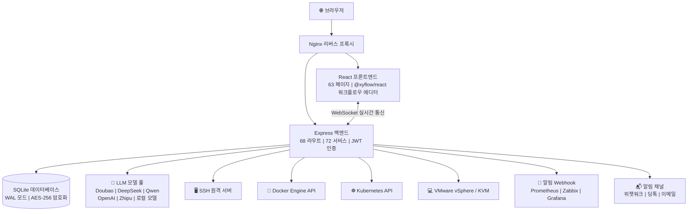

[English](README.en.md) | [中文](README.md) | [한국어](README.ko.md) | [日本語](README.ja.md) | [Deutsch](README.de.md) | [Français](README.fr.md)

***

**중요한 라이선스 변경 공지 (2026-05-27)**

본 프로젝트는 2026년 5월 27일부터 모든 신규 코드 기여가 **Mozilla Public License 2.0 (MPL-2.0)** 라이선스로 오픈소스됩니다. 본 프로젝트는 폐쇄형 2차 개발, 패키지 판매, SaaS 상업화 등 상업적 용도를 금지하며, 영구적으로 오픈소스입니다. 이 프로젝트는 수많은 오픈소스 정신을 포용한 엔지니어들에게 속하며, 단일 기업의 것이 아닙니다.

***

<br />

<h1 align="center">⚡ ITOps Agent Platform</h1>
<p align="center">
  <strong>AI 멀티 에이전트 협업 기반 엔터프라이즈급 운영 자동화 플랫폼</strong>
  <br/>
  중국산 오픈소스 · PagerDuty + Rundeck + Portainer + vCenter 대안
  <br/>
  <em>하나의 플랫폼으로 알림 → 진단 → 복구 → 승인 → 검증 전체 폐쇄형 루프 완성</em>
</p>

<p align="center">
  <a href="https://github.com/qinshihu/itops-agent-platform/actions/workflows/ci.yml"></a>
  <a href="https://github.com/qinshihu/itops-agent-platform/releases/latest"></a>
  <a href="LICENSE"></a>
  <a href="https://github.com/qinshihu/itops-agent-platform"></a>
  <a href="https://github.com/qinshihu/itops-agent-platform/issues"></a>
  <br/>
  <a href="https://gitee.com/IT_Oline/itops-agent-platform"></a>
  <a href="https://gitcode.com/gcw_IM7aAihp/itops-agent-platform"></a>
  <br/>
  
  
  
  
  
  <br/>
  
  
  
  
  <br/>
  <a href="https://star-history.com/#qinshihu/itops-agent-platform&Date">
    
  </a>
</p>

🎮 [온라인 데모](https://agentdemo-0mwug01t6.maozi.io/) &emsp;|&emsp; 📝[비전 및 커뮤니티 기여](项目愿景与社区共建.md) &emsp;|&emsp; 📝[AI 프로그래밍 스킬](SKILL.md) &emsp;|&emsp; 📝[교육 도서](https://aiopsdoc-0mwug01t6.maozi.io/book/) &emsp;|&emsp; 📖[프로젝트 문서](https://aiopsdoc-0mwug01t6.maozi.io/) &emsp;|&emsp; ✍️[저자의 말](https://mp.weixin.qq.com/s/NDqYrfqR0RZEvSESyVD2hg)

🌐 공식 웹사이트: <https://www.zjzwfw.cloud/ITOpsAgentinfo>

📦 코드 저장소: [GitHub](https://github.com/qinshihu/itops-agent-platform)  |  [Gitee](https://gitee.com/IT_Oline/itops-agent-platform)  |  [GitCode](https://gitcode.com/gcw_IM7aAihp/itops-agent-platform)

---------------------------------------------------------------


## 🎯 누가 사용하나 / 누구에게 적합한가?

| 역할 | 전형적인 고통 지점 | 본 플랫폼의 해결 방안 |
| ---------------- | --------------------------- | -------------------------- |
| **운영 엔지니어** | 자정에 알림에 깨어 SSH로 수동 조사 | AI 자동 근본 원인 진단 → 승인 푸시 → 모바일 원터치 복구 |
| **SRE / DevOps** | 여러 도구를 오가며 정보 사일로 | 알림+진단+실행+승인 원스톱 폐쇄형 루프 |
| **IT 관리자 / CTO** | 운영이 전적으로 사람에 의존, 장애 대응이 운에 맡김 | 자동화 검사 + 자동 복구 전략, 반복 노동에서 사람을 해방 |
| **중소기업 IT** | PagerDuty/Rundeck 등 상용 소프트웨어를 구매할 여유 없음 | 기능 동등, 오픈소스 무료, 데이터가 도메인을 벗어나지 않음 |
| **보안 및 컴플라이언스 팀** | 복구 조작에 승인 및 감사 추적 없음 | HITL 인간 승인 + 전체 체인 감사 + 명령 보안 필터링 |

***

## 왜 이 프로젝트가 필요한가?

새벽 3시, 서버 CPU가 99%로 치솟았다. 기존 프로세스는:

```
알림 수신 → 잠에서 깨어남 → VPN 로그인 → SSH 접속 → 명령어로 조사 → 문서 확인 → 복구 → 보고서 작성 → 다시 잠자리
```

**전체 과정 30-60분. 당신은 계속 잠들 수 있었어야 했다.**

ITOps Agent Platform은 이 프로세스를 다음과 같이 변화시킨다:

```
알림 트리거 → AI 자동 근본 원인 진단 → 복구 명령 생성 → 모바일 승인 푸시 → 원터치 실행 → 자동 검증 → 보고서 생성
```

**전체 3분. 당신은 휴대폰에서 "동의"를 누르기만 하면 된다.**

***

## 🚀 운영의 궁극적 형태: 자동화에서 자율화로

ITOps Agent Platform은 단순한 운영 도구가 아니다. 이는 **IT 운영의 궁극적 진화 방향**을 겨냥한다 — AI 완전 자율 운영.

```
수동 운영  →  스크립트 자동화  →  플랫폼화  →  AI 보조  →  🤖 자율 운영 (본 프로젝트)
 2000년대        2010년대        2020년대       2024+         지금 & 미래
```

| 진화 단계 | 특징 | 인간의 역할 |
|---------|------|---------|
| 수동 운영 | 명령어 입력, 서버 로그인 | 실행자 |
| 스크립트 자동화 | Shell / Python 반자동화 | 스크립트 관리자 |
| 플랫폼화 | Ansible / Prometheus / Terraform | 플랫폼 운영자 |
| AI 보조 | Copilot 제안, 알림 분석 | 의사결정자 |
| **AI 자율 운영** | **AI 에이전트 전체 폐쇄형 루프: 인지 → 진단 → 의사결정 → 실행 → 검증** | **감독자** |

### 왜 이것이 궁극적 형태인가?

| 차원 | 기존 방식 | ITOps Agent Platform |
|------|---------|---------------------|
| 장애 대응 | 인간: 발견 → 위치 파악 → 복구 (30-60분) | AI: 자동 인지 → 진단 → 복구 (3분 미만) |
| 운영 규모 | 1인당 20-50대 관리 | **1인당 500+ 노드 관리, AI가 80%+ 업무 처리** |
| 지식 축적 | 시니어 엔지니어 머릿속, 흩어진 문서 | **지식 베이스 + RAG, AI가 지속 학습, 영구 보존** |
| 의사결정 품질 | 개인 경험에 의존, 불안정 | **멀티 에이전트 협업 추론, 완전한 추론 체인 감사 가능** |
| 한계 비용 | 기기 추가 ≈ 인력 추가 | **기기 추가 ≈ 에이전트 추가, 한계 비용이 0에 수렴** |

> **이것은 운영 도구가 아니라 운영의 차세대 운영체제이다.** AI 에이전트가 알림 수신, 근본 원인 진단, 복구 의사결정, 명령 실행, 결과 검증의 전체 체인 폐쇄형 루프를 자율적으로 완료할 수 있을 때, 운영은 더 이상 "사람이 시스템을 지켜보는 것"이 아니라 "사람이 전략을 설계하고 AI가 전략을 실행하는 것"이 된다.

### 산업 동향: AI 자율 운영은 되돌릴 수 없는 방향

- **Gartner**는 AIOps를 IT 운영 전략 기술 동향으로 선정하며, AI 주도 자율 운영이 기업 표준이 될 것을 예측
- **CNCF** 클라우드 네이티브 + AI 융합은 차세대 인프라의 핵심 방향
- 운영 인력 비용은 매년 상승하고 있으며, **AI 에이전트는 인력 증가 없이 비즈니스 규모 10배 성장을 지원할 수 있는 유일한 방안**
- **오픈소스 + AI 에이전트 협업**은 상용 소프트웨어 독점을 깨고 기술 보편화를 실현하는 핵심 경로

### 우리의 포지셔닝

**ITOps Agent Platform은 현재 오픈소스 AIOps 프로젝트 중 유일하게 「알림 → 진단 → 의사결정 → 실행 → 검증」전체 체인 AI 자율 폐쇄형 루프를 엔지니어링하여 프로덕션에 적용한 플랫폼이다.**

장기 목표: 일상 운영 업무의 80%를 AI 에이전트가 완전히 자율적으로 완료하도록 하고, 인간 운영 엔지니어는 아키텍처 설계, 전략 수립 및 혁신적 업무에 집중하게 한다. **이것은 단순한 오픈소스 프로젝트가 아니라 운영 엔지니어 해방 운동의 출발점이다.**

---

## ⏰ 왜 지금인가?

세 가지 동향이 동일한 시간대에 교차하며, AI 자율 운영을 "개념"에서 "필연"으로 변화시킨다:

| 동향 | 설명 |
|------|------|
| **LLM 능력 임계점 돌파** | GPT-4o / DeepSeek / Doubao / Qwen 등 모델이 프로덕션급 추론 능력을 갖추어 장애 진단, 명령 생성 등 엄격한 시나리오에 적합 |
| **운영 인력 비용의 되돌릴 수 없는 상승** | 기업 IT 규모 10배 성장, 운영팀은 동비율 확장 불가, 유일한 출구는 AI가 80%+ 일상 업무 처리 |
| **오픈소스 생태계의 충분한 성숙** | Docker / K8s / React / TypeScript / Node.js 기술 스택이 엔터프라이즈급 제품을 지원할 만큼 성숙, 오픈소스는 더 이상 "조잡함"의 대명사가 아님 |

> **2026년은 AI 자율 운영의 원년이다.** LLM 능력 + 운영 고통 지점 + 오픈소스 생태계가 교차할 때, ITOps Agent Platform은 이 역사적 시점에 서 있다. 이 창을 놓치면 한 시대를 놓치는 것이다.

---

### 400억 달러 시장, AI가 규칙을 재작성 중

글로벌 IT 운영 시장 규모는 **400억 달러(2025년)**이며, 2030년에는 700억 달러를 돌파할 것으로 예상된다. 모든 패러다임 전환은 새로운 강자를 탄생시킨다:

- 클라우드 컴퓨팅 전환 → AWS(시가총액 2조 달러)
- 클라우드 모니터링 전환 → Datadog(시가총액 400억 달러)
- 개발 도구 전환 → GitLab(140억 달러 IPO)
- **운영 자동화 전환 → ?**

> **문제는 "일어나지 않을 것"이 아니라 "누가 이 분야의 GitLab이 될 것"이다.** 오픈소스 AIOps 리더 자리는 현재 공석이다 — 이는 승자가 대부분을 차지하는 시장이다.

| 당시 GitLab | 오늘의 ITOps Agent Platform |
|------------|--------------------------|
| GitHub의 오픈소스 대안 | PagerDuty + Rundeck + Portainer의 오픈소스 대안 |
| 초기에는 기본 CI/CD만 | 12개 AI 에이전트 + 68개 API 라우트 |
| 코드 호스팅이 100억 달러 가치가 있다고 믿는 사람 없음 | **운영 플랫폼이 100억 달러 가치가 있다고 믿는 사람 없음** |

> ITOps Agent Platform은 더 큰 시장의 더 이른 단계에 서 있다.

### 세 가지 되돌릴 수 없는 순풍

| 순풍 | 왜 되돌릴 수 없는가 |
|------|------------|
| **AI 능력 폭발** | LLM이 "장난감"에서 "프로덕션급"으로 오는 데 2년밖에 걸리지 않았다. 다음 단계는 "자율 의사결정" |
| **운영 인력 단절** | 70년대생 운영 전문가 은퇴 물결 + 젊은 세대가 7×24 근무를 원치 않음 = AI가 유일한 출구 |
| **오픈소스가 기업 소프트웨어를 잠식** | GitLab, Confluent, Grafana, HashiCorp — 오픈소스 IPO가 5번 발생했으며, 매번 오픈소스가 폐쇄형보다 더 강한 상업적 폭발력을 입증 |

> **이것은 선택의 문제가 아니라 누구와 함께할지의 문제이다.** 위 세 곡선이 교차할 때, AI 자율 운영은 수학적 필연이다.

***


***

## 5분 만에 전체 폐쇄형 루프 체험

```bash
# 1. 원라인 명령어 배포 (Docker 환경 필요)
curl -sL https://gitee.com/IT_Oline/itops-agent-platform/raw/main/deploy.sh -o deploy.sh && chmod +x deploy.sh && ./deploy.sh

# 2. 브라우저에서 http://localhost:8080 열기, 기본 계정 admin/admin
# 3. 서버 추가 → 시스템이 호스트의 컨테이너 및 리소스를 자동 발견
# 4. 알림 Webhook 구성 → 테스트 알림 트리거 → AI 자동 분석 관찰
# 5. "자동 복구" 클릭 → 모바일 승인 → 완료!
```

**5분 만에 제로에서 완전한 AI 운영 폐쇄형 루프 체험.**

***

## 이 플랫폼은 무엇을 할 수 있는가?

### 경로 1️⃣  지능형 알림 → AI 진단 → 자동 복구

```
Prometheus / Zabbix 알림 → Webhook 수신
  → AI 근본 원인 분석 (자연어 진단 보고서)
    → 자동 복구 명령 + 위험 평가 생성
      → 위챗워크/딩톡 승인 푸시 → 모바일 원터치 승인
        → SSH 자동 실행 → 결과 검증 → 보고서 생성
```

<details>
<summary><b>펼쳐서 이 워크플로우가 해결하는 고통 지점 보기</b></summary>

| 기존 방식 | 본 플랫폼 |
| -------------- | -------------------- |
| 알림 폭풍, 자정에 깨어남 | AI 자동 중복 제거 및 노이즈 감소, 유사 알림 집계 |
| 수동 SSH 조사, 경험으로 추측 | AI가 로그 + 지표 분석, 자연어 진단 제공 |
| 문서에서 복구 단계 검색 | 구조화된 복구 명령(JSON) 자동 생성 |
| 복구에 승인 없어, 사고 시 책임자 없음 | 인간 승인 노드, 모바일 원터치 승인 |
| 복구 오류 및 롤백 불가 우려 | 결과 자동 검증, 실패 알림 |

</details>

### 경로 2️⃣  시각화 워크플로우 → 정기 자동 검사

```
드래그 앤 드롭 워크플로우 오케스트레이션 (에이전트 + 승인 + 조건부 분기)
  → Cron 정기 트리거 구성
    → 다중 서버 자동 검사 실행
      → 컴플라이언스 검사 보고서 생성
        → 이상 자동 알림 생성 → 경로 1️⃣ 진입
```

### 경로 3️⃣  컨테이너 및 가상화 통합 관리

```
원클릭 Docker 호스트 / VMware vCenter / Proxmox VE / KVM 노드 추가
  → 모든 컨테이너 및 VM 자동 발견
    → CPU / 메모리 / 네트워크 실시간 모니터링 (WebSocket 푸시)
      → 컨테이너 로그 스트리밍 조회
        → Docker Compose 시각화 오케스트레이션
          → K8s 클러스터 가져오기 및 관리 (kubeconfig 가져오기 + 클러스터 상태 모니터링)
            → 이미지 레지스트리 통합 (Harbor / ACR / Docker Hub)
```

### 경로 4️⃣  데이터센터 및 네트워크 인프라 관리

```
네트워크 계획 → IP 서브넷 및 VLAN 관리 → IP 자동 할당 / 예약 / 회수
  → 데이터센터 룸 모델링 (랙 / PDU / 장비 수명주기 / 전원 관리)
    → 룸 3D 디지털 트윈 모니터링 (WebGL 실시간 렌더링)
      → 네트워크 토폴로지 자동 발견 (SNMP / LLDP / ARP)
```

***

## 유사 오픈소스 프로젝트와 무엇이 다른가?

| 기능 | ITOps Agent | GrafanaOnCall | Portainer | UptimeKuma | Rundeck | Coolify |
| ----------------- | :---------: | :-----------: | :-------: | :--------: | :-----: | :-----: |
| 알림 수신 + 노이즈 감소 | ✅ | ✅ | ❌ | ✅ | ❌ | ❌ |
| **AI 멀티 에이전트 협업** | **✅** | ❌ | ❌ | ❌ | ❌ | ❌ |
| **알림 → 자동 복구 폐쇄형 루프** | **✅** | ❌ | ❌ | ❌ | ❌ | ❌ |
| **인간 개입 승인 (HITL)** | **✅** | ❌ | ❌ | ❌ | ❌ | ❌ |
| Docker/VM 시각화 관리 | ✅ | ❌ | ✅ | ❌ | ❌ | ✅ |
| K8s 클러스터 관리 | ✅ | ❌ | ✅ | ❌ | ❌ | ❌ |
| IP 서브넷 / VLAN 관리 | ✅ | ❌ | ❌ | ❌ | ❌ | ❌ |
| 데이터센터 룸 모델링 | ✅ | ❌ | ❌ | ❌ | ❌ | ❌ |
| 룸 3D 디지털 트윈 | ✅ | ❌ | ❌ | ❌ | ❌ | ❌ |
| 워크플로우 드래그 앤 드롭 오케스트레이션 | ✅ | ✅ | ❌ | ❌ | ✅ | ❌ |
| Web SSH 터미널 | ✅ | ❌ | ✅ | ❌ | ❌ | ❌ |
| 지식 베이스 + RAG | ✅ | ❌ | ❌ | ❌ | ❌ | ❌ |
| 정기 검사 + 자동 보고서 | ✅ | ❌ | ❌ | ❌ | ✅ | ❌ |
| 비용 분석 + 자동 스케일링 | ✅ | ❌ | ❌ | ❌ | ❌ | ❌ |
| **로컬 AI · 데이터 도메인 외부 미출시** | **✅** | ❌ | ❌ | ❌ | ❌ | ❌ |
| **국산화 (신창) 친화적** | **✅** | ❌ | ❌ | ❌ | ❌ | ❌ |

> **한 문장 요약**: 기존 오픈소스 도구는 각자 한 구간만 관리 — OnCall은 알림, Portainer는 컨테이너, Rundeck은 실행. ITOps Agent는 이 모든 것을 연결하고 **AI 멀티 에이전트 협업 브레인**을 추가하여 진정한 "알림이 들어오면 복구가 완료된다"를 실현한다.

### 상용 솔루션 대비

무료 오픈소스가 유일한 장점이 아니다. 유료 상용 제품과의 정면 비교:

| 기능 | PagerDuty + Rundeck | ServiceNow ITOM | **ITOps Agent (오픈소스 무료)** |
|------|:---:|:---:|:---:|
| 연간 비용 (100노드) | $50,000+ | $100,000+ | **$0** |
| AI 자율 진단 | ❌ 알림 라우팅만 | ⚠️ 추가 모듈 필요 | **✅ 멀티 에이전트 협업 추론** |
| 자동 복구 폐쇄형 루프 | ❌ 수동 실행 필요 | ⚠️ 맞춤 개발 필요 | **✅ 내장 전체 체인** |
| 인간 개입 승인 (HITL) | ❌ | ⚠️ 맞춤화 필요 | **✅ 위챗워크/딩톡 네이티브 푸시** |
| 컨테이너/VM/K8s 관리 | ❌ | ❌ | **✅ 내장 시각화** |
| 데이터 도메인 외부 미출시 | ❌ SaaS 강제 클라우드 | ❌ SaaS 강제 클라우드 | **✅ 100% 온프레미스 배포** |
| 오픈소스 및 통제 가능 | ❌ 폐쇄형 락인 | ❌ 폐쇄형 락인 | **✅ MPL-2.0 오픈소스** |
| 커뮤니티 주도 | ❌ | ❌ | **✅** |

> **하나의 오픈소스 프로젝트가 세 개의 상용 제품(PagerDuty + Rundeck + Portainer)을 합친 것도 하지 못한 것을 실현한다.** 그리고 무료이다.

***

## 아키텍처 개요



> 📐 [전체 아키텍처 다이어그램 보기 →](./docs/ARCHITECTURE_DIAGRAM.md)

***

| 진입 장벽 | 설명 |
|------|------|
| **12 에이전트 협업 스케줄링** | 단일 AI API 호출이 아닌, 멀티 에이전트 분업 + 협업 + 중재의 복잡한 분산 시스템 |
| **전체 체인 상태 머신** | 알림 → 진단 → 의사결정 → 승인 → 실행 → 검증, 7노드 상태 전환이 엔지니어링되어 다듬어짐 |
| **명령 보안 엔진** | 7가지 위험 명령 정책 + 역할 권한 매트릭스, AI 생성 명령이 프로덕션 환경에서 안전하게 실행되도록 보장 |
| **멀티 모델 다운그레이드 체인** | 주 모델 장애 시 백업 모델로 자동 전환, AI 서비스 고가용성 보장, 단일 장애점 없음 |
| **32버전 데이터베이스 마이그레이션** | 32번의 스키마 반복을 거쳐 안정적으로 진화, 엔지니어링 성숙도가 데모급 프로젝트를 훨씬 초월 |

### 규모 경제학: 오픈소스 모델의 상업적 폭발력

| 지표 | 기존 운영 SaaS | ITOps Agent 오픈소스 모델 |
|------|:---:|:---:|
| 고객 획득 비용 | 세일즈 주도, 단일 기업 고객 $10,000+ | **≈ $0 (커뮤니티 주도 + 개발자 자발적 전파)** |
| 한계 서비스 비용 | 사용자 수에 비례하여 선형 증가 | **0에 수렴 (사용자 자체 호스팅)** |
| 네트워크 효과 | 약함 | **강함 (에이전트가 많을수록 → 플랫폼이 강해짐 → 커뮤니티가 커짐)** |
| 생태계 락인 | 계약 만료 시 이전 가능 | **지식 베이스 + 에이전트 마켓플레이스 + 워크플로우 템플릿 (깊은 결합)** |
| 상업화 유연성 | 구독만 판매 가능 | **엔터프라이즈 에디션 / 관리형 클라우드 / 기술 지원 / 에이전트 마켓플레이스 / 교육 인증** |

> 오픈소스 모델의 핵심 강점은 고객 획득 효율성과 규모화 능력에 있으며, 업계 주류 오픈소스 프로젝트에서 검증되었다. 이는 프로젝트의 장기적 지속 가능한 발전에 튼튼한 기반을 제공한다.

## 🗺️ 미래 로드맵

| 단계 | 핵심 목표 |
|------|---------|
| **v3.x 엔지니어링** (현재) | 다중 호스트 컨테이너/VM/K8s 통합 관리, 알림 → 복구 전체 체인 폐쇄형 루프 |
| **v4.x 지능화** | 멀티 에이전트 자율 협상 의사결정, 크로스 시스템 연관 분석, AI 자기 학습 전략 최적화 |
| **v5.x 자율화** | 제로 인간 개입 자율 운영, AI 주도 용량 계획 및 비용 최적화 |
| **v6.x 생태계화** | 에이전트 마켓플레이스 (커뮤니티 공유 에이전트), 다중 클러스터 연합, 운영 디지털 트윈 |

> **로드맵은 단순한 일정표가 아니라 운영 산업의 미래에 대한 약속이다.** 프로젝트는 지속적으로 반복되며, 매 단계가 "완전한 AI 자율 운영"이라는 궁극적 목표를 향해 전진한다.

***

## 핵심 기능

### 🤖 AI 지능형 운영

- **12개 프리셋 에이전트**: 알림 처리, 장애 진단, 로그 분석, 시스템 검사, 변경 실행, 문서 생성, 컴플라이언스 검사, 명령 실행, 자동 검사, 명령 생성 전문가, 네트워크 검사 전문가, 데이터베이스 운영
- **AI 복구 폐쇄형 루프**: 알림 → AI 분석 → 복구 명령 생성 → 승인 → 실행 → 검증
- **근본 원인 분석**: AI 주도 알림 분석, 자연어 진단 보고서, 완전한 추론 체인
- **AI Copilot**: 자연어 운영 어시스턴트, 시스템 상태 자동 인지
- **지식 베이스 + RAG**: 21개 프리셋 지식, 의미론적 검색으로 LLM 컨텍스트 주입

### 🔧 시각화 관리

- **워크플로우 에디터**: 드래그 앤 드롭 오케스트레이션, 직렬/병렬/조건부 분기, 10개 프리셋 템플릿
- **Web SSH 터미널**: xterm.js 인터랙티브 터미널, 창 자동 크기 조정, 세션 관리
- **컨테이너 관리**: 다중 호스트 Docker 시각화 (시작/중지/로그/모니터링/Compose 오케스트레이션)
- **VM 관리**: VMware vSphere / Proxmox VE / KVM 다중 플랫폼, 스냅샷 관리, 라이브 마이그레이션
- **K8s 관리**: kubeconfig 클러스터 가져오기, Pod / Deployment / Service / Node 전체 수명주기
- **네트워크 관리**: IP 서브넷 / VLAN 계획, IP 주소 풀 자동 생성, 할당 / 예약 / 회수, 일괄 조작
- **데이터센터 관리**: 룸 랙 모델링, 장비 수명주기 추적, PDU/UPS 전원 관리
- **룸 3D 모니터링**: Three.js WebGL 디지털 트윈, 실시간 장비 상태 시각화
- **대형 화면 대시보드**: 전체 화면 NOC 모니터링 센터

### 🏢 엔터프라이즈급 기능

- **HITL 승인**: 워크플로우 인간 승인 노드, 위챗워크/딩톡 푸시, 모바일 승인
- **알림 노이즈 감소**: 지능형 중복 제거 + 억제 + 연관 분석
- **자동 스케일링**: CPU/메모리 지표 주도, 쿨다운 윈도우, 스케일링 이력
- **비용 분석**: 컨테이너/VM 비용 추정 + 최적화 제안
- **정기 작업**: Cron 표현식, 지정된 워크플로우 자동 실행
- **보고 시스템**: Markdown 보고서 자동 생성

### 🔒 보안 및 컴플라이언스

- **AES-256-GCM 암호화**: 서버 비밀번호, SSH 키 은행급 암호화
- **JWT 듀얼 토큰 인증**: Access Token (24h) + Refresh Token (7d), 자동 갱신
- **SSH 명령 보안 필터링**: 7가지 위험 명령 정책 (rm -rf / mkfs / iptables -F 등), 역할별 차단
- **로그인 보호**: 5회 실패 시 30분 잠금, 강제 비밀번호 복잡도
- **감사 로그**: 전체 조작 추적 가능
- **Non-root 실행**: Docker 컨테이너 최소 권한 원칙
- **로컬 AI**: Ollama / LM Studio / vLLM 지원, 데이터 도메인 외부 미출시

***

## 지원 AI 모델

통합 AI 모델 풀 관리를 통해 주/백 다운그레이드 체인을 지원하며, 각 공급자는 독립적인 서킷 브레이커를 갖춘다.

| 유형 | 공급자/모델 | 접근 방식 | 권장 시나리오 |
| -------- | ---------------------------------- | --------- | --------------- |
| **국내 클라우드** | Volcano Engine · Doubao | 네이티브 API | 중국 내 권장, 안정적이고 빠름 |
| **국내 클라우드** | Alibaba Cloud · Qwen | OpenAI 호환 | 엔터프라이즈 애플리케이션 |
| **국내 클라우드** | DeepSeek | OpenAI 호환 | 코드 생성, 추론 |
| **국내 클라우드** | Zhipu AI (GLM-4) | OpenAI 호환 | 우수한 중국어 이해 |
| **국내 클라우드** | Moonshot · Kimi | OpenAI 호환 | 장문 텍스트 처리 |
| **국내 클라우드** | Baidu · Wenxin Yiyan | OpenAI 호환 | 국내 기업 |
| **국내 클라우드** | 01.AI (Yi) / Baichuan | OpenAI 호환 | 오픈소스 모델 |
| **국제 클라우드** | OpenAI (GPT-4o) / Anthropic Claude | 네이티브 API | 외부 네트워크 환경 |
| **로컬 배포** | Ollama / LM Studio / vLLM | OpenAI 호환 | **데이터 100% 도메인 내 보관** |

> ✅ 통합 모델 풀 관리 ✅ 주/백 다운그레이드 체인 ✅ 독립적인 서킷 브레이커 ✅ 드래그 앤 드롭 정렬 ✅ 연결성 테스트

***

## 빠른 시작

### 방법 1: 원클릭 스크립트 배포 (권장)

```bash
# Linux/Mac
curl -sL https://gitee.com/IT_Oline/itops-agent-platform/raw/main/deploy.sh -o deploy.sh && chmod +x deploy.sh && ./deploy.sh

# Windows PowerShell
.\deploy.ps1
```

### 방법 2: Docker Compose

```bash
cp .env.example .env
docker compose up -d --build
# 프론트엔드: http://localhost:8080
# 상태 확인: http://localhost:3001/health
```

### 방법 3: 로컬 개발 (핫 리로드)

```bash
# Docker 로컬 개발 환경
cd local-dev
# Windows: .\start-dev.bat
# Linux/Mac: ./start-dev.sh

# 또는 기존 방식
npm run dev
# 프론트엔드: http://localhost:3000
# 백엔드: http://localhost:3001
```

**기본 관리자**: `admin` / `admin` (최초 로그인 시 강제 비밀번호 변경)

***

## 기술 스택

| 계층 | 기술 |
| ------ | ----------------------------------------------- |
| 프론트엔드 | React 18 + TypeScript + Vite 5 + Tailwind CSS 3 |
| 상태 관리 | Zustand + React Query |
| 워크플로우 에디터 | @xyflow/react |
| 백엔드 | Node.js + Express 4 + TypeScript |
| 데이터베이스 | SQLite (better-sqlite3, WAL 모드) |
| 실시간 통신 | Socket.io 4 |
| 원격 연결 | SSH2 |
| 컨테이너 조작 | Dockerode |
| 배포 | Docker + Docker Compose + Nginx |

***

## 프로젝트 구조

```
├── backend/src/
│   ├── app.ts                    # Express 진입점
│   ├── routes/                   # 68개 API 라우트 모듈
│   ├── services/                 # 72개 비즈니스 서비스
│   ├── models/                   # 데이터베이스 + 마이그레이션 (32 버전)
│   ├── presets/                  # 프리셋 데이터 (에이전트 / 워크플로우 / 지식 베이스 등)
│   ├── middleware/               # 6개 미들웨어 (auth / rateLimiter / validation 등)
│   ├── websocket/                # Socket.io 실시간 통신
│   └── utils/                    # 유틸리티 함수
├── frontend/src/
│   ├── pages/                    # 63개 페이지 컴포넌트
│   ├── components/               # 공통 컴포넌트 (DataRoom3D / WorkflowEditor 등)
│   ├── contexts/                 # React Context (Auth / Theme / Toast)
│   └── lib/                      # Axios 래퍼 / 유틸리티 라이브러리
├── docker/                       # 프로덕션 Docker 구성 + Nginx
├── docs/                         # 기술 문서
├── .github/workflows/            # CI/CD (ci.yml + release.yml)
├── docker-compose.yml            # 프로덕션 오케스트레이션
└── deploy.sh / deploy.ps1        # 원클릭 배포 스크립트
```

***

## 문서 네비게이션

| 문서 | 설명 |
| --------------------------------------------- | --------- |
| [배포 가이드](./docs/DEPLOYMENT.md) | 상세 배포 조작 |
| [API 문서](./docs/API.md) | 전체 API 인터페이스 |
| [아키텍처 설계](./docs/ARCHITECTURE.md) | 시스템 아키텍처 설명 |
| [개발 가이드](./docs/DEVELOPMENT.md) | 로컬 개발 환경 구축 |
| [워크플로우 가이드](./docs/WORKFLOW_GUIDE.md) | 워크플로우 오케스트레이션 사용 |
| [자동 복구 설계](./docs/AUTO_REMEDIATION_DESIGN.md) | 알림 자동 복구 |
| [네트워크 장비 검사](./docs/NETWORK_DEVICE_INSPECTION.md) | 네트워크 장비 기능 |
| [테스트 가이드](./docs/TEST_GUIDE.md) | 기능 테스트 설명 |
| [프로젝트 비전](./项目愿景与社区共建.md) | 비전 및 커뮤니티 기여 |

***

## 저자

**탄 츠 (Tan Ce)** — 독립 개발자 | AIOps 탐구자

- 🌐 공식 웹사이트: [ITOpsAgentinfo](https://www.zjzwfw.cloud/ITOpsAgentinfo)
- 📝 블로그: [zjzwfw.cloud](https://www.zjzwfw.cloud/)
- 📧 이메일: <huawei_network@foxmail.com>
- 💬 위챗 공식 계정: **IT Online**

<p align="left">
  
</p>

***

## 🙏 기여자 감사

| 아바타 | 이름 / 사용자명 | 역할 | 주요 기여 |
| :-----------------------------------------------------------------------------------------------------------------------: | :-----------------------------------------------: | :--------: | :----------- |
|  | **열성 시민 고 씨** | 위챗 기여자 | 테스트 피드백 |
|  | **@린** | 위챗 기여자 | 테스트 피드백 |
|  | **얼둥천** | 위챗 기여자 | 테스트 |
|  | **xiezhiliang89** | GitHub 기여자 | 테스트 |

<a href="https://github.com/qinshihu/itops-agent-platform/graphs/contributors">
  
</a>

***

## 🌍 커뮤니티 비전: 이것은 단순한 코드가 아니라, 한 번의 운동이다

ITOps Agent Platform은 단순한 오픈소스 프로젝트가 아니다. 이는 **운영 엔지니어 해방 운동**이다.

우리는 믿는다:

- **운영은 7×24 대기하는 육체 노동이 아니어야 한다**, 전략 설계와 아키텍처 혁신이어야 한다
- **AI는 운영 엔지니어를 대체해서는 안 된다**, 운영 엔지니어가 하고 싶지 않은 반복 작업을 대체해야 한다
- **오픈소스 커뮤니티의 힘**은 상용 소프트웨어보다 더 나은 제품을 만들 수 있다
- **모든 운영 엔지니어는 알림 폭풍에서 해방되어 가족과 함께 시간을 보내고, 진정으로 사랑하는 일을 추구할 자격이 있다**

> 당신도 운영의 미래가 AI 자율화라고 믿는다면, 우리와 함께하라. **Star는 프로젝트에 대한 최대의 인정이며, Issues의 모든 피드백은 이 비전을 한 걸음 더 가까이 이끈다.**

---

## 🔭 장기 비전

> **"우리는 운영 분야의 자율 운영체제를 구축하고 있다."**
>
> 전 세계 5,000만 운영 엔지니어가 400억 달러의 IT 인프라를 관리하고 있다. 오늘, 그들은 여전히 새벽 3시에 일어나 서버를 수동으로 수리하고 있다.
>
> 우리가 하는 일은 운영을 "사람이 도구를 조작하는 것"에서 "사람이 전략을 설계하고 AI가 자율적으로 실행하는 것"으로 변화시키는 것이다. 이것은 기능 향상이 아니라 패러다임 전환이다.
>
> 프로젝트는 지속적으로 반복되고 있으니, 관심을 가져달라. 모든 Star는 미래에 대한 투표이다.

***

## 🤝 기여 참여

어떤 형태의 기여든 환영한다!

- 🐛 [버그 제출](https://github.com/qinshihu/itops-agent-platform/issues/new?template=bug_report.yml)
- 💡 [새 기능 제안](https://github.com/qinshihu/itops-agent-platform/issues/new?template=feature_request.yml)
- 📝 [문서 개선](https://github.com/qinshihu/itops-agent-platform/issues/new?template=docs_update.yml)
- 🔒 [보안 문제 보고](SECURITY.md)

자세한 내용은 [기여 가이드](CONTRIBUTING.md)를 참조하라.

***

## ⭐ 프로젝트 지원

이 프로젝트가 도움이 되었다면 **Star** ⭐를 주어 더 많은 사람이 볼 수 있도록 하라!

<p align="center">
  <a href="https://github.com/qinshihu/itops-agent-platform">
    
  </a>
  &nbsp;&nbsp;
  <a href="https://github.com/qinshihu/itops-agent-platform/fork">
    
  </a>
</p>

> 🌟 **Star가 많을수록 프로젝트가 GitHub Trending에 추천될 가능성이 높아지고, 더 많은 개발자가 공동 구축에 참여하게 된다. 모든 Star는 프로젝트에 대한 최대의 격려이다!**

***

## 📄 라이선스

[MPL-2.0](./LICENSE) © Tan Ce
