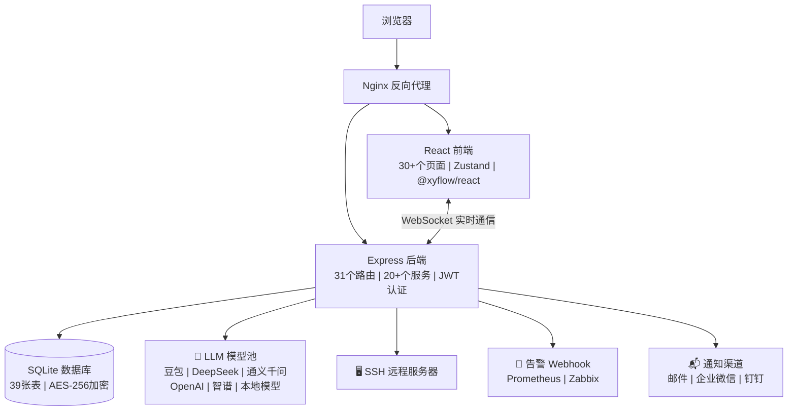

[English](README.en.md) | [中文](README.md)

---

**重要许可证⚠️变更通知（2026-05-27）** 

本项目自今日起，所有新提交的代码将采用 **Mozilla Public License 2.0 (MPL-2.0)** 许可证开源。
- 2026年5月27日 16:00 之前提交的所有代码，仍遵循原 MIT 许可证
- 任何基于本项目 2026-05-27 之后版本的衍生作品，必须遵守 MPL-2.0 许可证
- 本项目不允许**闭源二次开发、打包销售、SaaS化运营**等商业用途，并承诺永久开源！
- 👤 作者：谭策 | IT Online


# ITOps Agent Platform

企业级 IT 运维多 Agent 自动化平台 — 基于大语言模型的全开源多Agent智能运维解决方案。

📝[项目愿景与社区共建](项目愿景与社区共建.md) 📝[项目入门学习文档（供大家参考）](从入门到精通（项目教学书籍）)

[](https://github.com/qinshihu/itops-agent-platform/actions/workflows/ci.yml)
[](https://github.com/qinshihu/itops-agent-platform/actions/workflows/release.yml)
[](https://github.com/qinshihu/itops-agent-platform/releases/latest)
[](LICENSE)

🌐 **项目官网**: <https://www.zjzwfw.cloud/ITOpsAgentinfo>


## 项目简介

ITOps Agent Platform 是一个企业级全栈运维自动化平台，通过可视化工作流编排多个 AI Agent 协同工作，实现服务器巡检、告警处理、故障诊断、合规检查等运维任务的自动化。




> 📐 [查看完整架构图 →](./docs/ARCHITECTURE_DIAGRAM.md)

### 核心特性

- **多 Agent 协作** — 9 个预设运维 Agent，支持自定义创建，覆盖告警、诊断、巡检、变更等场景
- **可视化工作流** — 拖拽式编排，支持串行/并行/条件分支，实时 WebSocket 推送执行进度
- **HITL 人工审批** — 工作流支持审批节点，暂停执行等待人工确认，支持超时自动拒绝/等待，审批请求自动推送企业微信/钉钉/邮箱
- **AI 智能修复闭环** — 告警自动触发 AI 分析 → 自动生成结构化修复命令 → 审批节点确认 → 自动执行修复 → 验证结果反馈
- **Web SSH 终端** — 基于 xterm.js 的交互式远程终端，支持实时输入输出、窗口自适应、双向实时通信
- **主机管理增强** — 多级分组树形结构、CSV/JSON 批量导入、SSH 自动信息采集（CPU/内存/磁盘/OS）
- **数据导入导出** — 支持 CSV/JSON 格式批量导入服务器，导出告警、审计日志、报表数据
- **备份恢复** — 完整的数据库备份与恢复流程，支持压缩、完整性校验和恢复后自动优雅重启
- **自动修复** — 告警自动触发修复策略，支持自定义修复工作流和审批流程
- **根因分析** — AI 驱动的告警根因分析，快速定位问题源头
- **告警降噪** — 智能告警去重和抑制，减少告警风暴
- **服务器管理** — SSH 远程连接，命令执行与历史审计，14 项合规检查
- **告警中心** — Webhook 接收 Prometheus/Zabbix/通用告警，自动降噪与工作流触发
- **知识库 + RAG** — 22 条预设知识条目，智能检索注入 LLM 上下文
- **AI Copilot** — 自然语言对话式运维助手，自动感知系统状态
- **多模型支持** — 同时支持豆包（Doubao）、OpenAI 和本地部署大模型（Ollama/LM Studio/vLLM 等 OpenAI 兼容接口），数据可完全不出域
- **企业级安全** — AES-256-GCM 敏感数据加密、JWT 认证、速率限制、审计日志、内存泄漏防护
- **Docker 一键部署** — 前后端容器化，5 分钟上线，支持阿里云镜像仓库和本地开发热重载
- **CI/CD 自动化** — 完整的 GitHub Actions 流水线，自动构建、测试、发布和镜像推送

## 安全特性

项目采用多层安全设计，保障您的服务器和数据安全：

| 安全措施 | 说明 |
|---------|------|
| **🔐 AES-256-GCM 加密** | 服务器密码和 SSH 密钥采用银行级加密存储，密钥自动生成 |
| **🎫 JWT 双令牌认证** | Access Token + Refresh Token 机制，自动刷新，黑名单登出 |
| **🔒 登录失败锁定** | 连续 5 次登录失败自动锁定账户 30 分钟，防止暴力破解 |
| **💪 密码复杂度校验** | 强制要求密码包含大小写字母、数字和特殊字符（8 位以上） |
| **📜 完整操作审计** | 所有登录、命令执行、配置变更均有详细审计日志，可追溯 |
| **🚫 敏感信息脱敏** | 密码、API 密钥等敏感信息在日志和输出中自动脱敏 |
| **🛡️ 非 root 运行** | Docker 容器以非 root 用户运行，遵循最小权限原则 |
| **🧱 Nginx 安全头** | HSTS、CSP、X-Frame-Options、XSS 防护等安全配置 |
| **⚡ API 速率限制** | 防止恶意请求和暴力破解，保护接口安全 |
| **🌐 Webhook IP 白名单** | 支持配置告警 Webhook 来源 IP 白名单，防止伪造告警 |
| **✍️ Webhook 签名验证** | HMAC-SHA256 签名验证，确保告警来源可信 |
| **🏠 本地 AI 支持** | 支持 Ollama、LM Studio、vLLM 等本地部署模型，数据 100% 不出域 |
| **🔑 强制密码修改** | 首次登录系统强制要求修改默认密码，杜绝弱口令风险 |

> **数据安全目标**：所有服务器凭证只在本地加密存储，不会发送给任何第三方 AI。Agent 执行的命令和输出也只在您的服务器内部流转。

## 支持的 AI 模型

项目支持国内外绝大多数主流大模型，通过 AI 模型池统一管理，支持主备降级链。

| 类型 | 提供商/模型 | 接入方式 | 推荐场景 |
|------|------------|---------|---------|
| **国内云 API** | 火山引擎 · 豆包 (Doubao) | 原生 API | 国内用户推荐，稳定快速 |
| **国内云 API** | 阿里云 · 通义千问 (Qwen) | OpenAI 兼容 | 国内企业级应用 |
| **国内云 API** | DeepSeek (深度求索) | OpenAI 兼容 | 代码生成、推理能力强 |
| **国内云 API** | 智谱 AI (GLM-4) | OpenAI 兼容 | 中文理解优秀 |
| **国内云 API** | Moonshot · Kimi | OpenAI 兼容 | 长文本处理 |
| **国内云 API** | 百度 · 文心一言 | OpenAI 兼容 | 国内企业应用 |
| **国内云 API** | 零一万物 (Yi) | OpenAI 兼容 | 开源模型 |
| **国内云 API** | 百川智能 (Baichuan) | OpenAI 兼容 | 开源模型 |
| **国际云 API** | OpenAI (GPT-4o, o1, o3) | 原生 API | 有外网环境用户 |
| **国际云 API** | Anthropic Claude | OpenAI 兼容层 | 复杂推理任务 |
| **国际云 API** | Meta Llama | Ollama/vLLM | 开源模型 |
| **国际云 API** | Mistral | OpenAI 兼容 | 开源模型 |
| **本地部署** | Ollama | OpenAI 兼容 | 数据安全要求高，内网部署 |
| **本地部署** | LM Studio | OpenAI 兼容 | 桌面端本地模型 |
| **本地部署** | vLLM | OpenAI 兼容 | 高性能推理服务 |
| **本地部署** | 其他 OpenAI 兼容接口 | OpenAI 兼容 | 任意兼容服务 |

**本地模型推荐**：Qwen2.5、Llama3、DeepSeek-Coder、Yi、ChatGLM、Phi-3、Mistral 等开源大模型。

**特性**：
- ✅ AI 模型池统一管理，支持添加任意数量模型
- ✅ 主备模型降级链（primary_model_id + fallback_model_id）
- ✅ 每个提供商独立熔断器，防止单点故障
- ✅ 拖拽排序定义优先级
- ✅ 模型连通性测试验证
- ✅ API Key 继承机制，减少重复配置

## 技术栈

| 层      | 技术                                          |
| ------ | ------------------------------------------- |
| 前端     | React 18 + TypeScript + Tailwind CSS + Vite |
| 状态管理   | Zustand + React Query                       |
| 工作流编辑器 | @xyflow/react                               |
| 后端     | Node.js + Express + TypeScript              |
| 数据库    | SQLite (better-sqlite3)                     |
| 实时通信   | Socket.io                                   |
| 远程连接   | SSH2                                        |
| 部署     | Docker + Docker Compose + Nginx             |

## 快速开始

### 方式一：一键脚本部署（推荐）

```bash
# Windows
.\deploy.ps1

# Linux/Mac
chmod +x deploy.sh && ./deploy.sh
```

脚本会自动拉取阿里云镜像、生成配置、启动服务并验证健康状态。

### 方式二：Docker Compose 部署

```bash
# 1. 配置环境变量
cp .env.example .env

# 2. 构建并启动（本地源码构建）
docker-compose up -d --build

# 3. 访问
# 前端: http://localhost:8080
# 后端: http://localhost:3001
# 健康: http://localhost:3001/health
```

### 方式三：手动拉取阿里云镜像部署

```bash
# 拉取镜像
docker pull registry.cn-hangzhou.aliyuncs.com/huluwa666/tsq-images-hub:IT_Onlin-ITOps-backend-latest
docker pull registry.cn-hangzhou.aliyuncs.com/huluwa666/tsq-images-hub:IT_Onlin-ITOps-frontend-latest

# 启动服务
docker-compose up -d
```

也可使用简化版：

```bash
docker-compose -f docker-compose.simple.yml up -d --build
```

或一键脚本：

```bash
# Windows
.\start.ps1

# Linux/Mac
chmod +x start.sh stop.sh && ./start.sh
```

### 本地开发

#### 方式一：Docker 本地开发环境（推荐，热重载）

项目提供了专门的本地开发环境配置（`local-dev/` 目录），使用 Docker 容器运行但支持代码热重载：

```bash
# Windows
cd local-dev
.\start-dev.bat

# Linux/Mac
cd local-dev
./start-dev.sh
```

**特点：**
- 前端：Vite 热重载，修改代码即时刷新 http://localhost:5173
- 后端：tsx watch 热重载，修改代码自动重启 http://localhost:3001
- 数据库：Docker volume 持久化，停止容器不丢失数据
- 调试支持：Node.js 调试端口（localhost:9229）

#### 方式二：传统本地开发

```bash
# 同时启动前后端开发服务器
npm run dev
```

- 前端：Vite 热重载，修改代码即时刷新 http://localhost:3000
- 后端：tsx watch 热重载，修改代码自动重启 http://localhost:3001
- 数据库：SQLite 文件持久化，数据保存在 `backend/data/app.db`

**默认管理员**: `admin` / `admin`

> ⚠️ 首次登录后系统会强制要求修改密码


## 功能模块

### 仪表盘

系统概览，展示服务器、告警、任务等核心指标。


### Web SSH 终端

- 基于 xterm.js 的交互式 SSH 终端
- 实时双向通信（WebSocket）
- 窗口大小自适应
- 连接状态可视化
- 终端会话管理（30 分钟 TTL 自动清理）


### 主机管理

- 多级分组树形结构，按分组筛选服务器
- CSV/JSON 批量导入，自动验证 SSH 连通性和去重
- 一键采集主机信息（OS/CPU/内存/磁盘/IP）
- 服务器卡片展示分组标签和硬件信息
- 支持 CSV/JSON 格式导出服务器列表


### 服务器管理

- 添加/编辑/删除服务器，支持 SSH 密码或密钥认证
- 标签筛选、连接测试
- 在线 Shell 命令执行，命令历史审计
- 14 项系统合规检查（CPU/内存/磁盘/网络/服务/安全等）
- 命令历史和合规历史 JSON 导出


### Agent 管理

- 9 个预设 Agent：告警处理、故障诊断、日志分析、系统巡检、变更执行、文档生成、合规检查、服务器命令执行、自动巡检
- 支持自定义创建 Agent，配置系统提示词、模型、温度参数
- Agent 测试与执行历史追踪


### 工作流编排

- 可视化拖拽式编辑器
- 6 个预设工作流模板
- 支持上下文传递、服务器选择
- 执行顺序拓扑排序，视觉位置优先


### 任务执行

- 实时 WebSocket 推送执行进度
- 节点高亮、思考过程展示
- 支持暂停/继续/取消
- 自动生成 Markdown 执行报告


### 告警中心

- Webhook 接收：Prometheus Alertmanager / Zabbix / 通用格式
- 告警自动降噪去重
- 告警→工作流自动映射触发
- 状态管理：新建/已确认/已解决


### 通知系统

- 支持 Webhook、邮件、企业微信、钉钉通知
- 通知配置管理
- 系统通知自动推送


### 数据导入导出

- CSV 格式批量导入服务器列表（提供标准模板下载）
- 智能去重：hostname+name 联合去重，自动跳过重复服务器
- 详细错误报告：每行错误信息单独返回，便于定位问题
- 事务保证：要么全部成功要么全部失败，不会部分导入
- 支持导出：服务器列表、告警数据、审计日志、报表
- 导出格式：CSV（Excel 可直接打开）和 JSON

### 备份恢复

- 自动/手动备份数据库，支持 gzip 压缩
- 备份完整性校验（文件大小验证）
- 恢复备份后自动优雅重启，确保数据一致性
- 备份历史管理和清理策略
- 支持定时自动备份


### 知识库

- 22 条预设知识条目
- 增强 RAG 检索，关键词+语义相关度排序
- 自动注入 LLM 对话上下文
- 批量导入/导出


### AI Copilot

- 自然语言对话式运维助手
- 自动感知系统告警、服务器、任务状态
- 基于规则的快速响应 + LLM 深度分析


### 定时任务

- 4 个预设定时任务
- Cron 表达式配置
- 自动执行指定工作流

### 用户与审计

- 用户管理（admin/operator/viewer 角色）
- JWT 认证 + Token 黑名单
- 完整操作审计日志

### 报告系统

- 工作流执行自动生成 Markdown 报告
- 报告模板管理
- 报告查看与下载

### 审批中心（HITL）

- 工作流支持人工审批节点，可在工作流编排中拖拽添加
- 审批节点支持配置：审批说明、超时时间、超时行为（自动拒绝/继续等待）
- 统一审批中心页面，展示待审批、已通过、已拒绝的审批请求
- 审批操作：通过/拒绝（需填写原因）
- 审批请求自动推送通知（企业微信、钉钉、邮箱）
- 支持从手机移动端快速审批
- WebSocket 实时推送审批状态变更

### AI 修复记录

- AI 分析告警后自动生成结构化修复命令（JSON 格式）
- 自动创建修复工作流：[审批节点] → [执行修复 Agent 节点]
- 根据风险等级自动设置审批超时时间（low: 30分钟, medium: 1小时, high: 2小时）
- 展示完整修复流程：诊断报告、修复命令、风险等级、执行状态
- 支持查看执行结果和错误信息
- 与告警、任务系统深度集成

## 项目结构

```
├── backend/
│   └── src/
│       ├── app.ts                  # Express 应用入口
│       ├── models/database.ts      # SQLite 数据库初始化和预设数据
│       ├── routes/                 # API 路由（32 个模块）
│       ├── services/               # 业务逻辑（20+ 个服务，含 aiRemediationService）
│       ├── middleware/             # 中间件（6 个：auth, errorHandler, rateLimiter, validation, trace, commandFilter）
│       ├── websocket/              # WebSocket 实时通信
│       └── utils/                  # 工具函数
├── frontend/
│   └── src/
│       ├── App.tsx                 # React 应用入口
│       ├── pages/                  # 页面组件（28 个，含 Approvals、AiRemediations）
│       ├── components/             # 通用组件
│       ├── contexts/               # React Context
│       ├── hooks/                  # 自定义 Hooks
│       └── lib/                    # 工具库
├── docker/                         # Docker 生产配置
├── docs/                           # 技术文档
├── examples/                       # 测试脚本和示例
├── .github/workflows/              # GitHub Actions CI/CD 配置
├── docker-compose.yml              # 生产级 Docker Compose
├── docker-compose.simple.yml       # 简化版 Docker Compose
├── deploy.ps1 / deploy.sh          # 一键部署脚本
├── start.ps1 / start.sh            # 一键启动脚本
├── stop.ps1 / stop.sh              # 一键停止脚本
└── .env.example                    # 环境变量示例
```

## 文档导航

| 文档                                   | 说明             |
| ------------------------------------ | -------------- |
| [部署手册](./docs/DEPLOYMENT.md)              | 详细部署操作说明       |
| [技术规范](./docs/SPEC.md)                    | 功能规范和接口定义      |
| [API 文档](./docs/API.md)              | 完整 API 接口文档    |
| [架构设计](./docs/ARCHITECTURE.md)       | 系统架构说明         |
| [开发指南](./docs/DEVELOPMENT.md)        | 本地开发环境搭建       |
| [生产环境](./docs/PRODUCTION.md)         | 生产部署最佳实践       |
| [Web 终端](./docs/WEB_TERMINAL.md)          | Web SSH 终端技术文档 |
| [主机管理](./docs/SERVER_MANAGEMENT.md)       | 主机管理增强功能文档     |
| [网络设备巡检](./docs/NETWORK_DEVICE_INSPECTION.md) | 网络设备巡检功能     |
| [变更日志](./docs/CHANGELOG.md)               | 版本更新记录         |
| [测试指南](./docs/TEST_GUIDE.md)              | 功能测试说明         |
| [QAnything 集成](./docs/QANYTHING_INTEGRATION.md) | QAnything 知识库集成 |
| [工作流指南](./docs/WORKFLOW_GUIDE.md)              | 工作流编排使用指南     |
| [自动修复设计](./docs/AUTO_REMEDIATION_DESIGN.md)   | 告警自动修复功能设计   |

## 环境变量

| 变量                     | 说明                                      | 默认值                                        |
| ------------------------ | ---------------------------------------- | ------------------------------------------ |
| `NODE_ENV`               | 运行环境                                  | production |
| `PORT`                   | 后端端口                                  | 3001                                       |
| `DATABASE_PATH`          | 数据库路径                                 | ./data/app.db                              |
| `JWT_SECRET`             | JWT 签名密钥（生产环境必须修改）            | 开发环境自动生成                                   |
| `JWT_EXPIRES_IN`         | Access Token 有效期                      | 24h                                        |
| `ADMIN_INITIAL_PASSWORD` | 管理员初始密码（可选）                       | admin（默认）                               |
| `ALLOWED_ORIGINS`        | CORS 允许源列表（逗号分隔）                   | http://localhost:3000,http://localhost:80,http://localhost:8080 |
| `DOUBAO_API_KEY`         | 豆包 API 密钥（也可在网页设置）               | -                                          |
| `DOUBAO_API_BASE`        | 豆包 API 地址                             | https://ark.cn-beijing.volces.com/api/v3 |
| `DOUBAO_MODEL`           | 豆包模型名称                               | doubao-4o                                  |
| `OPENAI_API_KEY`         | OpenAI API 密钥（也可在网页设置）          | -                                          |
| `OPENAI_API_BASE`        | OpenAI API 地址                            | https://api.openai.com/v1                |
| `OPENAI_MODEL`           | OpenAI 模型名称                           | gpt-4o                                     |
| `LOCAL_AI_API_BASE`      | 本地 AI API 地址（Ollama 等）              | -                                          |
| `LOCAL_AI_MODEL`         | 本地 AI 模型名称                            | -                                          |
| `WEBHOOK_VERIFY_ENABLED` | 是否启用 Webhook 签名验证（生产环境建议开启） | false                                      |
| `WEBHOOK_SECRET`         | Webhook 签名密钥（启用签名验证时必须）       | -                                          |
| `WEBHOOK_IP_WHITELIST`   | Webhook IP 白名单（逗号分隔，空为允许所有）    | -                                          |
| `LOG_LEVEL`              | 日志级别                                   | info                                       |

## 安全特性详解

### 认证与访问控制

- **JWT 双令牌认证**：Access Token (24h) + Refresh Token (7d)，自动刷新，黑名单登出
- **登录失败锁定**：连续 5 次登录失败自动锁定账户 30 分钟，防止暴力破解
- **强制密码修改**：首次登录系统强制要求修改默认密码，杜绝弱口令风险
- **密码复杂度校验**：要求密码至少 8 位，包含大小写字母、数字、特殊字符

### 数据加密与安全

- **AES-256-GCM 加密存储**：服务器密码和 SSH 密钥采用银行级加密，密钥自动生成
- **bcrypt 密码哈希**：成本因子 12，抗彩虹表攻击
- **敏感信息自动脱敏**：密码、API 密钥等敏感信息在日志和输出中自动脱敏
- **邮件模板 XSS 防护**：HTML 自动转义，防止注入攻击

### API 与网络安全

- **API 速率限制**：不同接口有不同频率限制，防止恶意请求和暴力破解
- **Nginx 安全头**：HSTS/CSP/X-Frame-Options/XSS-Protection/Referrer-Policy/Permissions-Policy
- **CORS 白名单控制**：可配置允许的跨域来源
- **Webhook 安全**：
  - HMAC-SHA256 签名验证，确保告警来源可信
  - IP 白名单，只允许指定告警源 IP 发送请求
  - 速率限制，防止拒绝服务攻击

### 容器与部署安全

- **非 root 用户运行**：Docker 容器以非 root 用户运行，遵循最小权限原则
- **优雅关闭机制**：SIGTERM/SIGINT 信号处理，30s 超时保护，确保资源正确释放
- **全局异常处理**：uncaughtException/unhandledRejection 捕获，防止进程崩溃
- **定时清理机制**：Token 黑名单、终端会话、用户缓存均有 TTL 自动清理

### 审计与溯源

- **完整操作审计日志**：所有登录、命令执行、配置变更均有详细记录，可追溯
- **用户锁定审计**：登录失败、账户锁定、解锁操作均有日志记录

> 🔒 **零信任安全模型**：所有服务器凭证只在本地加密存储，不会发送给任何第三方 AI。Agent 执行的命令和输出也只在您的服务器内部流转。

## 🚀 CI/CD 自动化

本项目配置了完整的 GitHub Actions CI/CD 流水线：

| 流水线 | 触发条件 | 功能 |
|--------|---------|------|
| [CI](.github/workflows/ci.yml) | Push/PR 到 main | Lint + TypeScript 检查 + 测试 + Docker 构建验证 |
| [Release](.github/workflows/release.yml) | 推送 tag (`v*`) 或手动 | 构建 Docker 镜像 → 推送阿里云 → 自动创建 GitHub Release |
| [Mirror](.github/workflows/mirror.yml) | Push 到 main 或手动 | 自动同步代码到 Gitee/Gitcode |

> 📖 详细配置指南：[docs/CICD_SETUP.md](docs/CICD_SETUP.md)

## 作者

**谭策** — 独立开发者 | AIOps 领域探索者

- 🌐 项目官网：[ITOpsAgentinfo](https://www.zjzwfw.cloud/ITOpsAgentinfo)
- 📝 博客：[zjzwfw.cloud](https://www.zjzwfw.cloud/)
- 📧 邮箱：<huawei_network@foxmail.com>
- 💬 微信公众号：**IT Online**

<p align="left">
  
</p>

## 🙏 特别鸣谢

感谢以下所有为本项目做出贡献的人！

| 头像 | 姓名 / 用户名 | 角色 | 主要贡献 |
|:---:|:---:|:---:|:---|
|  | **谭策** ([@qinshihu](https://github.com/qinshihu)) | 项目作者 | 项目架构设计、核心功能开发、文档编写 |
|  | **热心市民高先生** | 微信贡献者 | 项目测试开发反馈 |
|  | **@林** | 微信贡献者 | 项目测试开发反馈 |
|  | **尔东辰** | 微信贡献者 | 项目测试 |

> 💡 **如何添加贡献者**：
> 1. 将头像图片放入 [`./docs-assets/contributors/`](./docs-assets/contributors/) 文件夹
> 2. 命名格式：`用户名.png`（如 `qinshihu.png`）或 `wechat-昵称.png`（微信贡献者）
> 3. 在上方表格中替换 `placeholder-X.svg` 为实际图片文件名
> 4. 修改姓名、链接和贡献描述
> 5. 详见 [贡献者头像文件夹说明](./docs-assets/contributors/README.md)
>
> **支持的贡献者类型**：
> - ✅ GitHub 开发者（自动获取头像或手动上传）
> - ✅ 微信好友/群友（保存微信头像图片上传）
> - ✅ 社区成员、测试人员、文档贡献者
> - ✅ 组织/公司（Logo 图片）

### 社区贡献者

<a href="https://github.com/qinshihu/itops-agent-platform/graphs/contributors">
  
</a>

> 自动生成的所有代码贡献者头像墙，由 [contributors-img](https://contrib.rocks) 提供

## 🤝 参与贡献

我们欢迎任何形式的贡献！请参阅 [贡献指南](CONTRIBUTING.md) 了解详情。

- [🐛 提交 Bug](https://github.com/qinshihu/itops-agent-platform/issues/new?template=bug_report.yml)
- [💡 提出新功能](https://github.com/qinshihu/itops-agent-platform/issues/new?template=feature_request.yml)
- [📝 改进文档](https://github.com/qinshihu/itops-agent-platform/issues/new?template=docs_update.yml)
- [🔒 报告安全问题](SECURITY.md)

## 📄 许可证

[MPL-2.0](./LICENSE) © 谭策
