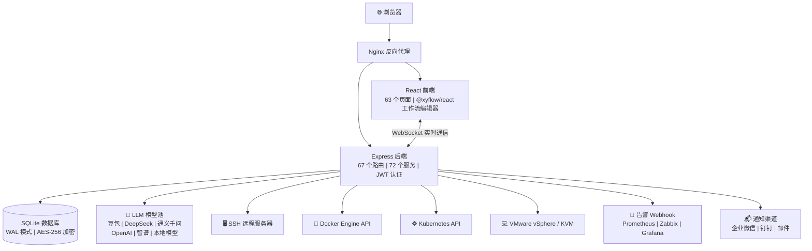

[English](README.en.md) | [中文](README.md)

---

**重要许可证变更通知（2026-05-27）**

本项目自 2026年5月27日 起，所有新提交的代码采用 **Mozilla Public License 2.0 (MPL-2.0)** 许可证开源。2026年5月27日 16:00 之前提交的代码仍遵循原 MIT 许可证。本项目禁止闭源二次开发、打包销售、SaaS化运营等商业用途，永久开源。

👤 作者：谭策 | IT Online

---

<br/>

<h1 align="center">⚡ ITOps Agent Platform</h1>
<p align="center">
  <strong>AI 多 Agent 协作的企业级运维自动化平台</strong>
  <br/>
  国产开源 · PagerDuty + Rundeck + Portainer + vCenter 替代方案
  <br/>
  <em>一个平台，搞定告警 → 诊断 → 修复 → 审批 → 验证全闭环</em>
</p>

<p align="center">
  <a href="https://github.com/qinshihu/itops-agent-platform/actions/workflows/ci.yml"></a>
  <a href="https://github.com/qinshihu/itops-agent-platform/releases/latest"></a>
  <a href="LICENSE"></a>
  <a href="https://github.com/qinshihu/itops-agent-platform"></a>
  <a href="https://github.com/qinshihu/itops-agent-platform/issues"></a>
  <br/>
  
  
  
  
  
  <br/>
  
  
  
  
  <br/>
  <a href="https://star-history.com/#qinshihu/itops-agent-platform&Date">
    
  </a>
</p>

📝 [项目愿景与社区共建](项目愿景与社区共建.md) &nbsp;|&nbsp; 📝 [项目AI编程Skill](SKILL.md) &nbsp;|&nbsp; 📖 [项目文档](https://aiopsdoc-0mwug01t6.maozi.io/) &nbsp;|&nbsp; 🎮 [在线演示](https://agentdemo-0mwug01t6.maozi.io/)

🌐 项目官网：<https://www.zjzwfw.cloud/ITOpsAgentinfo>

---

## 🎯 谁在用 / 谁适合用？

| 角色 | 典型痛点 | 本平台如何解决 |
|------|---------|--------------|
| **运维工程师** | 半夜被告警吵醒，手动 SSH 排查 | AI 自动诊断根因 → 推送审批 → 手机一键修复 |
| **SRE / DevOps** | 多套工具来回切换，信息孤岛 | 告警+诊断+执行+审批一站式闭环 |
| **IT 主管 / CTO** | 运维全靠人，故障响应靠运气 | 自动化巡检 + 自愈策略，把人从重复劳动中解放 |
| **中小企业 IT** | 买不起 PagerDuty/Rundeck 等商业软件 | 功能对标，开源免费，数据不出域 |
| **安全合规团队** | 修复操作无审批、无审计 | HITL 人工审批 + 全链路审计 + 命令安全过滤 |

---

## 为什么需要这个项目？

凌晨 3 点，服务器 CPU 飙到 99%。传统流程是：

```
告警通知 → 被吵醒 → 登录 VPN → SSH 上去 → 敲命令排查 → 翻文档 → 修复 → 写报告 → 睡觉
```

**整个过程 30-60 分钟，而你本可以继续睡觉。**

ITOps Agent Platform 把这个流程变成：

```
告警触发 → AI 自动诊断根因 → 生成修复命令 → 推送手机审批 → 一键执行 → 自动验证 → 生成报告
```

**全程 3 分钟，你只需要在手机上点一下"同意"。**

---


---

## 5 分钟体验完整闭环

```bash
# 1. 一行命令部署（需要 Docker 环境）
curl -sL https://gitee.com/IT_Oline/itops-agent-platform/raw/main/deploy.sh -o deploy.sh && chmod +x deploy.sh && ./deploy.sh

# 2. 打开浏览器 http://localhost:8080，默认账号 admin/admin
# 3. 添加一台服务器 → 系统自动发现宿主机上的容器和资源
# 4. 配置告警 Webhook → 触发一条测试告警 → 观察 AI 自动分析
# 5. 点击"自动修复" → 手机审批 → 完成！
```

**5 分钟，从零到完整的 AI 运维闭环体验。**

---

## 这个平台到底能做什么？

### 路径1️⃣ &nbsp; 智能告警 → AI 诊断 → 自动修复

```
Prometheus / Zabbix 告警 → Webhook 接收 
  → AI 根因分析（自然语言诊断报告）
    → 自动生成修复命令 + 风险评估
      → 企微/钉钉推送审批 → 手机一键通过
        → SSH 自动执行修复 → 验证结果 → 生成报告
```

<details>
<summary><b>展开查看这个流程解决了什么痛点</b></summary>

| 传统方式 | 本平台 |
|---------|--------|
| 告警风暴，半夜被吵醒 | AI 自动降噪去重，同类告警聚合 |
| 手动 ssh 排查，靠经验猜 | AI 分析日志 + 指标，给自然语言诊断 |
| 翻文档找修复步骤 | 自动生成结构化修复命令（JSON） |
| 修复没审批，出事没人担 | 人工审批节点，移动端一键审批 |
| 担心修复出错无法回滚 | 自动验证结果，失败告警 |

</details>

### 路径2️⃣ &nbsp; 可视化工作流 → 定时自动巡检

```
拖拽编排工作流（Agent + 审批 + 条件分支）
  → 配置 Cron 定时触发
    → 自动执行多台服务器巡检
      → 生成合规检查报告
        → 异常自动创建告警 → 进入路径1️⃣
```

### 路径3️⃣ &nbsp; 容器与虚拟化统一管理

```
一键添加 Docker 主机 / VMware vCenter / KVM 节点
  → 自动发现所有容器和虚拟机
    → 实时监控 CPU / 内存 / 网络（WebSocket 推送）
      → 容器日志流式查看
        → Docker Compose 可视化编排
          → 镜像仓库集成（Harbor / ACR / Docker Hub）
```

---

## 和同类开源项目有什么不同？

| 能力 | ITOps Agent | Grafana<br/>OnCall | Portainer | Uptime<br/>Kuma | Rundeck | Coolify |
|------|:---------:|:---------:|:---------:|:-----------:|:-------:|:-------:|
| 告警接入 + 降噪 | ✅ | ✅ | ❌ | ✅ | ❌ | ❌ |
| **AI 多 Agent 协作** | **✅** | ❌ | ❌ | ❌ | ❌ | ❌ |
| **告警 → 自动修复闭环** | **✅** | ❌ | ❌ | ❌ | ❌ | ❌ |
| **人工审批（HITL）** | **✅** | ❌ | ❌ | ❌ | ❌ | ❌ |
| Docker/VM 可视化管理 | ✅ | ❌ | ✅ | ❌ | ❌ | ✅ |
| K8s 集群管理 | ✅ | ❌ | ✅ | ❌ | ❌ | ❌ |
| 工作流拖拽编排 | ✅ | ✅ | ❌ | ❌ | ✅ | ❌ |
| Web SSH 终端 | ✅ | ❌ | ✅ | ❌ | ❌ | ❌ |
| 知识库 + RAG | ✅ | ❌ | ❌ | ❌ | ❌ | ❌ |
| 定时巡检 + 自动报告 | ✅ | ❌ | ❌ | ❌ | ✅ | ❌ |
| 成本分析 + 自动伸缩 | ✅ | ❌ | ❌ | ❌ | ❌ | ❌ |
| **本地 AI · 数据不出域** | **✅** | ❌ | ❌ | ❌ | ❌ | ❌ |
| **国产化（信创）友好** | **✅** | ❌ | ❌ | ❌ | ❌ | ❌ |

> **一句话总结**：现有开源工具各管一段 — OnCall 管告警、Portainer 管容器、Rundeck 管执行。ITOps Agent 把这一切打通，加上 **AI 多 Agent 协作大脑**，实现真正的「告警进来，修复完成」。

---

## 架构一览



> 📐 [查看完整架构图 →](./docs/ARCHITECTURE_DIAGRAM.md)

---

## 核心特性

### 🤖 AI 智能运维

- **12 个预设 Agent**：告警处理、故障诊断、日志分析、系统巡检、变更执行、文档生成、合规检查、命令执行、自动巡检、命令生成专家、网络巡检专家、数据库运维
- **AI 修复闭环**：告警 → AI 分析 → 修复命令生成 → 审批 → 执行 → 验证
- **根因分析**：AI 驱动告警分析，自然语言诊断报告，完整推理链
- **AI Copilot**：自然语言运维助手，自动感知系统状态
- **知识库 + RAG**：21 条预设知识，语义检索注入 LLM 上下文

### 🔧 可视化管理

- **工作流编辑器**：拖拽编排，串行/并行/条件分支，10 个预设模板
- **Web SSH 终端**：xterm.js 交互式终端，窗口自适应，会话管理
- **容器管理**：Docker 可视化（启停/日志/监控/Compose 编排）
- **虚拟机管理**：VMware vSphere / KVM 支持，快照管理，实时迁移
- **K8s 管理**：Pod / Deployment / Service / Node 全生命周期管理
- **大屏仪表盘**：全屏 NOC 监控中心

### 🏢 企业级能力

- **HITL 审批**：工作流人工审批节点，企微/钉钉推送，移动端审批
- **告警降噪**：智能去重 + 抑制 + 关联分析
- **自动伸缩**：CPU/内存指标驱动，冷却窗口，伸缩历史
- **成本分析**：容器/VM 成本估算 + 优化建议
- **定时任务**：Cron 表达式，自动执行指定工作流
- **报告系统**：自动生成 Markdown 报告

### 🔒 安全与合规

- **AES-256-GCM 加密**：服务器密码、SSH 密钥银行级加密
- **JWT 双令牌认证**：Access Token (24h) + Refresh Token (7d)，自动刷新
- **SSH 命令安全过滤**：7 类危险命令策略（rm -rf / mkfs / iptables -F 等），按角色拦截
- **登录保护**：5 次失败锁定 30 分钟，强制密码复杂度
- **审计日志**：全操作可追溯
- **非 root 运行**：Docker 容器最小权限原则
- **本地 AI**：支持 Ollama / LM Studio / vLLM，数据不出域

---

## 支持的 AI 模型

通过统一的 AI 模型池管理，支持主备降级链，每个提供商独立熔断器。

| 类型 | 提供商/模型 | 接入方式 | 推荐场景 |
|------|-----------|---------|---------|
| **国内云** | 火山引擎 · 豆包 (Doubao) | 原生 API | 国内推荐，稳定快速 |
| **国内云** | 阿里云 · 通义千问 (Qwen) | OpenAI 兼容 | 企业级应用 |
| **国内云** | DeepSeek | OpenAI 兼容 | 代码生成、推理 |
| **国内云** | 智谱 AI (GLM-4) | OpenAI 兼容 | 中文理解优秀 |
| **国内云** | Moonshot · Kimi | OpenAI 兼容 | 长文本处理 |
| **国内云** | 百度 · 文心一言 | OpenAI 兼容 | 国内企业 |
| **国内云** | 零一万物 (Yi) / 百川 (Baichuan) | OpenAI 兼容 | 开源模型 |
| **国际云** | OpenAI (GPT-4o) / Anthropic Claude | 原生 API | 外网环境 |
| **本地部署** | Ollama / LM Studio / vLLM | OpenAI 兼容 | **数据 100% 不出域** |

> ✅ 模型池统一管理 &nbsp; ✅ 主备降级链 &nbsp; ✅ 独立熔断器 &nbsp; ✅ 拖拽排序 &nbsp; ✅ 连通性测试

---

## 快速开始

### 方式一：一键脚本部署（推荐）

```bash
# Linux/Mac
curl -sL https://gitee.com/IT_Oline/itops-agent-platform/raw/main/deploy.sh -o deploy.sh && chmod +x deploy.sh && ./deploy.sh

# Windows PowerShell
.\deploy.ps1
```

### 方式二：Docker Compose

```bash
cp .env.example .env
docker compose up -d --build
# 前端: http://localhost:8080
# 健康检查: http://localhost:3001/health
```

### 方式三：本地开发（热重载）

```bash
# Docker 本地开发环境
cd local-dev
# Windows: .\start-dev.bat
# Linux/Mac: ./start-dev.sh

# 或传统方式
npm run dev
# 前端: http://localhost:3000
# 后端: http://localhost:3001
```

**默认管理员**: `admin` / `admin`（首次登录强制修改密码）

---

## 技术栈

| 层 | 技术 |
|-----|------|
| 前端 | React 18 + TypeScript + Vite 5 + Tailwind CSS 3 |
| 状态管理 | Zustand + React Query |
| 工作流编辑器 | @xyflow/react |
| 后端 | Node.js + Express 4 + TypeScript |
| 数据库 | SQLite (better-sqlite3, WAL 模式) |
| 实时通信 | Socket.io 4 |
| 远程连接 | SSH2 |
| 容器操作 | Dockerode |
| 部署 | Docker + Docker Compose + Nginx |

---

## 项目结构

```
├── backend/src/
│   ├── app.ts                    # Express 入口
│   ├── routes/                   # 67 个 API 路由模块
│   ├── services/                 # 72 个业务服务
│   ├── models/                   # 数据库 + 迁移（32 版本）
│   ├── middleware/               # 6 个中间件（auth / rateLimiter / validation 等）
│   ├── websocket/                # Socket.io 实时通信
│   └── utils/                    # 工具函数
├── frontend/src/
│   ├── pages/                    # 63 个页面组件
│   ├── components/               # 通用组件
│   ├── contexts/                 # React Context (Auth / Theme / Toast)
│   └── lib/                      # Axios 封装 / 工具库
├── docker/                       # 生产 Docker 配置 + Nginx
├── docs/                         # 技术文档
├── .github/workflows/            # CI/CD (ci.yml + release.yml)
├── docker-compose.yml            # 生产编排
└── deploy.sh / deploy.ps1        # 一键部署脚本
```

---

## 文档导航

| 文档 | 说明 |
|------|------|
| [部署手册](./docs/DEPLOYMENT.md) | 详细部署操作 |
| [API 文档](./docs/API.md) | 完整 API 接口 |
| [架构设计](./docs/ARCHITECTURE.md) | 系统架构说明 |
| [开发指南](./docs/DEVELOPMENT.md) | 本地开发搭建 |
| [工作流指南](./docs/WORKFLOW_GUIDE.md) | 工作流编排使用 |
| [自动修复设计](./docs/AUTO_REMEDIATION_DESIGN.md) | 告警自动修复 |
| [网络设备巡检](./docs/NETWORK_DEVICE_INSPECTION.md) | 网络设备功能 |
| [测试指南](./docs/TEST_GUIDE.md) | 功能测试说明 |
| [项目愿景](./项目愿景与社区共建.md) | 愿景与共建 |

---

## 作者

**谭策** — 独立开发者 | AIOps 领域探索者

- 🌐 项目官网：[ITOpsAgentinfo](https://www.zjzwfw.cloud/ITOpsAgentinfo)
- 📝 博客：[zjzwfw.cloud](https://www.zjzwfw.cloud/)
- 📧 邮箱：<huawei_network@foxmail.com>
- 💬 微信公众号：**IT Online**

<p align="left">
  
</p>

---

## 🙏 致谢贡献者

| 头像 | 名称 / 用户名 | 角色 | 主要贡献 |
|:---:|:---:|:---:|:---|
|  | **谭策** ([@qinshihu](https://github.com/qinshihu)) | 项目作者 | 架构设计、核心开发、文档 |
|  | **热心市民高先生** | 微信贡献者 | 测试反馈 |
|  | **@林** | 微信贡献者 | 测试反馈 |
|  | **尔东辰** | 微信贡献者 | 测试 |
|  | **xiezhiliang89** | GitHub 贡献者 | 测试 |

<a href="https://github.com/qinshihu/itops-agent-platform/graphs/contributors">
  
</a>

---

## 🤝 参与贡献

我们欢迎任何形式的贡献！

- 🐛 [提交 Bug](https://github.com/qinshihu/itops-agent-platform/issues/new?template=bug_report.yml)
- 💡 [提出新功能](https://github.com/qinshihu/itops-agent-platform/issues/new?template=feature_request.yml)
- 📝 [改进文档](https://github.com/qinshihu/itops-agent-platform/issues/new?template=docs_update.yml)
- 🔒 [报告安全问题](SECURITY.md)

查看 [贡献指南](CONTRIBUTING.md) 了解详情。

---

## ⭐ 支持项目

如果这个项目帮到了你，请给我们一个 **Star** ⭐ 让更多人看到！

<p align="center">
  <a href="https://github.com/qinshihu/itops-agent-platform">
    
  </a>
  &nbsp;&nbsp;
  <a href="https://github.com/qinshihu/itops-agent-platform/fork">
    
  </a>
</p>

> 🌟 **Star 越多，项目越容易被 GitHub Trending 推荐，也越能吸引更多开发者加入共建。每一颗 Star 都是对项目最大的鼓励！**

---

## 📄 许可证

[MPL-2.0](./LICENSE) © 谭策
