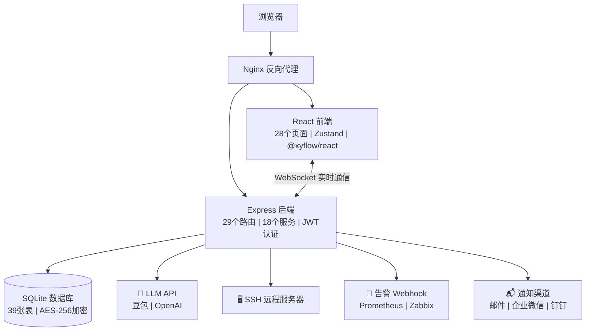

# ITOps Agent Platform

企业级 IT 运维多 Agent 自动化平台 — 基于大语言模型的智能运维解决方案。

[](https://github.com/qinshihu/itops-agent-platform/actions/workflows/ci.yml)
[](https://github.com/qinshihu/itops-agent-platform/actions/workflows/release.yml)
[](https://github.com/qinshihu/itops-agent-platform/releases/latest)
[](LICENSE)

🌐 **项目官网**: <https://www.zjzwfw.cloud/ITOpsAgentinfo>


## 项目简介

ITOps Agent Platform 是一个企业级全栈运维自动化平台，通过可视化工作流编排多个 AI Agent 协同工作，实现服务器巡检、告警处理、故障诊断、合规检查等运维任务的自动化。



> 📐 [查看完整架构图 →](./docs/ARCHITECTURE_DIAGRAM.md)

### 核心特性

- **多 Agent 协作** — 9 个预设运维 Agent，支持自定义创建，覆盖告警、诊断、巡检、变更等场景
- **可视化工作流** — 拖拽式编排，支持串行/并行/条件分支，实时 WebSocket 推送执行进度
- **Web SSH 终端** — 基于 xterm.js 的交互式远程终端，支持实时输入输出、窗口自适应、双向实时通信
- **主机管理增强** — 多级分组树形结构、Excel 批量导入、SSH 自动信息采集（CPU/内存/磁盘/OS）
- **服务器管理** — SSH 远程连接，命令执行与历史审计，13 项合规检查
- **告警中心** — Webhook 接收 Prometheus/Zabbix/通用告警，自动降噪与工作流触发
- **知识库 + RAG** — 22 条预设知识条目，智能检索注入 LLM 上下文
- **AI Copilot** — 自然语言对话式运维助手，自动感知系统状态
- **多模型支持** — 同时支持豆包（Doubao）和 OpenAI 双 API
- **企业级安全** — AES-256-GCM 敏感数据加密、JWT 认证、速率限制、审计日志、内存泄漏防护
- **Docker 一键部署** — 前后端容器化，5 分钟上线，支持阿里云镜像仓库

## 技术栈

| 层      | 技术                                          |
| ------ | ------------------------------------------- |
| 前端     | React 18 + TypeScript + Tailwind CSS + Vite |
| 状态管理   | Zustand + React Query                       |
| 工作流编辑器 | @xyflow/react                               |
| 后端     | Node.js + Express + TypeScript              |
| 数据库    | SQLite (better-sqlite3)                     |
| 实时通信   | Socket.io                                   |
| 远程连接   | SSH2                                        |
| 部署     | Docker + Docker Compose + Nginx             |

## 快速开始

### 方式一：一键脚本部署（推荐）

```bash
# Windows
.\deploy.ps1

# Linux/Mac
chmod +x deploy.sh && ./deploy.sh
```

脚本会自动拉取阿里云镜像、生成配置、启动服务并验证健康状态。

### 方式二：Docker Compose 部署

```bash
# 1. 配置环境变量
cp .env.example .env

# 2. 构建并启动（本地源码构建）
docker-compose up -d --build

# 3. 访问
# 前端: http://localhost:8080
# 后端: http://localhost:3001
# 健康: http://localhost:3001/health
```

### 方式三：手动拉取阿里云镜像部署

```bash
# 拉取镜像
docker pull registry.cn-hangzhou.aliyuncs.com/huluwa666/tsq-images-hub:IT_Onlin-ITOps-backend-latest
docker pull registry.cn-hangzhou.aliyuncs.com/huluwa666/tsq-images-hub:IT_Onlin-ITOps-frontend-latest

# 启动服务
docker-compose up -d
```

也可使用简化版：

```bash
docker-compose -f docker-compose.simple.yml up -d --build
```

或一键脚本：

```bash
# Windows
.\start.ps1

# Linux/Mac
chmod +x start.sh stop.sh && ./start.sh
```

### 本地开发

```bash
# 后端
cd backend && npm install && npm run dev

# 前端
cd frontend && npm install && npm run dev
```

**默认管理员**: `admin` / `admin`

> ⚠️ 首次登录后系统会强制要求修改密码


## 功能模块

### 仪表盘

系统概览，展示服务器、告警、任务等核心指标。


### Web 终端

- 基于 xterm.js 的交互式 SSH 终端
- 实时双向通信（WebSocket）
- 窗口大小自适应
- 连接状态可视化


### 主机管理

- 多级分组树形结构，按分组筛选服务器
- JSON 批量导入，自动验证 SSH 连通性
- 一键采集主机信息（OS/CPU/内存/磁盘/IP）
- 服务器卡片展示分组标签和硬件信息


### 服务器管理

- 添加/编辑/删除服务器，支持 SSH 密码或密钥认证
- 标签筛选、连接测试
- 在线 Shell 命令执行，命令历史审计
- 14 项系统合规检查（CPU/内存/磁盘/网络/服务/安全等）
- 命令历史和合规历史 JSON 导出


### Agent 管理

- 9 个预设 Agent：告警处理、故障诊断、日志分析、系统巡检、变更执行、文档生成、合规检查、服务器命令执行、自动巡检
- 支持自定义创建 Agent，配置系统提示词、模型、温度参数
- Agent 测试与执行历史追踪


### 工作流编排

- 可视化拖拽式编辑器
- 6 个预设工作流模板
- 支持上下文传递、服务器选择
- 执行顺序拓扑排序，视觉位置优先


### 任务执行

- 实时 WebSocket 推送执行进度
- 节点高亮、思考过程展示
- 支持暂停/继续/取消
- 自动生成 Markdown 执行报告


### 告警中心

- Webhook 接收：Prometheus Alertmanager / Zabbix / 通用格式
- 告警自动降噪去重
- 告警→工作流自动映射触发
- 状态管理：新建/已确认/已解决

### 通知系统

- 支持 Webhook、邮件、企业微信、钉钉通知
- 通知配置管理
- 系统通知自动推送

### 知识库

- 22 条预设知识条目
- 增强 RAG 检索，关键词+语义相关度排序
- 自动注入 LLM 对话上下文
- 批量导入/导出


### AI Copilot

- 自然语言对话式运维助手
- 自动感知系统告警、服务器、任务状态
- 基于规则的快速响应 + LLM 深度分析


### 定时任务

- 4 个预设定时任务
- Cron 表达式配置
- 自动执行指定工作流

### 用户与审计

- 用户管理（admin/operator/viewer 角色）
- JWT 认证 + Token 黑名单
- 完整操作审计日志

### 报告系统

- 工作流执行自动生成 Markdown 报告
- 报告模板管理
- 报告查看与下载

## 项目结构

```
├── backend/
│   └── src/
│       ├── app.ts                  # Express 应用入口
│       ├── models/database.ts      # SQLite 数据库初始化和预设数据
│       ├── routes/                 # API 路由（29 个模块）
│       ├── services/               # 业务逻辑（18 个服务）
│       ├── middleware/             # 中间件（6 个：auth, errorHandler, rateLimiter, validation, trace, commandFilter）
│       ├── websocket/              # WebSocket 实时通信
│       └── utils/                  # 工具函数
├── frontend/
│   └── src/
│       ├── App.tsx                 # React 应用入口
│       ├── pages/                  # 页面组件（28 个）
│       ├── components/             # 通用组件
│       ├── contexts/               # React Context
│       ├── hooks/                  # 自定义 Hooks
│       └── lib/                    # 工具库
├── docker/                         # Docker 配置
├── docs/                           # 技术文档
├── examples/                       # 测试脚本和示例
├── docker-compose.yml              # 生产级 Docker Compose
├── docker-compose.simple.yml       # 简化版 Docker Compose
├── start.ps1 / start.sh            # 一键启动脚本
├── stop.ps1 / stop.sh              # 一键停止脚本
└── .env.example                    # 环境变量示例
```

## 文档导航

| 文档                                   | 说明             |
| ------------------------------------ | -------------- |
| [部署手册](./DEPLOYMENT.md)              | 详细部署操作说明       |
| [技术规范](./SPEC.md)                    | 功能规范和接口定义      |
| [API 文档](./docs/API.md)              | 完整 API 接口文档    |
| [架构设计](./docs/ARCHITECTURE.md)       | 系统架构说明         |
| [开发指南](./docs/DEVELOPMENT.md)        | 本地开发环境搭建       |
| [生产环境](./docs/PRODUCTION.md)         | 生产部署最佳实践       |
| [Web 终端](./WEB_TERMINAL.md)          | Web SSH 终端技术文档 |
| [主机管理](./SERVER_MANAGEMENT.md)       | 主机管理增强功能文档     |
| [Zabbix 集成](./docs/ZABBIX_CONFIG.md) | Zabbix 告警集成配置  |
| [变更日志](./CHANGELOG.md)               | 版本更新记录         |
| [测试指南](./TEST_GUIDE.md)              | 功能测试说明         |

## 环境变量

| 变量                | 说明            | 默认值                                        |
| ----------------- | ------------- | ------------------------------------------ |
| `NODE_ENV`        | 运行环境          | development                                |
| `PORT`            | 后端端口          | 3001                                       |
| `DATABASE_PATH`   | 数据库路径         | ./data/app.db                              |
| `JWT_SECRET`      | JWT 签名密钥      | 开发环境自动生成                                   |
| `JWT_EXPIRES_IN`  | Token 有效期     | 24h                                        |
| `ALLOWED_ORIGINS` | CORS 允许来源     | <http://localhost:3000>                    |
| `DOUBAO_API_KEY`  | 豆包 API 密钥     | -                                          |
| `DOUBAO_API_BASE` | 豆包 API 地址     | <https://ark.cn-beijing.volces.com/api/v3> |
| `DOUBAO_MODEL`    | 豆包模型          | doubao-4o                                  |
| `OPENAI_API_KEY`  | OpenAI API 密钥 | -                                          |
| `OPENAI_API_BASE` | OpenAI API 地址 | <https://api.openai.com/v1>                |
| `OPENAI_MODEL`    | OpenAI 模型     | gpt-4o                                     |
| `LOG_LEVEL`       | 日志级别          | info                                       |

## 安全特性

- 服务器密码和 SSH 密钥 AES-256-GCM 加密存储
- JWT 认证 + Token 黑名单机制（数据库错误时安全降级：拒绝）
- access_token + refresh_token 双 token 机制，自动刷新
- API 速率限制
- bcrypt 密码哈希（成本因子 12）
- 完整操作审计日志
- 敏感信息自动脱敏
- Nginx 安全头（HSTS/CSP/X-Frame-Options/XSS-Protection）
- 部署脚本默认 admin/admin 初始密码，首次登录强制修改
- 邮件模板 XSS 防护（HTML 转义）
- Graceful Shutdown（优雅关闭，30s 超时保护）
- 非 root 用户容器运行 + 最小权限文件权限

## 🚀 CI/CD 自动化

本项目配置了完整的 GitHub Actions CI/CD 流水线：

| 流水线 | 触发条件 | 功能 |
|--------|---------|------|
| [CI](.github/workflows/ci.yml) | Push/PR 到 main | Lint + TypeScript 检查 + 测试 + Docker 构建验证 |
| [Release](.github/workflows/release.yml) | 推送 tag (`v*`) 或手动 | 构建 Docker 镜像 → 推送阿里云 → 自动创建 GitHub Release |
| [Mirror](.github/workflows/mirror.yml) | Push 到 main 或手动 | 自动同步代码到 Gitee/Gitcode |

> 📖 详细配置指南：[docs/CICD_SETUP.md](docs/CICD_SETUP.md)

## 作者

**谭策** — 独立开发者 | AIOps 领域探索者

- 🌐 项目官网：[ITOpsAgentinfo](https://www.zjzwfw.cloud/ITOpsAgentinfo)
- 📝 博客：[zjzwfw.cloud](https://www.zjzwfw.cloud/)
- 📧 邮箱：<huawei_network@foxmail.com>
- 💬 微信公众号：**IT Online**

<p align="left">
  
</p>

## 许可证

[MIT](./LICENSE) © 谭策
