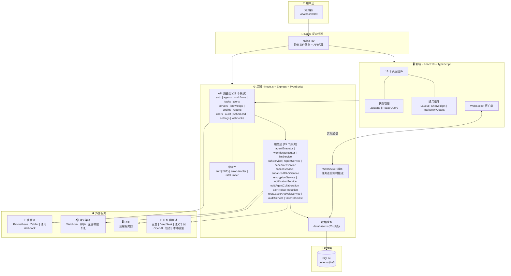
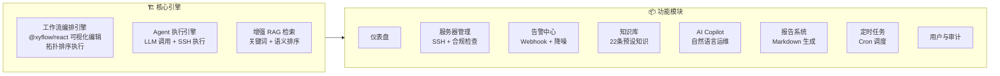
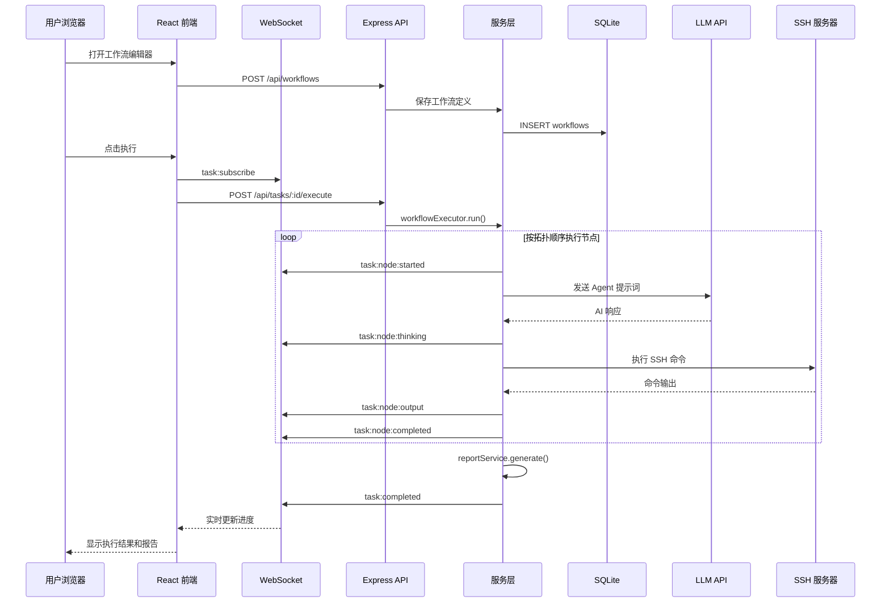
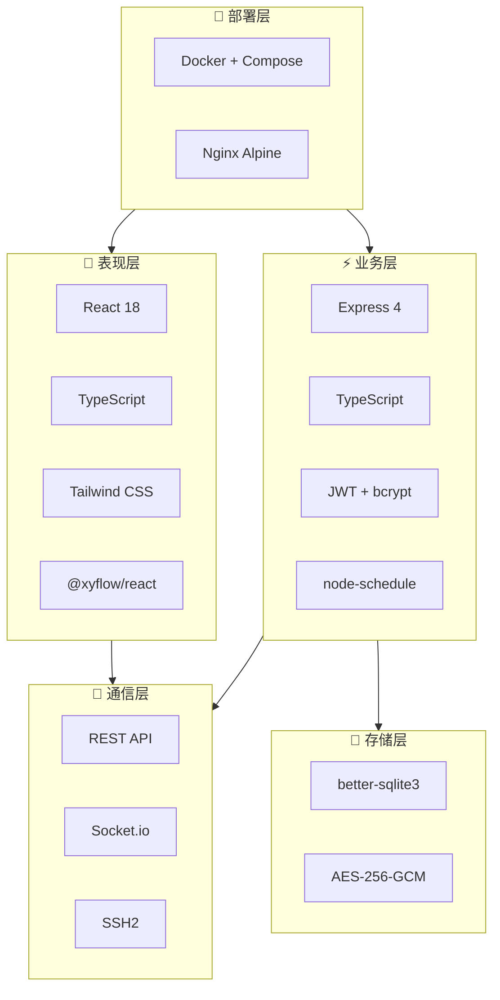

# ITOps Agent Platform 架构图

## 系统架构总览

```mermaid
graph TB
    subgraph 用户["👤 用户层"]
        Browser["浏览器<br/>localhost:8080"]
    end

    subgraph Nginx["🔀 Nginx 反向代理"]
        NG["Nginx :80<br/>静态文件服务 + API代理"]
    end

    subgraph Frontend["🖥️ 前端 - React 18 + TypeScript"]
        direction TB
        Pages["18 个页面组件"]
        Components["通用组件<br/>Layout | ChatWidget | MarkdownOutput"]
        State["状态管理<br/>Zustand | React Query"]
        WS_Client["WebSocket 客户端"]
        Pages --- Components
        Pages --- State
    end

    subgraph Backend["⚙️ 后端 - Node.js + Express + TypeScript"]
        direction TB
        API["API 路由层 (21 个模块)<br/>auth | agents | workflows | tasks | alerts<br/>servers | knowledge | copilot | reports<br/>users | audit | scheduled | settings | webhooks"]
        Services["服务层 (15 个服务)<br/>agentExecutor | workflowExecutor | llmService<br/>sshService | reportService | schedulerService<br/>copilotService | enhancedRAGService<br/>encryptionService | notificationService<br/>multiAgentCollaboration | alertNoiseReduction<br/>rootCauseAnalysisService | auditService | tokenBlacklist"]
        Middleware["中间件<br/>auth(JWT) | errorHandler | rateLimiter"]
        WS_Server["WebSocket 服务<br/>任务进度实时推送"]
        DB_Model["数据模型<br/>database.ts (25 张表)"]

        API --> Services
        API --- Middleware
        Services --> DB_Model
        WS_Server --> DB_Model
    end

    subgraph Data["🗄️ 数据层"]
        SQLite[("SQLite<br/>better-sqlite3")]
    end

    subgraph External["🌐 外部服务"]
        LLM["🤖 LLM 模型池<br/>豆包 | DeepSeek | 通义千问<br/>OpenAI | 智谱 | 本地模型"]
        SSH["🖥️ SSH<br/>远程服务器"]
        Alerts["🚨 告警源<br/>Prometheus | Zabbix | 通用Webhook"]
        Notify["📬 通知渠道<br/>Webhook | 邮件 | 企业微信 | 钉钉"]
    end

    Browser --> NG
    NG --> Frontend
    NG --> Backend
    Frontend --> API
    WS_Client <-->|"实时通信"| WS_Server
    DB_Model --> SQLite
    Services --> LLM
    Services --> SSH
    Services --> Notify
    API --> Alerts
```

## 功能模块架构

```mermaid
graph LR
    subgraph Core["🏗️ 核心引擎"]
        WF["工作流编排引擎<br/>@xyflow/react 可视化编辑<br/>拓扑排序执行"]
        Agent["Agent 执行引擎<br/>LLM 调用 + SSH 执行"]
        RAG["增强 RAG 检索<br/>关键词 + 语义排序"]
    end

    subgraph Features["📦 功能模块"]
        Dashboard["仪表盘"]
        Servers["服务器管理<br/>SSH + 合规检查"]
        Alerts_M["告警中心<br/>Webhook + 降噪"]
        Knowledge["知识库<br/>22条预设知识"]
        Copilot["AI Copilot<br/>自然语言运维"]
        Reports["报告系统<br/>Markdown 生成"]
        Scheduled["定时任务<br/>Cron 调度"]
        Users["用户与审计"]
    end

    Core --> Features
```

## 数据流架构

```mermaid
sequenceDiagram
    participant U as 用户浏览器
    participant F as React 前端
    participant W as WebSocket
    participant A as Express API
    participant S as 服务层
    participant D as SQLite
    participant L as LLM API
    participant SS as SSH 服务器

    U->>F: 打开工作流编辑器
    F->>A: POST /api/workflows
    A->>S: 保存工作流定义
    S->>D: INSERT workflows

    U->>F: 点击执行
    F->>W: task:subscribe
    F->>A: POST /api/tasks/:id/execute
    A->>S: workflowExecutor.run()
    
    loop 按拓扑顺序执行节点
        S->>W: task:node:started
        S->>L: 发送 Agent 提示词
        L-->>S: AI 响应
        S->>W: task:node:thinking
        S->>SS: 执行 SSH 命令
        SS-->>S: 命令输出
        S->>W: task:node:output
        S->>W: task:node:completed
    end

    S->>S: reportService.generate()
    S->>W: task:completed
    W-->>F: 实时更新进度
    F-->>U: 显示执行结果和报告
```

## 技术栈层次

```mermaid
graph TB
    subgraph Deploy["🐳 部署层"]
        Docker["Docker + Compose"]
        Nginx2["Nginx Alpine"]
    end

    subgraph Front["🎨 表现层"]
        React["React 18"]
        TS_F["TypeScript"]
        Tailwind["Tailwind CSS"]
        Flow["@xyflow/react"]
    end

    subgraph Back["⚡ 业务层"]
        Express["Express 4"]
        TS_B["TypeScript"]
        JWT["JWT + bcrypt"]
        Schedule["node-schedule"]
    end

    subgraph Comm["📡 通信层"]
        HTTP["REST API"]
        WS["Socket.io"]
        SSH2["SSH2"]
    end

    subgraph Store["💾 存储层"]
        SQLite2["better-sqlite3"]
        AES["AES-256-GCM"]
    end

    Deploy --> Front
    Deploy --> Back
    Front --> Comm
    Back --> Comm
    Back --> Store
```

---

> 💡 这些 Mermaid 图表在 GitHub 上会自动渲染为可视化图表。直接复制到 README.md 或查看 GitHub 仓库即可看到效果。